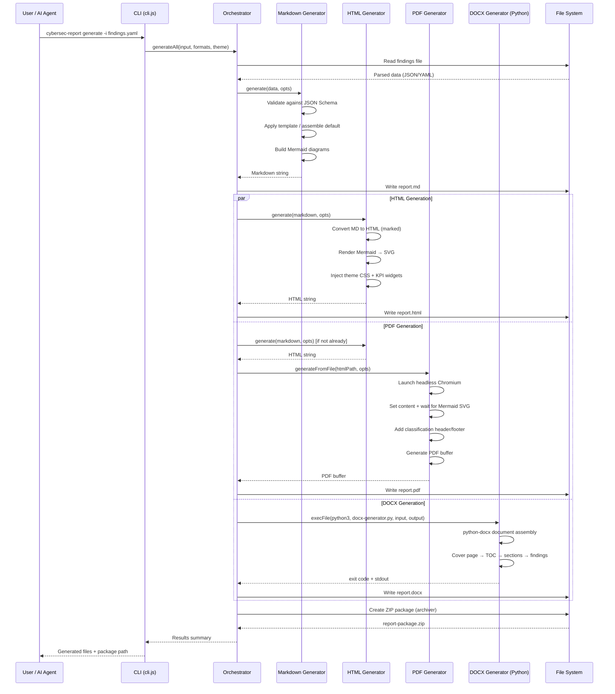

# CyberSec Reporting Engine — Architecture Documentation

> **Version:** 1.0.0 · **Last Updated:** 2026-06-01 · **Classification:** Internal

---

## Table of Contents

1. [System Architecture Overview](#1-system-architecture-overview)
2. [Component Architecture](#2-component-architecture)
3. [Data Flow](#3-data-flow)
4. [Skill Lifecycle](#4-skill-lifecycle)
5. [Template Inheritance Model](#5-template-inheritance-model)
6. [Output Pipeline](#6-output-pipeline)
7. [Plugin & Extension Architecture](#7-plugin--extension-architecture)
8. [Multi-Tenant Considerations](#8-multi-tenant-considerations)
9. [Security Architecture](#9-security-architecture)
10. [Performance & Scaling Considerations](#10-performance--scaling-considerations)

---

## 1. System Architecture Overview

The CyberSec Reporting Engine is a modular, pipeline-oriented document generation platform that transforms structured security findings into professional multi-format deliverables. It is built around four core engines — **Skills**, **Templates**, **Output**, and **Branding** — orchestrated through a central controller that manages the complete lifecycle from data ingestion to packaged deliverable.

```mermaid
flowchart TB
    subgraph Input["Input Layer"]
        A[Structured Findings<br/>JSON / YAML]
        B[AI Agent Prompts<br/>Claude Code / OpenCode]
        C[CLI Commands<br/>Node.js CLI]
    end

    subgraph Skills["Skills Engine"]
        D[Universal Report Engine<br/>Orchestration Skill]
        E[Offensive Skills<br/>Pentest · Red Team · Vuln Assessment]
        F[Defensive Skills<br/>Hardening · Threat Hunting · Detection]
        G[DFIR Skills<br/>Forensics · Incident Response · Malware]
        H[GRC Skills<br/>Compliance · Gap Analysis]
    end

    subgraph Templates["Template Engine"]
        I[Variable Substitution<br/>{{handlebar}} syntax]
        J[Conditional Inclusion<br/>Rule-based sections]
        K[Computed Variables<br/>Aggregations · Percentages]
    end

    subgraph Output["Output Engine"]
        L[Markdown Generator<br/>native · version-controlled]
        M[HTML Generator<br/>interactive · dashboards]
        N[PDF Generator<br/>Puppeteer · print-ready]
        O[DOCX Generator<br/>Python · Microsoft Word]
    end

    subgraph Branding["Branding Engine"]
        P[Theme Registry<br/>4 corporate themes]
        Q[Component Library<br/>badges · cover pages · KPI widgets]
        R[Override System<br/>client > engagement > theme > default]
    end

    A --> D
    B --> D
    C --> D
    D --> E
    D --> F
    D --> G
    D --> H
    E & F & G & H --> I
    I --> J
    J --> K
    K --> L
    L --> M
    M --> N
    L --> O
    P & Q & R --> M
    P & Q & R --> N
    P & Q & R --> O

    L --> Z[Output Directory<br/>md · html · pdf · docx]
    M --> Z
    N --> Z
    O --> Z
```

### Design Principles

| Principle | Implementation |
|-----------|---------------|
| **Separation of Concerns** | Skills (content logic), Templates (structure), Output (rendering), Branding (visuals) are fully decoupled |
| **Pipeline Architecture** | Each output format is a stage in a directed acyclic graph; failures in one stage do not block others |
| **Fault Isolation** | DOCX generation runs in a separate Python process; PDF rendering is sandboxed in headless Chromium |
| **Schema-First** | All inputs validated against JSON Schema before processing; malformed data rejected at entry |
| **Event-Driven** | Orchestrator emits progress/error events consumed by CLI progress bars, web dashboards, and logging |
| **Extensible by Design** | Skills, templates, themes, and output formats are all pluggable via directory-based discovery |

---

## 2. Component Architecture

### 2.1 Skills Engine

The Skills Engine is the content orchestration layer. Each skill is a self-contained directory providing:

```
skills/pentest-report/
├── SKILL.md          # Claude Code format: full methodology, workflows, quality controls
├── skill.yaml        # OpenCode format: structured metadata, prompt, validation rules
└── examples/         # (optional) Sample input/output pairs
```

**Skill Categories:**

| Category | Skills | Description |
|----------|--------|-------------|
| **Offensive** | `pentest-report`, `redteam-report`, `vulnerability-assessment-report`, `ad-assessment-report`, `cloud-security-report` | Penetration testing, red teaming, vulnerability assessments |
| **Defensive** | `hardening-report`, `threat-hunting-report` | System hardening, threat hunting, detection engineering |
| **DFIR** | `forensics-report`, `incident-response-report` | Digital forensics, incident response, malware analysis |
| **GRC** | `compliance-report` | Compliance assessments, gap analysis, regulatory reviews |

**Skill Format (Dual Compatibility):**

- **Claude Code (`SKILL.md`):** YAML frontmatter + Markdown body with methodology, workflow steps, input/output schemas, quality controls, and examples.
- **OpenCode (`skill.yaml`):** Fully structured YAML with `name`, `description`, `tags`, `categories`, `prompt`, `workflows`, `expected_outputs`, and `validation_rules`.

### 2.2 Template Engine

The Template Engine transforms structured data into Markdown using `{{variable}}` substitution syntax.

**Core Capabilities:**

| Feature | Description |
|---------|-------------|
| **Variable Substitution** | `{{metadata.title}}`, `{{executiveSummary}}`, dot-path access |
| **Conditional Sections** | Show/hide sections based on finding counts, engagement type |
| **Computed Variables** | `total_findings_count`, `critical_pct`, `mean_cvss`, `sla_compliance_pct` |
| **Severity Weighting** | critical=10, high=7, medium=4, low=1, info=0 for aggregate scoring |
| **Standards Cross-Referencing** | Auto-map vulnerability classes to CWE, CAPEC, MITRE ATT&CK, Kill Chain phases |
| **i18n Support** | en-US, en-GB, es-ES, fr-FR, de-DE with locale-specific date/number formatting |

**Variable Substitution Engine** (`outputs/markdown/markdown-generator.js:71`):

```javascript
function substituteVariables(template, context) {
  return template.replace(/\{\{(.+?)\}\}/g, (_, path) => {
    const keys = path.trim().split('.');
    let value = context;
    for (const k of keys) {
      if (value == null) break;
      value = value[k];
    }
    return value != null ? String(value) : `{{${path}}}`;
  });
}
```

### 2.3 Output Engine

Four output generators arranged in a dependency chain:

```
Markdown ──→ HTML ──→ PDF
    │
    └──→ DOCX (Python subprocess)
```

| Generator | Technology | Input | Output | Key Features |
|-----------|-----------|-------|--------|-------------|
| **Markdown** | Node.js (native) | JSON/YAML findings | `.md` | Schema validation, Mermaid diagrams, table generation |
| **HTML** | Node.js + marked + JSDOM + mermaid | Markdown string | `.html` | Interactive features, theme CSS, severity badges, KPI widgets, search, collapsible sections |
| **PDF** | Node.js + Puppeteer | HTML file | `.pdf` | Page headers/footers, classification markings, bookmarks, page presets (A4/letter/legal/A3) |
| **DOCX** | Python + python-docx | JSON/YAML findings | `.docx` | Cover page, TOC, styled tables, headers/footers, corporate fonts |

### 2.4 Branding Engine

The Branding Engine provides a complete visual identity system decoupled from content generation.

**Theme Registry** (`branding/themes/`):

| Theme ID | Name | Best For |
|----------|------|----------|
| `enterprise-dark` | Enterprise Dark | Executive reports, board presentations |
| `enterprise-light` | Enterprise Light | Printed reports, client deliverables |
| `executive-blue` | Executive Blue | C-Suite briefings, premium deliverables |
| `security-ops` | Security Operations | SOC dashboards, incident reports |

**Component Library** (`branding/components/`):

- **Cover Pages:** Enterprise, Executive, Technical
- **Severity Badges:** HTML, SVG, Markdown, Unicode emoji rendering modes
- **KPI Widgets:** Auto-generated from findings data
- **Executive Tables:** Styled with alternating row shading
- **Risk Cards:** Color-coded risk summary cards
- **Mermaid Templates:** Pre-built chart configurations

**Override Priority System:**

```
client-specific overrides (priority 100)
  → engagement-specific settings (priority 95)
    → active theme values (priority 50)
      → engine defaults (priority 0)
```

---

## 3. Data Flow

### 3.1 End-to-End Flow



### 3.2 Orchestrator State Machine

```
IDLE → LOADING_DATA → GENERATING_MD → GENERATING_HTML ─┬─→ PACKAGING → COMPLETE
                                    → GENERATING_PDF  ─┤
                                    → GENERATING_DOCX ─┘
```

The orchestrator (`outputs/orchestrator.js`) manages this state machine, emitting `progress` and `error` events at each transition. The CLI renders these as a progress bar:

```
[markdown   ] [████████████████████] 100% Written: ./output/report.md
[html       ] [████████████████████] 100% Written: ./output/report.html
[pdf        ] [████████████████████] 100% Written: ./output/report.pdf
[docx       ] [████████████████████] 100% Written: ./output/report.docx
[package    ] [████████████████████] 100% Package: ./output/report-package.zip
```

---

## 4. Skill Lifecycle

### 4.1 How Skills Are Loaded

Skills are discovered via filesystem enumeration in the `skills/` directory. Each skill provides two entry points:

1. **`SKILL.md`** — Claude Code native format. Loaded by the AI agent when a user asks to generate a report. Contains the complete methodology, workflow steps, quality controls, and examples. The AI agent reads this file and follows its instructions to produce findings data.

2. **`skill.yaml`** — OpenCode format. Loaded by the OpenCode agent via its skill loading mechanism (referenced in `available_skills`). Defines structured workflows, validation rules, and expected outputs.

### 4.2 Skill Execution Flow

```
1. DISCOVERY
   ├── User/AI agent identifies required skill (e.g., "pentest-report")
   ├── Engine loads SKILL.md + skill.yaml from skills/<skill-name>/
   └── Validates skill metadata (version, standards compatibility)

2. INGESTION
   ├── AI agent follows workflow steps defined in the skill
   ├── Collects findings, evidence, and assessment data
   ├── Structures data per the Input Schema defined in the skill
   └── Outputs structured JSON/YAML findings file

3. VALIDATION
   ├── MarkdownGenerator.validate() checks against JSON Schema
   ├── Required fields: metadata.title, metadata.generatedAt, metadata.version
   ├── Sections must have id and title; findings follow universal finding schema
   └── Invalid data rejected with specific error messages

4. GENERATION
   ├── Orchestrator.generateAll() processes the validated data
   ├── Template engine applies variable substitution
   ├── Output generators produce md, html, pdf, docx
   └── Package creator bundles all files into ZIP

5. DELIVERY
   ├── Generated files written to output directory
   ├── Manifest.json created with file listing + metadata
   └── Optional: serve command starts local HTTP viewer
```

### 4.3 Skill Output

Each skill produces findings conforming to the **Universal Finding Schema**. This schema is defined in `templates/finding-schema/finding-schema.yaml` and includes fields for:

- Finding identification (ID, title, description)
- Risk scoring (CVSS v4.0 vector + score, risk rating, likelihood)
- Standards mapping (CWE, CAPEC, MITRE ATT&CK, Kill Chain phase, OWASP category)
- Technical details (affected assets, reproduction steps, evidence)
- Business context (business impact, data classification, regulatory implications)
- Remediation (primary fix, compensating controls, references)

---

## 5. Template Inheritance Model

The template system uses a **composition-over-inheritance** model. Rather than classic OOP inheritance, templates compose sections from a shared component library.

### 5.1 Template Types

| Template | Path | Purpose |
|----------|------|---------|
| `executive-summary` | `templates/executive/executive-summary.md` | C-suite deliverables (1-2 pages) |
| `technical-report` | `templates/technical/technical-report.md` | Full technical findings (unlimited pages) |
| `finding-schema` | `templates/finding-schema/finding-schema.yaml` | Canonical finding object definition |
| `dashboards` | `templates/dashboards/dashboard-templates.md` | Visual dashboards and charts |

### 5.2 Section Composition

Templates define an ordered list of sections. Each section can be conditionally included:

```yaml
conditional_inclusion:
  critical_findings_section: "critical_count > 0"
  cloud_section: "cloud_environments is defined and cloud_env_count > 0"
  ad_section: "ad_description is defined"
```

### 5.3 Variable Resolution Order

When resolving `{{variable}}` placeholders, the engine checks in this order:

1. **Data context** — Values from the findings JSON/YAML
2. **Computed variables** — Derived values (`total_findings_count`, `critical_pct`)
3. **Configuration defaults** — Values from `.cybersecrc.yaml`
4. **Environment variables** — `CYBERSEC_*` prefixed variables
5. **Literal fallback** — Unresolved variables remain as `{{variable}}` in output

---

## 6. Output Pipeline

### 6.1 Markdown → HTML Pipeline

```
Markdown String
  → marked.parse() → HTML body
    → Severity badge injection (regex replacement)
    → Mermaid code block → SVG rendering (JSDOM + mermaid.render())
      → Theme CSS injection (from brand config)
        → KPI widget generation (from findings array)
          → Interactive JS injection (search, collapsible sections)
            → Print stylesheet injection
              → Complete HTML document
```

### 6.2 Markdown → HTML → PDF Pipeline

```
Markdown String → HTML document (as above)
  → Puppeteer (headless Chromium)
    → page.setContent(html, { waitUntil: 'networkidle0' })
    → page.waitForFunction(mermaid SVGs rendered)
    → page.pdf({
        format: pageSize,
        landscape: orientation,
        displayHeaderFooter: true,
        headerTemplate: classification banner,
        footerTemplate: page numbers,
        margin: { top, bottom, left, right },
        printBackground: true
      })
      → PDF buffer → file
```

**Page Presets:**

| Preset | Width | Height | Typical Use |
|--------|-------|--------|------------|
| `a4` | 210mm | 297mm | International standard |
| `letter` | 8.5in | 11in | US standard |
| `legal` | 8.5in | 14in | Legal documents |
| `a3` | 297mm | 420mm | Large diagrams |

### 6.3 Markdown → DOCX Pipeline

DOCX generation runs as a **separate Python process** for fault isolation:

```
JSON/YAML findings file
  → Python subprocess (docx-generator.py)
    → python-docx Document creation
      → Page margins, fonts, heading styles
      → Cover page (title, classification, metadata)
      → Table of Contents (Word TOC field)
      → Executive summary section
      → Findings sections (severity-coded headings)
        → Styled tables with header color + alternating rows
        → Markdown-to-DOCX basic renderer (headings, lists, code blocks)
      → Page breaks between major sections
      → Appendix with generation metadata
        → Document.save(outputPath)
```

---

## 7. Plugin & Extension Architecture

Extensions are configured in `templates/template-config.yaml`:

```yaml
extensions:
  - name: "custom-cis-benchmark-mapping"
    enabled: true
  - name: "live-cve-enrichment"
    enabled: false
  - name: "mitre-attack-intelligence"
    enabled: true
  - name: "epss-scoring"
    enabled: false
  - name: "ssvc-decision-tree"
    enabled: false
```

### Extension Points

| Hook | Description | Interface |
|------|-------------|-----------|
| `preValidation` | Before schema validation | `(data: object) => object` |
| `postValidation` | After schema validation, before generation | `(data: object) => object` |
| `preRender` | Before template rendering | `(markdown: string) => string` |
| `postRender` | After template rendering | `(markdown: string) => string` |
| `preOutput` | Before output format generation | `(content: string, format: string) => string` |
| `onComplete` | After all outputs generated | `(results: object) => void` |

### Creating a Custom Extension

1. Create a directory in `extensions/<extension-name>/`
2. Implement `index.js` with a default export class
3. Register in `template-config.yaml` under `extensions`
4. Set `enabled: true` to activate

---

## 8. Multi-Tenant Considerations

The engine supports multi-tenant operation through:

| Mechanism | Description |
|-----------|-------------|
| **Project-level config** | `.cybersecrc.yaml` in each project directory overrides global defaults |
| **Output isolation** | Each project writes to its own `./output` directory |
| **Template isolation** | Custom templates in `./templates/` take precedence over global templates |
| **Brand overrides** | Client-specific branding via the override system (`branding-config.yaml`) |
| **Classification enforcement** | Per-report classification levels with header/footer markings |
| **TLP support** | Traffic Light Protocol (TLP:CLEAR, GREEN, AMBER, AMBER+STRICT, RED) |

---

## 9. Security Architecture

### 9.1 Input Sanitization

- All user input validated against JSON Schema before processing
- Finding IDs must match `^F-\d{3}$` pattern
- Engagement IDs must match format-specific patterns (e.g., `^PT-\d{4}-Q[1-4]-\d{3}$`)
- File paths validated to prevent directory traversal
- YAML parsing uses `yaml.safe_load()` in Python; Node.js `yaml.parse()` with safe defaults

### 9.2 Output Security

- HTML output escapes all user-provided content (`escapeHtml()`)
- PDF generation in sandboxed Chromium (`--no-sandbox` flag available for containerized environments)
- DOCX generation in isolated Python subprocess with 60-second timeout
- Classification markings automatically applied to headers/footers

### 9.3 Dependency Security

- `marked` library configured with sanitized rendering
- `jsdom` used for server-side DOM manipulation (no browser context)
- `puppeteer` runs in headless mode with minimal permissions
- `archiver` creates ZIP packages with manifest.json for integrity verification

### 9.4 Recommended Hardening

```
# Environment variables for production
CYBERSEC_REPORT_DIR=/secure/output
CYBERSEC_TMP_DIR=/secure/tmp
CYBERSEC_MAX_FILE_SIZE=52428800    # 50MB
PUPPETEER_EXECUTABLE_PATH=/usr/bin/chromium
```

---

## 10. Performance & Scaling Considerations

### 10.1 Generation Performance

| Operation | Typical Duration | Notes |
|-----------|-----------------|-------|
| Markdown generation | < 100ms | In-memory string operations |
| HTML generation | 200-500ms | Marked parsing + Mermaid SVG rendering |
| PDF generation | 2-5s | Headless Chromium launch + rendering |
| DOCX generation | 500ms-2s | Python subprocess + document assembly |
| Full pipeline (100 findings) | 5-10s | Parallel HTML/PDF/DOCX generation |

### 10.2 Memory Usage

- Markdown/HTML: ~50MB baseline
- PDF (Puppeteer): ~200MB per concurrent generation
- DOCX (Python): ~100MB per subprocess

### 10.3 Concurrency

The orchestrator supports configurable concurrency:

```javascript
new OutputOrchestrator({
  concurrency: 4,  // Max parallel output generators
});
```

HTML and PDF generation run in parallel after Markdown completes. DOCX runs independently.

### 10.4 Caching Strategy

- Mermaid render results cached per-diagram-hash (in-memory)
- Chromium browser instance reused across PDF generations
- Template files loaded once and cached

### 10.5 Scaling for Enterprise

| Scale | Approach |
|-------|----------|
| **Single server** | Default configuration; sufficient for consulting firms |
| **CI/CD pipeline** | Run as GitHub Actions / GitLab CI job; isolate per-branch |
| **Multi-tenant SaaS** | Containerize per-client; orchestrate via job queue |
| **High volume (>1000 reports/day)** | Split generation across worker pool; use shared Chromium instances |

---

## Appendix A: Key File Reference

| File | Purpose | Lines |
|------|---------|-------|
| `cli.js` | CLI entry point (Commander.js) | 479 |
| `outputs/orchestrator.js` | Master orchestrator (EventEmitter) | 403 |
| `outputs/markdown/markdown-generator.js` | Markdown + template engine | 383 |
| `outputs/html/html-generator.js` | HTML + Mermaid + themes | 429 |
| `outputs/pdf/pdf-generator.js` | PDF via Puppeteer | 258 |
| `outputs/docx/docx-generator.py` | DOCX via python-docx | 515 |
| `.cybersecrc.yaml` | Default configuration | 120 |
| `templates/template-config.yaml` | Template system configuration | 714 |
| `branding/branding-config.yaml` | Brand system configuration | 436 |

## Appendix B: Dependency Graph

```
cli.js
  └── outputs/orchestrator.js
        ├── outputs/markdown/markdown-generator.js
        │     ├── yaml (parsing)
        │     ├── jsonschema (validation)
        │     └── glob (template discovery)
        ├── outputs/html/html-generator.js
        │     ├── marked + marked-highlight
        │     ├── highlight.js
        │     ├── jsdom
        │     └── mermaid
        ├── outputs/pdf/pdf-generator.js
        │     └── puppeteer
        └── child_process → outputs/docx/docx-generator.py
              ├── python-docx
              └── pyyaml
```
