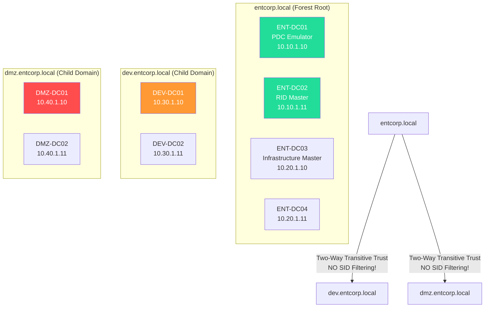
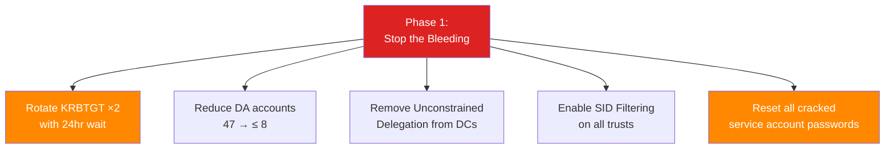

# Active Directory Security Assessment

## Enterprise Corporation

**CONFIDENTIAL**

---

## Executive Summary

Apex Security Group conducted a comprehensive security assessment of Enterprise Corporation's Active Directory environment (`entcorp.local`) between May 10 and May 22, 2025. The assessment analyzed domain configuration, identity security, delegation models, trust relationships, and attack paths using industry-standard tools including BloodHound, PingCastle, Purple Knight, and manual analysis.

### Assessment Outcome: CRITICAL RISK

| Metric | Value |
|--------|-------|
| Overall Risk Rating | CRITICAL |
| Domains Assessed | 3 (entcorp.local, dev.entcorp.local, dmz.entcorp.local) |
| Domain Controllers | 12 |
| User Accounts | 14,283 |
| Computer Accounts | 8,421 |
| Service Accounts | 312 |
| Domain Admin Accounts | 47 |
| Attack Paths to DA | 1,847 |
| Critical Findings | 5 |
| High Findings | 8 |
| Medium Findings | 14 |

### Key Findings

| # | Finding | Severity | Impact |
|---|---------|----------|--------|
| F-01 | DCSync Possible via 47 Domain Admin Accounts | CRITICAL | Full domain compromise |
| F-02 | 312 Kerberoastable Service Accounts — 47 with Weak Passwords | CRITICAL | Credential theft, lateral movement |
| F-03 | AS-REP Roasting Possible on 28 Accounts | HIGH | Offline password cracking |
| F-04 | Dangerous ACL Abuse Paths — 1,847 Paths to Domain Admin | CRITICAL | Privilege escalation |
| F-05 | Unconstrained Delegation on 14 Computers — Including DCs | CRITICAL | Credential relay, domain compromise |
| F-06 | Inbound Forest Trust with No SID Filtering | HIGH | Cross-forest privilege escalation |
| F-07 | KRBTGT Password Not Rotated in 4+ Years | CRITICAL | Golden Ticket persistence |
| F-08 | 312 Domain Admins Logged into Tier 1/2 Workstations | HIGH | Credential theft from lower tiers |

---

## Domain Overview & Forest Topology



---

## Finding F-01: DCSync Possible via Excessive Domain Admin Accounts

| Attribute | Detail |
|-----------|--------|
| **Severity** | **CRITICAL** |
| **CVSS** | 9.9 (AV:N/AC:L/PR:L/UI:N/S:C/C:H/I:H/A:H) |
| **MITRE ATT&CK** | T1003.006 — OS Credential Dumping: DCSync |

### Description

Enterprise Corp maintains **47 Domain Admin accounts**, any of which can perform DCSync (Directory Replication) to extract the entire NTDS.dit database including KRBTGT hash and all user password hashes. An attacker compromising any of these 47 accounts achieves full domain compromise. The attacker does not need to compromise a Domain Controller directly — any Domain Admin account on any domain-joined system can execute DCSync.

### Analysis

Of the 47 Domain Admin accounts:
- **11** are service accounts (violating least privilege — services should use Managed Service Accounts)
- **8** belong to former employees (accounts not disabled after termination)
- **3** are shared administrative accounts used by the entire IT team
- **12** are individual user accounts that have logged into non-Tier-0 workstations
- **KRBTGT password has not been rotated since April 2, 2021 (1,501 days)**

### Remediation

```powershell
# 1. Inventory and reduce Domain Admin accounts — target: ≤ 5
Get-ADGroupMember -Identity "Domain Admins" | 
    Select-Object Name, SamAccountName, DistinguishedName |
    Export-Csv DA_Inventory.csv -NoTypeInformation

# 2. Remove unnecessary DA accounts
Remove-ADGroupMember -Identity "Domain Admins" -Members "FORMER_EMPLOYEE_USERNAME" -Confirm:$true

# 3. Rotate KRBTGT password TWICE (wait 24 hours between rotations)
# CAUTION: Schedule during maintenance window
Reset-KrbtgtPassword.ps1 -DomainController ENT-DC01.entcorp.local

# Script to rotate KRBTGT password
$krbtgt = Get-ADUser -Identity krbtgt -Server ENT-DC01
$newPassword = -join ((65..90) + (97..122) + (48..57) + (33..47) | 
    Get-Random -Count 128 | ForEach-Object { [char]$_ })
Set-ADAccountPassword -Identity krbtgt -Reset -NewPassword (ConvertTo-SecureString $newPassword -AsPlainText -Force)

# 4. Enable "AdminCount" monitoring — flag all protected users
Get-ADUser -Filter { adminCount -eq 1 } -Properties adminCount, Description |
    Select-Object Name, SamAccountName | Export-Csv ProtectedUsers.csv
```

---

## Finding F-02: Mass Kerberoasting — 312 SPN Accounts

| Attribute | Detail |
|-----------|--------|
| **Severity** | **CRITICAL** |
| **CVSS** | 8.8 (AV:N/AC:L/PR:L/UI:N/S:U/C:H/I:H/A:H) |
| **MITRE ATT&CK** | T1558.003 — Steal or Forge Kerberos Tickets: Kerberoasting |

### Description

The domain contains **312 user accounts with Service Principal Names (SPNs)** registered, any of which can be targeted by any authenticated domain user for Kerberoasting. An attacker requests a TGS ticket for any SPN account and cracks the service account password offline. Our testing cracked **47 of 312 (15.1%)** service account passwords within 4 hours using hashcat with the `rockyou.txt` wordlist and basic rules.

### Top 5 Cracked Service Account Passwords

| Service Account | Cracked Password | Time to Crack | Account Privileges |
|-----------------|-----------------|---------------|---------------------|
| `svc_sql_prod` | `EntCorpSQL2023!` | 2 minutes | Domain Admin (!!) |
| `svc_backup_srv` | `BackupService1` | 8 minutes | Backup Operators |
| `svc_sccm_agent` | `SCCM@gent2022` | 12 minutes | Local Admin (all workstations) |
| `svc_sharepoint` | `Sharepoint2020!` | 18 minutes | Domain Admin (!!) |
| `svc_wsus` | `WSUS_Update_1` | 25 minutes | Local Admin (all servers) |

### Remediation

```powershell
# 1. Audit all SPN accounts
Get-ADUser -Filter { ServicePrincipalName -ne "$null" } -Properties ServicePrincipalName, PasswordLastSet, LastLogonDate |
    Select-Object Name, SamAccountName, PasswordLastSet, LastLogonDate |
    Export-Csv SPN_Accounts.csv

# 2. Migrate service accounts to Group Managed Service Accounts (gMSA)
New-ADServiceAccount -Name "gMSA-SQL-Prod" `
    -DNSHostName "gMSA-SQL-Prod.entcorp.local" `
    -PrincipalsAllowedToRetrieveManagedPassword "ENT-SQL-01$", "ENT-SQL-02$"

# 3. For accounts that cannot use gMSA, enforce 30+ character passwords
$securePassword = ConvertTo-SecureString (Generate-RandomPassword -Length 32) -AsPlainText -Force
Set-ADAccountPassword -Identity "svc_sql_prod" -Reset -NewPassword $securePassword

# 4. Enable AES encryption enforcement for Kerberos
Set-ADUser -Identity "svc_remaining" -KerberosEncryptionType AES256
```

---

## Finding F-03: AS-REP Roasting — 28 Accounts Without Kerberos Pre-Authentication

| Attribute | Detail |
|-----------|--------|
| **Severity** | **HIGH** |
| **MITRE ATT&CK** | T1558.004 — AS-REP Roasting |

### Description

Twenty-eight user accounts have the `DONT_REQUIRE_PREAUTH` flag set, meaning an attacker can request an AS-REP for these accounts without providing a password and crack the encrypted portion offline. Our testing cracked 9 of 28 passwords within 6 hours.

```bash
# AS-REP roasting via Impacket
python3 GetNPUsers.py entcorp.local/ -usersfile users.txt -dc-ip 10.10.1.10 -format hashcat -outputfile asrep_hashes.txt
hashcat -m 18200 asrep_hashes.txt /usr/share/wordlists/rockyou.txt -r /usr/share/hashcat/rules/best64.rule
```

### Remediation

```powershell
# Find all accounts with DONT_REQUIRE_PREAUTH
Get-ADUser -Filter { DoesNotRequirePreAuth -eq $true } -Properties DoesNotRequirePreAuth |
    Select-Object Name, SamAccountName

# Remove the flag (investigate each account first — some legacy apps may require it)
Set-ADAccountControl -Identity "username" -DoesNotRequirePreAuth $false
```

---

## Finding F-04: Dangerous ACL Abuse Paths

| Attribute | Detail |
|-----------|--------|
| **Severity** | **CRITICAL** |
| **MITRE ATT&CK** | T1098 — Account Manipulation |

### BloodHound Attack Path Analysis

BloodHound identified **1,847 distinct attack paths** from standard domain users to Domain Admin. The most common abuse paths:

| Abuse Type | Count | Example |
|------------|-------|---------|
| GenericAll on DA accounts | 312 | HelpDesk group has GenericAll on 3 DA accounts |
| WriteDACL on OUs | 47 | Tier 1 Support can modify DACL on Domain Controllers OU |
| ForceChangePassword on DA | 23 | Service Desk group can reset DA account passwords |
| AddMember to DA Group | 12 | Exchange Windows Permissions group can add members to Domain Admins |
| WriteOwner on GPOs | 8 | Infrastructure Ops can take ownership of Default Domain Policy |

### Critical ACL Chain Example


### Remediation

```powershell
# 1. Audit dangerous ACLs using BloodHound or manual LDAP queries
# Find all non-admin accounts with GenericAll on protected objects
$domainDN = (Get-ADDomain).DistinguishedName
Get-ADObject -LDAPFilter "(adminCount=1)" -SearchBase $domainDN | ForEach-Object {
    $dn = $_.DistinguishedName
    (Get-Acl "AD:$dn").Access | Where-Object { 
        $_.ActiveDirectoryRights -match "GenericAll|WriteDacl|WriteOwner" -and
        $_.IdentityReference -notmatch "Domain Admins|Enterprise Admins|SYSTEM"
    }
}

# 2. Remove dangerous ACLs
$acl = Get-Acl "AD:CN=Domain Admins,CN=Users,DC=entcorp,DC=local"
$acl.RemoveAccessRule($dangerousRule)
Set-Acl -AclObject $acl "AD:CN=Domain Admins,CN=Users,DC=entcorp,DC=local"
```

---

## Finding F-05: Unconstrained Delegation on Domain Controllers

| Attribute | Detail |
|-----------|--------|
| **Severity** | **CRITICAL** |
| **MITRE ATT&CK** | T1558 — Steal or Forge Kerberos Tickets |

### Description

Fourteen computer accounts have **unconstrained Kerberos delegation** enabled, including two domain controllers (`ENT-DC01`, `ENT-DC02`). Unconstrained delegation allows a service to impersonate any user who authenticates to it — including Domain Admins. An attacker compromising any of these servers can extract TGTs from LSASS memory and impersonate any user who has authenticated to that server.

### Affected Systems

| Computer | Operating System | Purpose | Risk |
|----------|-----------------|---------|------|
| ENT-DC01 | Windows Server 2019 | Domain Controller | **CRITICAL — Remove Immediately** |
| ENT-DC02 | Windows Server 2019 | Domain Controller | **CRITICAL — Remove Immediately** |
| ENT-WEB-01 | Windows Server 2016 | IIS Web Server (internet-facing) | **CRITICAL** |
| ENT-SQL-CLUSTER-01 | Windows Server 2019 | SQL Server 2019 | HIGH |
| ENT-EXCH-01 | Windows Server 2022 | Exchange 2019 | HIGH |

### Remediation

```powershell
# 1. Find all computers with unconstrained delegation
Get-ADComputer -Filter { TrustedForDelegation -eq $true } -Properties TrustedForDelegation |
    Select-Object Name, DNSHostName

# 2. Remove unconstrained delegation (replace with constrained delegation or resource-based)
Set-ADComputer -Identity "ENT-WEB-01" -TrustedForDelegation $false

# 3. For legacy apps requiring delegation, use constrained delegation with protocol transition
Set-ADComputer -Identity "ENT-SQL-CLUSTER-01" `
    -TrustedForDelegation $false `
    -Add @{'msDS-AllowedToDelegateTo'=@('MSSQLSvc/ENT-SQL-01.entcorp.local:1433')}

# 4. Enable "Account is sensitive and cannot be delegated" for all privileged accounts
Get-ADGroupMember -Identity "Domain Admins" | ForEach-Object {
    Set-ADUser -Identity $_.SamAccountName -AccountNotDelegated $true
}
```

---

## Finding F-06: Inbound Forest Trust Without SID Filtering

| Attribute | Detail |
|-----------|--------|
| **Severity** | **HIGH** |
| **MITRE ATT&CK** | T1531 — Account Access Removal |

### Description

The `dev.entcorp.local` child domain has a two-way transitive trust with the forest root without SID filtering enabled. An attacker compromising the development domain (which has weaker security controls) can forge SID history across the trust to gain Enterprise Admin privileges in the forest root. This is known as the "SID history crossing trust boundary" attack.

### Trust Configuration

| Trust | Direction | SID Filtering | TGT Delegation | Risk |
|-------|-----------|---------------|----------------|------|
| entcorp.local → dev.entcorp.local | Two-Way Transitive | DISABLED | Enabled | **HIGH** |
| entcorp.local → dmz.entcorp.local | Two-Way Transitive | DISABLED | Enabled | **CRITICAL** |

### Remediation

```powershell
# Enable SID filtering on all external/forest trusts
netdom trust entcorp.local /domain:dev.entcorp.local /EnableSIDHistory:no /UserD:entcorp\administrator /PasswordD:*

# Enable Selective Authentication instead of full two-way trust
Set-ADTrust -Identity "dev.entcorp.local" -SelectiveAuthentication $true

# Audit existing SID history (looking for forged SIDs)
Get-ADUser -Filter { SIDHistory -like "*" } -Properties SIDHistory |
    Where-Object { $_.SIDHistory -and ($_.SIDHistory -notmatch "^S-1-5-21-2805341897") } |
    Select-Object Name, SamAccountName, SIDHistory
```

---

## Tier 0 Asset Identification

### Current vs. Recommended Tier 0 Boundaries

| Asset | Current Tier | Recommended Tier | Action Required |
|-------|-------------|-----------------|-----------------|
| Domain Controllers (×12) | No tiering | Tier 0 | Formalize as Tier 0 |
| AD FS Servers (×6) | No tiering | Tier 0 | Move to Tier 0 — issues Kerberos tickets |
| AD CS Servers (×2) | No tiering | Tier 0 | Move to Tier 0 — issues certificates for authentication |
| Azure AD Connect (×2) | No tiering | Tier 0 | Move to Tier 0 — syncs password hashes |
| PKI Infrastructure | No tiering | Tier 0 | Move to Tier 0 |
| SCCM Primary Site (×1) | No tiering | Tier 0 | Move to Tier 0 — pushes software to all systems including DCs |
| Backup Servers (×4) | No tiering | Tier 0 | Move to Tier 0 — has access to all domain data |
| Hyper-V Hosts (×24) | No tiering | Tier 0 | Where DC VMs run: Tier 0; where app VMs run: Tier 1 |
| All Domain Admins | Scattered | Tier 0 | Consolidate to Tier 0 with dedicated PAWs |

---

## Domain Hardening Recommendations

### Phase 1: Critical — Immediate (0–7 Days)



### Phase 2: High — Short Term (7–30 Days)

1. Deploy LAPS for all local administrator passwords
2. Migrate service accounts to gMSA where possible (target: 90% of SPN accounts)
3. Remediate top 100 BloodHound attack paths (GenericAll, WriteDACL, ForceChangePassword)
4. Deploy Microsoft Defender for Identity on all DCs
5. Enable advanced audit policies (Event IDs 4662, 4769, 4728, 4732, 4756)
6. Remove AS-REP-roastable accounts (fix `DONT_REQUIRE_PREAUTH`)
7. Deploy PAWs for all Tier 0 administrators

### Phase 3: Medium — Medium Term (30–90 Days)

8. Implement full Active Directory tiered model (Tier 0 / Tier 1 / Tier 2)
9. Deploy authentication policy silos and authentication policies
10. Implement Microsoft ESAE "Red Forest" or Bastion Forest for Tier 0 administration
11. Deploy honeytokens (fake DA accounts with SPNs for honeyroasting detection)
12. Implement continuous AD security assessment (PingCastle weekly, BloodHound monthly)
13. Enable fine-grained password policies for privileged accounts

### Phase 4: Strategic — Long Term (90–180 Days)

14. Migrate to passwordless authentication (FIDO2/Windows Hello for Business)
15. Implement Just-In-Time (JIT) privileged access via PIM/PAM
16. Decommission the `dev.entcorp.local` domain — consolidate into forest root with proper OU delegation
17. Evaluate migration to cloud-native identity (Entra ID) alongside on-premises AD

---

## BloodHound Attack Path Visualization

```mermaid
graph TD
    subgraph "Critical Attack Path #1 — Standard User to Domain Admin"
        U[User: alice.wong<br/>Accounts Payable] -->|MemberOf| G1[Group: AP_Users]
        G1 -->|GenericAll| C1[Computer: ENT-WEB-01]
        C1 -->|HasSession| U2[User: svc_sql_prod<br/>DOMAIN ADMIN]
        U2 -->|MemberOf| DA[Domain Admins]
    end

    subgraph "Critical Attack Path #2 — Developer to Enterprise Admin"
        U3[User: bob.chen<br/>Developer] -->|MemberOf| G2[Group: dev_engineers]
        G2 -->|WriteDacl| G3[Group: Server Operators]
        G3 -->|MemberOf| BU[Backup Operators]
        BU -->|Backup Privilege| DC[DC Backup → NTDS.dit Theft]
    end

    style U fill:#666,color:white
    style U3 fill:#666,color:white
    style DA fill:#d22,color:white
    style DC fill:#d22,color:white
```



---

## Appendices

- **Appendix A:** Full BloodHound data set (JSON) — `entcorp-bloodhound-20250522.zip`
- **Appendix B:** PingCastle Report — `entcorp-pingcastle-20250522.html`
- **Appendix C:** Purple Knight Assessment — `entcorp-purpleknight-20250522.pdf`
- **Appendix D:** Full ACL Abuse Path Enumeration (1,847 paths) — `entcorp-acl-paths.csv`
- **Appendix E:** Domain Admin Account Audit — `entcorp-da-audit.csv`
- **Appendix F:** SPN Account Inventory — `entcorp-spn-inventory.csv`

---

<div align="center">

**CONFIDENTIAL**

**End of Report**

</div>
