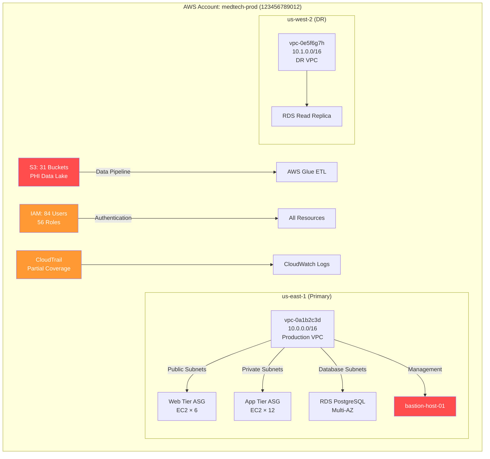
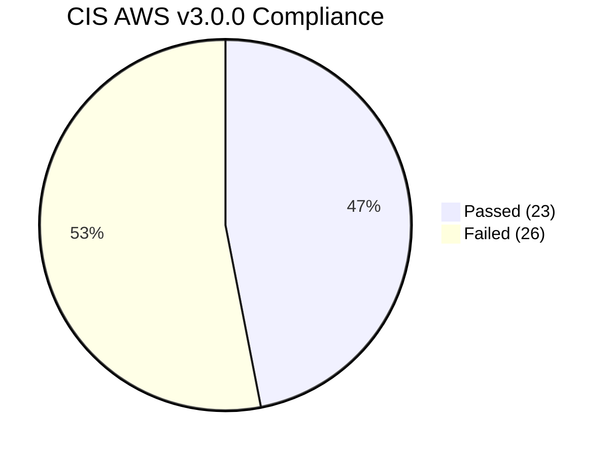
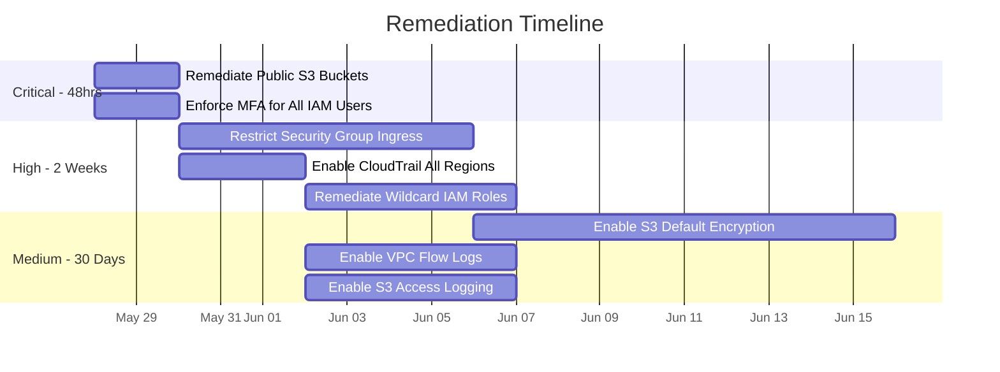

# AWS Cloud Security Assessment

## MedTech Innovations, Inc.

**Classification: CONFIDENTIAL**

---

## Executive Summary

Apex Security Group conducted a comprehensive security assessment of MedTech Innovations' production AWS environment spanning account `123456789012` (alias: `medtech-prod`). The assessment evaluated IAM configurations, S3 data storage security, network security groups, logging and monitoring, and compliance with the CIS AWS Foundations Benchmark v3.0.0.

### Overall Posture: AT RISK

| Metric | Value |
|--------|-------|
| CIS AWS Benchmark Compliance Score | 47% (23/49 controls passed) |
| Accounts Assessed | 1 production account |
| IAM Users Analyzed | 84 |
| IAM Roles Analyzed | 56 |
| S3 Buckets Analyzed | 31 |
| Security Groups Analyzed | 127 |
| Critical Findings | 4 |
| High Findings | 7 |
| Medium Findings | 12 |
| Low Findings | 5 |

### Key Findings Summary

| # | Finding | Severity | Service |
|---|---------|----------|---------|
| F-01 | S3 Buckets with Public Read Access Containing PHI | CRITICAL | S3 |
| F-02 | IAM Users Without MFA — Including Privileged Accounts | CRITICAL | IAM |
| F-03 | Overly Permissive Security Group — 0.0.0.0/0 to Port 22/3389 | HIGH | EC2/VPC |
| F-04 | CloudTrail Not Enabled in All Regions | HIGH | CloudTrail |
| F-05 | IAM Roles with Wildcard Resource Permissions | HIGH | IAM |
| F-06 | S3 Buckets Without Default Encryption | MEDIUM | S3 |
| F-07 | VPC Flow Logs Not Enabled | MEDIUM | VPC |

---

## AWS Account Architecture



---

## Finding F-01: S3 Buckets with Public Read Access Containing PHI

| Attribute | Detail |
|-----------|--------|
| **Severity** | **CRITICAL** |
| **Affected Resources** | `medtech-patient-images-prod`, `medtech-export-reports`, `medtech-mri-archive` |
| **Data Classification** | Protected Health Information (PHI) |
| **Compliance Impact** | HIPAA 164.502(a) — Impermissible Uses and Disclosures |

### Description

Three production S3 buckets contain medical imaging data (DICOM files), patient reports (PDF), and MRI archives with full patient identifiers (name, DOB, MRN). Bucket policies or ACLs grant `READ` access to the `AllUsers` (everyone) or `AnyAuthenticatedUser` groups. The `medtech-patient-images-prod` bucket alone contains approximately 847,000 patient imaging files spanning 2019–2025.

### Evidence — Public Bucket Enumeration

```bash
$ aws s3 ls s3://medtech-patient-images-prod/ --no-sign-request
                           PRE patients/
                           PRE metadata/
2025-04-15 08:32:11      1024 manifest.json

$ aws s3 ls s3://medtech-patient-images-prod/patients/ --no-sign-request | head -5
2024-11-03 14:22:05   2457088 100254_PATIENT_MRI_SAGITTAL.dcm
2024-11-03 14:22:07   2458112 100254_PATIENT_MRI_AXIAL.dcm
2024-03-18 09:15:33   3145728 100891_CHEST_CT_SCAN.dcm
...
```

### Remediation

**Immediate — Run now:**

```bash
# Block all public access at account level
aws s3control put-public-access-block \
  --account-id 123456789012 \
  --public-access-block-configuration \
    BlockPublicAcls=true,IgnorePublicAcls=true,BlockPublicPolicy=true,RestrictPublicBuckets=true

# For each affected bucket, remove public access
aws s3api put-public-access-block \
  --bucket medtech-patient-images-prod \
  --public-access-block-configuration \
    BlockPublicAcls=true,IgnorePublicAcls=true,BlockPublicPolicy=true,RestrictPublicBuckets=true

aws s3api put-bucket-acl --bucket medtech-patient-images-prod --acl private
```

**Terraform remediation snippet:**

```hcl
resource "aws_s3_bucket_public_access_block" "patient_images" {
  bucket = aws_s3_bucket.patient_images.id

  block_public_acls       = true
  block_public_policy     = true
  ignore_public_acls      = true
  restrict_public_buckets = true
}

resource "aws_s3_bucket_server_side_encryption_configuration" "patient_images" {
  bucket = aws_s3_bucket.patient_images.id

  rule {
    apply_server_side_encryption_by_default {
      sse_algorithm     = "aws:kms"
      kms_master_key_id = aws_kms_key.s3_encryption_key.arn
    }
    bucket_key_enabled = true
  }
}

resource "aws_s3_bucket_logging" "patient_images" {
  bucket        = aws_s3_bucket.patient_images.id
  target_bucket = aws_s3_bucket.s3_access_logs.id
  target_prefix = "log/patient-images/"
}
```

---

## Finding F-02: IAM Users Without MFA — Including Privileged Accounts

| Attribute | Detail |
|-----------|--------|
| **Severity** | **CRITICAL** |
| **Affected Resources** | 23 IAM users without MFA (including 4 with AdministratorAccess) |
| **Compliance Impact** | CIS AWS 1.2, 1.10; HIPAA 164.312(d) |

### Description

Twenty-three IAM users lack multi-factor authentication, including four users with the `AdministratorAccess` managed policy attached. These console-access users are susceptible to credential theft, phishing, and brute-force attacks. The absence of MFA violates both CIS AWS Benchmark controls and HIPAA access control requirements.

### Affected Privileged Users

| Username | Access Key Age | Policy | Last Activity |
|----------|---------------|--------|---------------|
| `mike.johnson` | 423 days | AdministratorAccess | Console access (yesterday) |
| `terraform-deploy` | 187 days | AdministratorAccess | Programmatic access (active) |
| `jenkins-ci` | 312 days | PowerUserAccess | Programmatic access (active) |
| `outsource-dev` | 89 days | AdministratorAccess | No activity (120 days) |

### Remediation

```bash
# Generate credential report
aws iam generate-credential-report
aws iam get-credential-report --output text | base64 -d > cred_report.csv

# Enforce MFA via IAM policy — attach to all users
aws iam put-user-policy \
  --user-name mike.johnson \
  --policy-name EnforceMFAPolicy \
  --policy-document '{
    "Version": "2012-10-17",
    "Statement": [
        {
            "Sid": "BlockMostAccessUnlessSignedInWithMFA",
            "Effect": "Deny",
            "NotAction": [
                "iam:CreateVirtualMFADevice",
                "iam:EnableMFADevice",
                "iam:GetUser",
                "iam:ListMFADevices",
                "iam:ResyncMFADevice",
                "sts:GetSessionToken"
            ],
            "Resource": "*",
            "Condition": {
                "BoolIfExists": {"aws:MultiFactorAuthPresent": "false"}
            }
        }
    ]
}'
```

---

## Finding F-03: Overly Permissive Security Groups

| Attribute | Detail |
|-----------|--------|
| **Severity** | **HIGH** |
| **Affected Resources** | 12 security groups exposing management ports to 0.0.0.0/0 |

### Description

Twelve security groups allow inbound SSH (port 22) or RDP (port 3389) from `0.0.0.0/0` (the entire internet). The bastion host (`sg-0a1b2c3d`) exposes SSH globally without IP restrictions, making it susceptible to brute-force attacks and exploitation of SSH vulnerabilities.

### Remediation — Terraform

```hcl
resource "aws_security_group_rule" "bastion_ssh" {
  type              = "ingress"
  from_port         = 22
  to_port           = 22
  protocol          = "tcp"
  cidr_blocks       = ["198.51.100.0/28"]  # Corporate VPN CIDR only
  security_group_id = aws_security_group.bastion.id
}
```

---

## Finding F-04: CloudTrail Not Enabled in All Regions

| Attribute | Detail |
|-----------|--------|
| **Severity** | **HIGH** |
| **Compliance Impact** | CIS AWS 3.1 |

CloudTrail is enabled only in `us-east-1` — API activity in `us-west-2`, `eu-west-1`, and `ap-southeast-1` is not logged.

### Remediation — Terraform

```hcl
resource "aws_cloudtrail" "global" {
  name                          = "medtech-cloudtrail-all-regions"
  s3_bucket_name                = aws_s3_bucket.cloudtrail_logs.id
  include_global_service_events = true
  is_multi_region_trail         = true
  enable_log_file_validation    = true
  kms_key_id                    = aws_kms_key.cloudtrail_key.arn

  event_selector {
    read_write_type           = "All"
    include_management_events = true
  }
}
```

---

## CIS AWS Benchmark Compliance Summary



### Score Breakdown by Section

| Section | Controls | Passed | Score |
|---------|----------|--------|-------|
| 1. Identity & Access Management | 21 | 9 | 43% |
| 2. Storage | 12 | 5 | 42% |
| 3. Logging | 8 | 3 | 38% |
| 4. Monitoring | 8 | 6 | 75% |

### Top Failed Controls

| Control ID | Control Description | Severity |
|------------|---------------------|----------|
| 1.2 | Ensure MFA is enabled for all IAM users | CRITICAL |
| 1.4 | Ensure no root user access key exists | CRITICAL |
| 2.1.2 | Ensure S3 Bucket Policy prohibits public read access | CRITICAL |
| 3.1 | Ensure CloudTrail is enabled in all regions | HIGH |
| 3.7 | Ensure S3 bucket access logging is enabled | MEDIUM |
| 3.9 | Ensure VPC flow logging is enabled in all VPCs | MEDIUM |

---

## Remediation Priority Matrix



---

## Strategic Recommendations

### Immediate (0–48 hours)

1. Remediate all public S3 buckets — enable Block Public Access at account level
2. Enforce MFA for all IAM users via IAM policy condition
3. Remove or rotate the root user access key

### Short-term (1–4 weeks)

4. Deploy AWS Config with CIS Benchmark conformance pack
5. Implement AWS GuardDuty for threat detection
6. Configure AWS Security Hub for centralized findings aggregation
7. Implement IAM Access Analyzer to identify externally shared resources

### Long-term (1–3 months)

8. Migrate to IAM Identity Center (SSO) and eliminate long-lived IAM user credentials
9. Implement SCPs to prevent public S3 bucket creation organization-wide
10. Deploy automated remediation via AWS Config auto-remediation rules
11. Implement infrastructure-as-code governance with Terraform policy checks (OPA/Sentinel)

---

## Appendices

### Appendix A: Full CIS AWS Benchmark Results

Complete 49-control assessment matrix available in `ASG-CLD-2025-0331-cis-results.xlsx`.

### Appendix B: IAM Credential Report

Full credential report for all 84 IAM users. Provided separately due to sensitivity.

### Appendix C: S3 Bucket Inventory

Complete inventory of 31 S3 buckets with encryption, logging, public access, and versioning status.

---

<div align="center">

**End of Report**

Apex Security Group
engagements@apexsec.com

</div>
