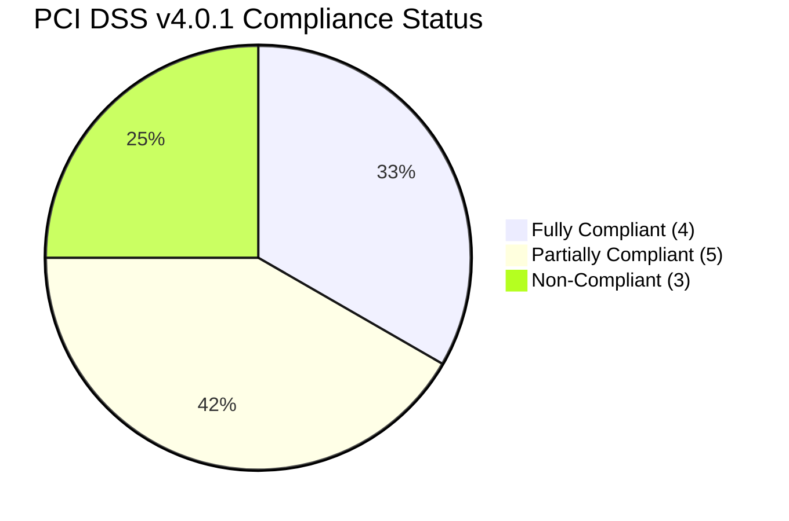
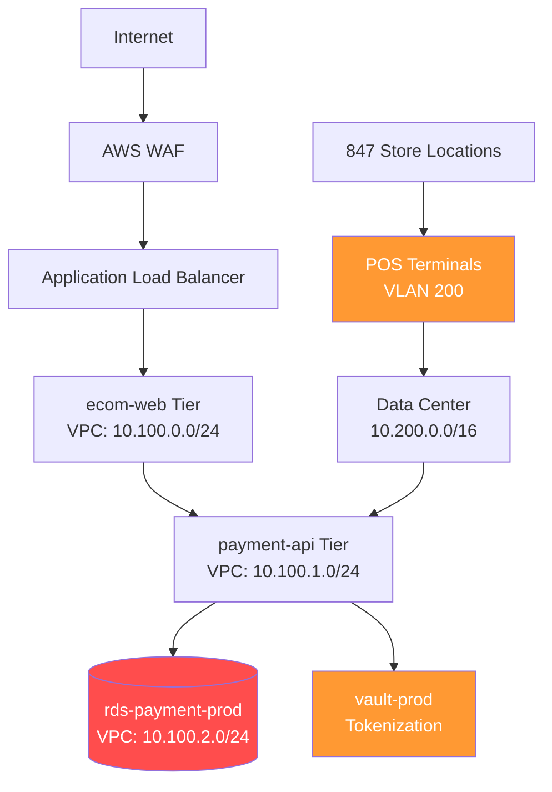
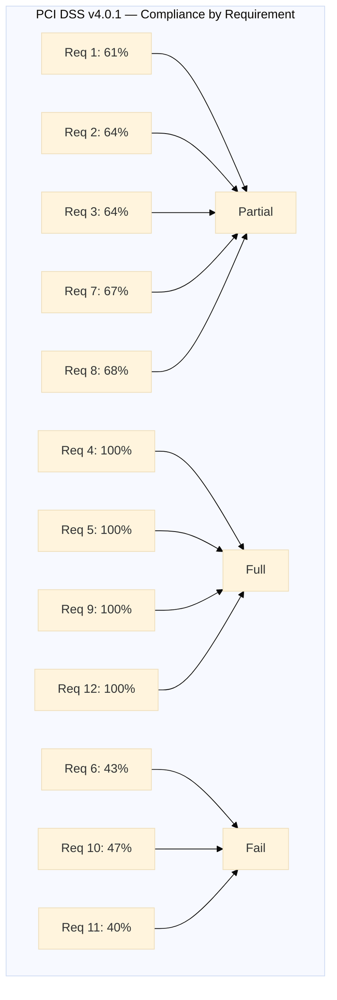
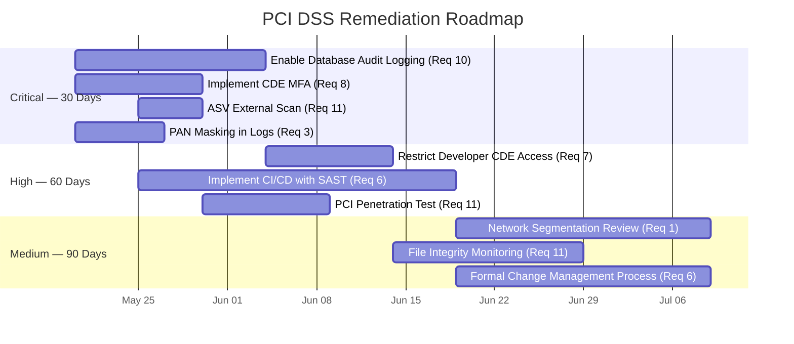
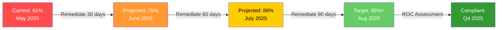

# PCI DSS v4.0.1 Compliance Assessment

## RetailCo Holdings, Inc.

**CONFIDENTIAL — Restricted to PCI Assessment Team and Executive Management**

---

## Executive Summary

Apex Security Group conducted a PCI DSS v4.0.1 readiness assessment of RetailCo Holdings' Cardholder Data Environment (CDE). The assessment evaluated compliance against all 12 PCI DSS requirements across the organization's e-commerce platform, point-of-sale systems, payment processing infrastructure, and supporting network environment.

### Overall Compliance Status

| Metric | Value |
|--------|-------|
| **Overall Compliance Score** | **61%** |
| Requirements Fully Compliant | 4 of 12 |
| Requirements Partially Compliant | 5 of 12 |
| Requirements Non-Compliant | 3 of 12 |
| Total Controls Assessed | 282 |
| Controls Passing | 172 |
| Controls Failing | 110 |
| Critical Gaps Identified | 7 |
| Target Assessment Date | Q4 2025 |

### Compliance Dashboard



---

## Scope Definition

### Cardholder Data Environment (CDE)

| System/Component | Description | CDE Classification |
|-----------------|-------------|-------------------|
| `ecom-web-*` (12 EC2 instances) | E-commerce web application | CDE — Systems that store/process/transmit CHD |
| `payment-api-*` (4 EC2 instances) | Payment processing API | CDE — Systems that store/process/transmit CHD |
| `pos-terminals-*` (847 terminals) | In-store point-of-sale | CDE — Systems that store/process/transmit CHD |
| `rds-payment-prod` | Payment database (RDS PostgreSQL) | CDE — Systems that store/process/transmit CHD |
| `s3-receipts-prod` | Digital receipt storage | CDE — Systems that store/process/transmit CHD |
| `vault-prod-*` (2 instances) | Tokenization vault (Hashicorp Vault) | CDE — Security-impacting system |
| `siem-prod-*` (2 instances) | Security monitoring | CDE — Security-impacting system |
| `jump-host-*` (2 instances) | Administrative access | Connected-to/system component |

### Network Diagram



---

## Control Assessment Matrix

### Requirement-by-Requirement Summary

| Req # | Requirement Title | Controls Tested | Passed | Score | Status |
|-------|------------------|-----------------|--------|-------|--------|
| 1 | Install and Maintain Network Security Controls | 18 | 11 | 61% | PARTIAL |
| 2 | Apply Secure Configurations to All System Components | 14 | 9 | 64% | PARTIAL |
| 3 | Protect Stored Account Data | 22 | 14 | 64% | PARTIAL |
| 4 | Protect Cardholder Data with Strong Cryptography During Transmission | 16 | 16 | 100% | COMPLIANT |
| 5 | Protect All Systems and Networks from Malicious Software | 18 | 18 | 100% | COMPLIANT |
| 6 | Develop and Maintain Secure Systems and Software | 28 | 12 | 43% | NON-COMPLIANT |
| 7 | Restrict Access to System Components and Cardholder Data by Business Need to Know | 24 | 16 | 67% | PARTIAL |
| 8 | Identify Users and Authenticate Access to System Components | 22 | 15 | 68% | PARTIAL |
| 9 | Restrict Physical Access to Cardholder Data | 20 | 20 | 100% | COMPLIANT |
| 10 | Log and Monitor All Access to System Components and Cardholder Data | 30 | 14 | 47% | NON-COMPLIANT |
| 11 | Test Security of Systems and Networks Regularly | 42 | 17 | 40% | NON-COMPLIANT |
| 12 | Support Information Security with Organizational Policies and Programs | 28 | 28 | 100% | COMPLIANT |

### Compliance Radar Chart



---

## Critical Gaps

### Gap 1: Req 6.4.2 — No Automated Software Change Approval (CRITICAL)

**Description:** RetailCo deploys code to the e-commerce platform via manual SFTP uploads without automated CI/CD pipelines, code review, or change approval workflows. Twenty-three production deployments in the past 90 days lacked evidence of change approval or security review.

**Impact:** Unauthorized or malicious code could be deployed to the CDE without detection.

**Remediation:**
```yaml
# Implement GitLab CI/CD with mandatory code review
# .gitlab-ci.yml
deploy_to_production:
  stage: deploy
  only:
    - main
  before_script:
    - semgrep --config=auto --error .
    - trivy image --severity CRITICAL,HIGH $CI_REGISTRY_IMAGE:$CI_COMMIT_SHA
  script:
    - aws ecs update-service --cluster payment-cluster --service ecom-web --force-new-deployment
  environment:
    name: production
  when: manual
  only:
    refs:
      - main
```

---

### Gap 2: Req 10.2.1 — Audit Logs Missing Critical Events (CRITICAL)

**Description:** The CDE does not capture audit logs for privileged user actions on the payment database. PostgreSQL audit logging is disabled. No log of administrative queries, schema changes, or direct database access exists.

**Remediation:**

```ini
# postgresql.conf — Enable comprehensive audit logging
log_statement = 'all'
log_duration = on
log_connections = on
log_disconnections = on
log_line_prefix = '%t [%p]: user=%u,db=%d,app=%a,remote=%h '
pgaudit.log = 'write, role, ddl, function'
pgaudit.log_level = 'notice'
pgaudit.log_catalog = on

# Forward to SIEM
shared_preload_libraries = 'pgaudit, pg_stat_statements'
```

```hcl
# Terraform: Ensure CloudWatch log export
resource "aws_db_instance" "payment_db" {
  enabled_cloudwatch_logs_exports = ["postgresql", "upgrade"]
  # ... other configuration
}
```

---

### Gap 3: Req 11.3.1 — No External ASV Scanning (CRITICAL)

**Description:** No external Approved Scanning Vendor (ASV) scans have been conducted within the past 12 months. Internal vulnerability scans are run quarterly but external-facing CDE systems have not been scanned by an ASV.

---

### Gap 4: Req 3.5.1 — PAN Stored in Clear Text in Logs (HIGH)

**Description:** Primary Account Numbers (PANs) are logged in clear text in application debug logs, Nginx access logs, and AWS CloudWatch Logs. Grep across log storage found 14,827 full PANs in the past 30 days.

**Remediation:**

```nginx
# Nginx log_format — strip PAN from URL parameters
map $request_uri $sanitized_uri {
    "~^(?<before_pan>.*)(card_number=|pan=)(?<pan_value>[0-9]{13,19})(?<after_pan>.*)$" 
        "${before_pan}card_number=****-REDACTED-****${after_pan}";
    default $request_uri;
}
access_log /var/log/nginx/access.log custom_format;
```

---

### Gap 5: Req 7.2.1 — Overly Broad CDE Access (HIGH)

**Description:** Developer group (`dev-team`) has ReadWrite access to the production payment database. Fourteen developers have credentials capable of directly querying the CDE database containing full PAN data.

**Remediation:**

```sql
-- Revoke direct dev access to production
REVOKE ALL ON ALL TABLES IN SCHEMA public FROM dev_team;
REVOKE ALL ON SCHEMA public FROM dev_team;
DROP ROLE dev_team;

-- Grant read-only access to masked views only
CREATE ROLE dev_readonly WITH LOGIN PASSWORD 'password_here';
GRANT USAGE ON SCHEMA masked_views TO dev_readonly;
GRANT SELECT ON masked_views.customers_masked TO dev_readonly;
GRANT SELECT ON masked_views.transactions_masked TO dev_readonly;
```

---

### Gap 6: Req 8.3.1 — No MFA for CDE Administrative Access (HIGH)

**Description:** SSH access to CDE servers and database administrative interfaces does not require multi-factor authentication. Root access to the payment database is granted via password-only authentication.

---

### Gap 7: Req 11.4.1 — No Annual Penetration Test (HIGH)

**Description:** RetailCo has never conducted a PCI-scoped external or internal penetration test. The last security assessment of any type was a vulnerability scan in 2023.

---

## Prioritized Remediation Roadmap



---

## Recommendations for Achieving Compliance

### Immediate Actions (P0 — 30 days)

1. Schedule and complete ASV external scanning with a PCI-approved vendor
2. Enable PostgreSQL audit logging (`pgaudit`) and ship logs to SIEM
3. Deploy MFA for all CDE administrative access (SSH, database admin, AWS Console)
4. Implement PAN masking/truncation in all log sources
5. Begin PCI-scoped penetration test (external + internal)

### Short-Term Actions (P1 — 30–60 days)

6. Revoke developer production database access; implement masked view access
7. Implement CI/CD pipeline with mandatory code review, SAST, and approval gates
8. Implement file integrity monitoring (AIDE/Tripwire) on CDE systems
9. Conduct formal network segmentation testing between CDE and non-CDE zones
10. Deploy database activity monitoring (DAM) solution

### Medium-Term Actions (P2 — 60–90 days)

11. Formalize change management process with documented approvals
12. Implement quarterly internal vulnerability scanning with remediation tracking
13. Conduct tabletop exercise for security incident response
14. Train all CDE personnel on PCI DSS awareness and secure coding practices
15. Implement automated user access review process (quarterly)

### Long-Term Strategy (P3 — 90–180 days)

16. Deploy tokenization to eliminate PAN storage in CDE
17. Implement P2PE (Point-to-Point Encryption) for in-store POS terminals
18. Migrate to zero-trust architecture for CDE access
19. Achieve continuous compliance monitoring via CSPM tooling
20. Target formal PCI DSS ROC assessment by Q4 2025

---

## Compliance Score Projection



---

## Appendices

- **Appendix A:** Full Control Assessment Matrix (282 controls) — `ASG-PCI-2025-0074-controls.xlsx`
- **Appendix B:** Evidence Collection Log
- **Appendix C:** Interview Log (28 personnel interviewed)
- **Appendix D:** Network Diagrams (Tier 1 — Confidential)
- **Appendix E:** ROC Template (pre-populated for Q4 2025 assessment)

---

<div align="center">

**CONFIDENTIAL**

**End of Report**

</div>
