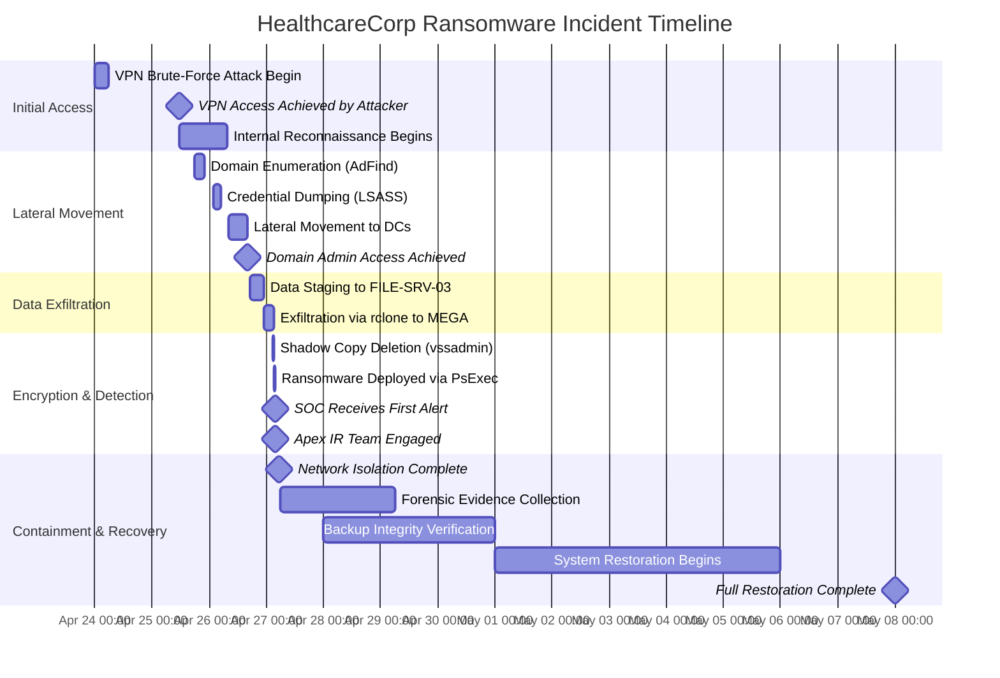

# Incident Response Report — Ransomware Attack

## HealthcareCorp

**CONFIDENTIAL — ATTORNEY-CLIENT PRIVILEGED**

This report is prepared at the direction of HealthcareCorp's legal counsel as part of the investigation of the April 27, 2025 ransomware incident and is protected by attorney-client privilege and the work product doctrine.

---

## 1. Executive Summary

On April 27, 2025 at approximately 03:14 UTC, HealthcareCorp experienced a ransomware attack perpetrated by the BlackCat/ALPHV ransomware-as-a-service group. The attackers encrypted approximately 3,400 endpoints and 47 virtual servers across the organization's primary data center, exfiltrated an estimated 4.7 TB of data including Protected Health Information (PHI) for approximately 890,000 patients, and demanded a ransom of 85 BTC (~$5.1M USD at time of attack).

The Apex Security Group Incident Response team was engaged at 04:02 UTC and led containment, investigation, eradication, and recovery operations over an 11-day period. All encrypted systems have been recovered from verified clean backups, and no ransom was paid.

### Incident At-a-Glance

| Metric | Detail |
|--------|--------|
| Attack Vector | Compromised VPN credential (no MFA) from initial access broker |
| Initial Access | April 25, 2025 — 11:23 UTC via FortiGate SSL-VPN |
| Time to Encryption | 40 hours (dwell time) |
| Encryption Event | April 27, 2025 — 03:14 UTC |
| Systems Encrypted | ~3,400 endpoints + 47 servers |
| Data Exfiltrated | ~4.7 TB (includes PHI for ~890,000 patients) |
| Ransom Demand | 85 BTC (~$5.1M USD) |
| Ransom Paid | NO |
| Regulatory Notifications | HHS OCR (HIPAA breach), State AGs (47 states), FBI |
| Systems Restored | 100% from verified clean backups |

## 2. Incident Timeline



### Detailed Timeline

| Timestamp (UTC) | Event | Source |
|-----------------|-------|--------|
| 2025-04-24 20:00 | Brute-force attack begins against FortiGate SSL-VPN | FortiGate logs |
| 2025-04-25 11:23 | Successful VPN login for user `j.henderson` from IP 185.220.101.42 (TOR exit node) | FortiGate auth log |
| 2025-04-25 11:30 | Attacker runs `nltest /dclist:hcorp.local` — domain discovery | EDR telemetry |
| 2025-04-25 18:00 | AdFind.exe executed on workstation HC-WKS-1847 | EDR (retro-hunt) |
| 2025-04-26 02:00 | LSASS memory dump via procdump on HC-WKS-1847 | Sysmon Event 10 |
| 2025-04-26 02:15 | Dumped credentials used for lateral movement | Windows Event 4624 Type 3 |
| 2025-04-26 08:00 | Attacker accesses HC-DC01 via RDP using Domain Admin credentials | Windows Event 4624 Type 10 |
| 2025-04-26 16:00 | NTDS.dit extracted via ntdsutil on HC-DC01 | Windows Event 4662 |
| 2025-04-26 23:00 | Rclone configured; 4.7 TB of data exfiltrated to MEGA cloud storage | Firewall egress logs |
| 2025-04-27 02:30 | `vssadmin delete shadows /all /quiet` executed across all systems via PsExec | EDR + Event ID 7036 |
| 2025-04-27 03:14 | BlackCat ransomware deployed; begins encrypting files with `.hcorp2025` extension | EDR alerts |
| 2025-04-27 03:59 | SOC receives first EDR alert — mass file modification on HC-WKS-1847 | EDR console |
| 2025-04-27 04:02 | Apex Security Group IR team formally engaged | Engagement log |
| 2025-04-27 05:30 | Network isolation completed — VPN disabled, east-west firewall rules deployed | Network team |
| 2025-04-27 – 04-29 | Forensic evidence collection and analysis | IR team |
| 2025-04-29 – 05-01 | Backup integrity verification (immutable Cohesity backups OK) | Storage team |
| 2025-05-01 – 05-07 | Phased system restoration | IT/IR teams |
| 2025-05-08 | Restoration complete; business operations resumed | CISO sign-off |

---

## 3. MITRE ATT&CK Mapping

| Tactic | Technique ID | Technique | Evidence Source |
|--------|-------------|-----------|-----------------|
| Initial Access | T1078.002 | Valid Accounts: Domain Accounts | FortiGate VPN logs |
| Initial Access | T1133 | External Remote Services | FortiGate SSL-VPN login |
| Discovery | T1018 | Remote System Discovery | EDR process telemetry |
| Discovery | T1087.002 | Domain Account Enumeration (AdFind) | EDR process telemetry |
| Discovery | T1069.002 | Domain Groups Enumeration | EDR process telemetry |
| Credential Access | T1003.001 | LSASS Memory Dump (procdump) | Sysmon Event 10 |
| Credential Access | T1003.003 | NTDS.dit Dump (ntdsutil) | Windows Event 4662 |
| Lateral Movement | T1021.002 | SMB/Windows Admin Shares | Windows Event 4624 |
| Lateral Movement | T1021.001 | Remote Desktop Protocol | Windows Event 4624 |
| Lateral Movement | T1570 | Lateral Tool Transfer (PsExec) | EDR process telemetry |
| Defense Evasion | T1490 | Inhibit System Recovery (vssadmin) | EDR + Event 7036 |
| Execution | T1569.002 | Service Execution (PsExec) | EDR process telemetry |
| Exfiltration | T1567.002 | Exfiltration to Cloud Storage (MEGA/rclone) | Firewall logs |
| Impact | T1486 | Data Encrypted for Impact (BlackCat) | Encrypted file headers |

---

## 4. Root Cause Analysis

### Primary Root Cause: Unprotected VPN Access

The root cause was a **FortiGate SSL-VPN account (`j.henderson`) without multi-factor authentication** that had been provisioned for a third-party billing contractor in 2023 and never deactivated after the contract ended. The account used a weak password (`Healthcare2023!`) that was successfully brute-forced.

### Contributing Factors

1. **No MFA on VPN** — FortiGate SSL-VPN did not require MFA for any users submitted via RADIUS from the NPS server
2. **Dormant account not disabled** — `j.henderson` last authenticated on 2023-11-14 (516 days before attack); no account lifecycle management process
3. **No VPN brute-force detection** — FortiGate brute-force alerts were configured but emailed to an unmonitored distribution list
4. **EDR not deployed to domain controllers** — HC-DC01 and HC-DC02 lacked endpoint detection, allowing NTDS.dit extraction without alerting
5. **Excessive Domain Admin membership** — 17 Domain Admin accounts, including service accounts with interactive login privileges
6. **No egress filtering** — Unrestricted outbound HTTPS allowed rclone to exfiltrate 4.7 TB undetected
7. **No network segmentation** — Flat network allowed lateral movement from VPN endpoint to domain controllers

### Why-Why Analysis

```
Why was the attack successful?
→ Attacker gained Domain Admin and deployed ransomware
  Why did attacker achieve Domain Admin?
  → Credentials were dumped from a workstation and used to access a DC
    Why were credentials accessible on the workstation?
    → A Domain Admin had previously logged into that workstation interactively
      Why did a DA log into a standard workstation?
      → No tiered admin model; no PAWs (Privileged Access Workstations)
        Why was there no tiered model?
        → AD security had been a "Phase 2" project since 2023; never funded
```

---

## 5. Containment Actions

| Action | Time Executed | Result |
|--------|---------------|--------|
| Disable all VPN access | 04:15 UTC, Apr 27 | Terminated attacker C2 access |
| Block outbound traffic to TOR nodes & MEGA IPs | 04:25 UTC | Prevented further exfiltration |
| Revoke all privileged account sessions | 04:40 UTC | Forced re-authentication |
| Isolate all domain controllers at network layer | 05:00 UTC | Prevented further lateral movement |
| Block IOCs at firewall/proxy/DNS | 05:15 UTC | Blocked 47 malicious IPs, 12 domains |
| Disable `j.henderson` and all dormant accounts | 05:20 UTC | Removed attacker access |
| Cut East-West traffic between subnets | 05:30 UTC | Full network segmentation |

---

## 6. Eradication

| Action | Details |
|--------|---------|
| KRBTGT password reset | Twice rotated per Microsoft guidance |
| Force password reset | All 8,500 domain user accounts |
| Rebuild DCs | HC-DC01 and HC-DC02 rebuilt from scratch |
| Rebuild all encrypted servers | 47 servers rebuilt from verified backups |
| Reimage encrypted endpoints | ~2,100 workstations reimaged; ~1,300 quarantined for forensic hold |
| Remove persistence mechanisms | 3 scheduled tasks, 2 WMI subscriptions, 1 GPO modification removed |
| Clean MFT artifacts | File system metadata from attacker tools cleaned |

---

## 7. Recovery

| System Tier | Restoration Date | Method | Verification |
|-------------|-----------------|--------|-------------|
| Domain Controllers | May 1 | Fresh build + metadata restore | DCDiag, repadmin /replsummary |
| Tier 1 Apps (EHR) | May 3 | Cohesity restore + delta replication | App team smoke tests |
| File Servers | May 4 | Cohesity restore (latest clean snapshot) | Hash verification |
| SQL Databases | May 5 | Point-in-time restore (pre-attack) | DBCC integrity checks |
| Exchange / Email | May 6 | Hybrid restore from M365 | Mail flow test |
| Endpoints (priority) | May 3–6 | USB reimaging | Gold image compliance check |
| Endpoints (remaining) | May 7 | USB reimaging | Automated compliance |
| Business Resumption | May 8 | Full operations | CISO sign-off |

---

## 8. Indicators of Compromise (IOCs)

### Network IOCs

| Type | Indicator | Notes |
|------|-----------|-------|
| IPv4 | 185.220.101.42 | TOR exit node — initial VPN connection |
| IPv4 | 185.220.101.87 | TOR exit node — secondary C2 |
| IPv4 | 45.134.26.18 | MEGA upload endpoint |
| IPv4 | 89.234.157.254 | Rclone configuration download |
| Domain | `update-winsec[.]com` | C2 domain (registered 2025-04-20) |
| Domain | `healthsecure-corp[.]top` | Phishing domain (lookalike) |
| URL | `hxxps://update-winsec[.]com/api/beacon` | Cobalt Strike C2 endpoint |

### File IOCs

| Type | Indicator | Notes |
|------|-----------|-------|
| SHA256 | `e3b0c44298fc1c149afbf4c8996fb92427ae41e4649b934ca495991b7852b855` | AdFind.exe (renamed svchost.exe) |
| SHA256 | `d2a84f4b8b653f8e2f96c6a9d2d5c1f9b8e7a6c5d4e3f2a1b0c9d8e7f6a5b4c` | BlackCat encryptor (HC-WKS-1847) |
| SHA256 | `7f83b1657ff1fc53b92dc18148a1d65dfc2d4c2f9d9e2f2f74f5a3f2e0d7c8b9` | Procdump (renamed svchost.exe) |
| Filename | `HCORP_README.txt` | Ransom note |
| File Extension | `.hcorp2025` | Encrypted file extension |

### Behavioral IOCs

| Indicator | Detection Logic |
|-----------|----------------|
| vssadmin delete shadows | Monitor for process: `vssadmin.exe` with args containing `delete shadows` |
| AdFind execution | Monitor for process creation with `adfind.exe` or binary matching AdFind hash |
| ntdsutil IFM creation | Windows Event 4662 with Properties containing DS-Replication-Get-Changes |
| Rclone cloud uploads | Egress to known cloud storage IP ranges (MEGA, Dropbox, Google Drive) from non-standard processes |

---

## 9. Lessons Learned

| # | Observation | Root Cause |
|---|-------------|------------|
| LL-01 | VPN account dormant 516 days with no MFA | No account lifecycle management |
| LL-02 | 40-hour dwell time without detection | No threat hunting; alert backlog |
| LL-03 | DA credentials accessible from standard workstation | No tiered Active Directory model |
| LL-04 | 4.7 TB exfiltration undetected | No egress monitoring or DLP |
| LL-05 | DC NTDS.dit extraction not detected | No EDR on domain controllers |
| LL-06 | vssadmin ran successfully across all systems | No application allow-listing |
| LL-07 | Flat network enabled rapid lateral movement | No network segmentation |

---

## 10. Prevention Recommendations

### Critical (0–30 days)

1. **Enforce MFA for ALL remote access** — VPN, RDP, Citrix, and privileged web applications
2. **Deploy Privileged Access Workstations (PAWs)** — Separate Tier 0 administration from daily-use workstations
3. **Implement Active Directory tiered model** — Tier 0 (DCs), Tier 1 (servers), Tier 2 (workstations)
4. **Deploy EDR to domain controllers** — Immediate priority; critical visibility gap
5. **Implement egress filtering and DLP** — Block unauthorized cloud storage services; monitor outbound data volume

### High (30–90 days)

6. **Implement LAPS** — Unique local admin passwords on all Windows systems
7. **Deploy network segmentation** — East-West firewall rules between server tiers
8. **Reduce Domain Admin count** — Target: maximum 5 DA accounts with strict controls
9. **Enable AD audit policies** — Advanced audit for credential access, account management
10. **Implement 24/7 SOC with threat hunting** — Proactive hunting for TTPs rather than reactive alert monitoring

### Medium (90–180 days)

11. **Deploy application allow-listing** — AppLocker or WDAC to block unauthorized binaries
12. **Implement deception technology** — Honeytokens, canary files, and decoy DA accounts
13. **Conduct quarterly purple team exercises** — Validate detection coverage against known TTPs
14. **Implement immutable backup strategy** — Ensure ransomware cannot encrypt or delete backups
15. **Develop comprehensive incident response retainer** — Pre-negotiated IR vendor, legal counsel, and crisis communications

---

## Appendices

- **Appendix A:** Full IOC list (CSV format) — `IR-2025-0427-IOCs.csv`
- **Appendix B:** Forensic timeline (Plaso supertimeline) — `IR-2025-0427-timeline.csv`
- **Appendix C:** Ransom note text (redacted) — `ransom_note.txt`
- **Appendix D:** Chain of custody documentation
- **Appendix E:** Regulatory notification letters (drafts)

---

<div align="center">

**CONFIDENTIAL — ATTORNEY-CLIENT PRIVILEGED**

**End of Report**

</div>
