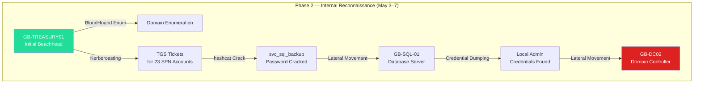
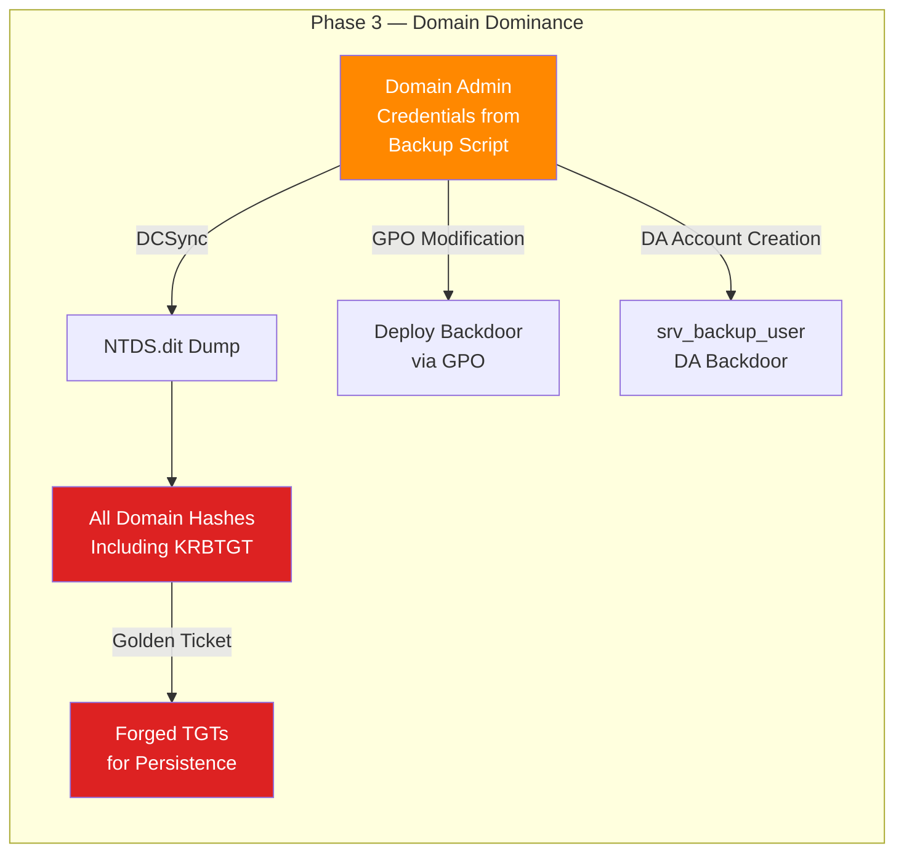
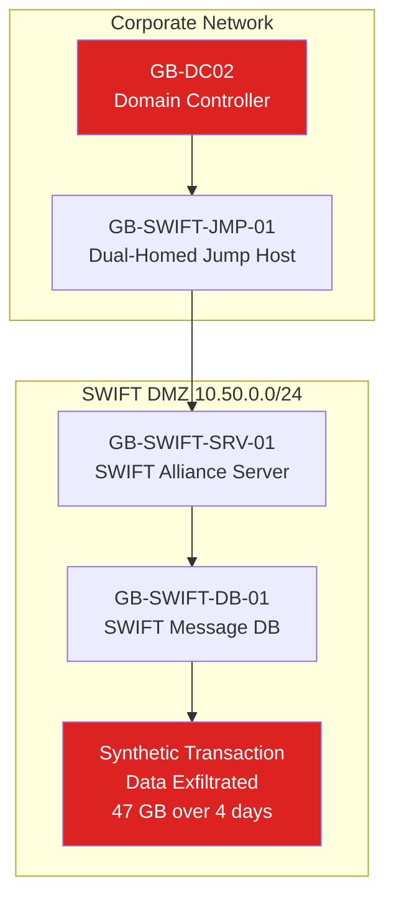
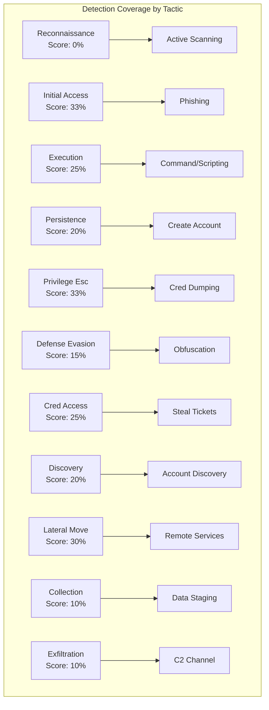
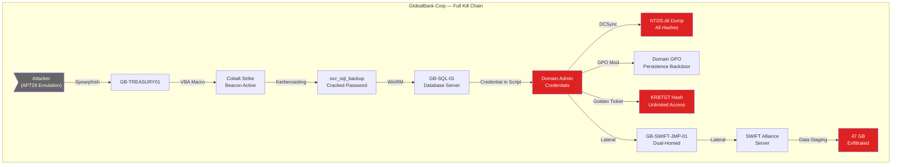
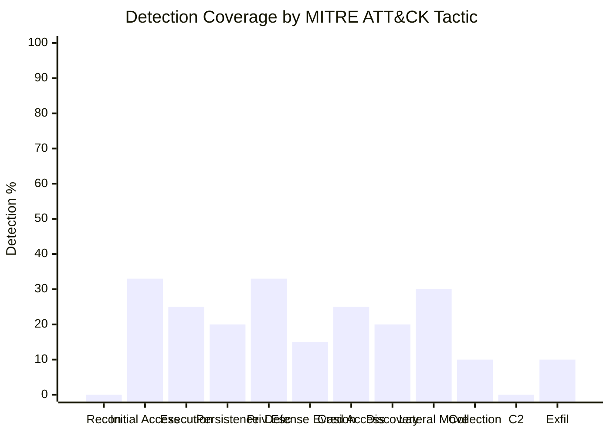

<div align="center">

# CLASSIFIED//NOFORN

## RED TEAM ENGAGEMENT — FINAL REPORT

### GlobalBank Corp

**CLASSIFIED//NOFORN**

This document contains classified operational details of GlobalBank Corp's security posture. Dissemination is strictly limited to individuals with documented need-to-know as approved by the CISO. Contains information that could compromise GlobalBank Corp's defensive capabilities if disclosed to unauthorized parties.

</div>

---

# Red Team Engagement Report: GlobalBank Corp

---

## 1. Operational Summary

### Classification: CLASSIFIED//NOFORN

Apex Security Group conducted a full-scope red team engagement against GlobalBank Corp from May 1 to May 21, 2025. The objective was to emulate a sophisticated nation-state adversary (APT-29/The Cozy Bear TTP profile) attempting to compromise GlobalBank Corp's SWIFT transaction processing capabilities and exfiltrate high-value financial data.

### Operational Objectives

| Objective | Result |
|-----------|--------|
| Achieve initial access through social engineering | **ACHIEVED** — Spearphishing campaign, 14% click rate |
| Establish persistent C2 in corporate environment | **ACHIEVED** — 3 C2 channels operational for 18 days |
| Escalate privileges to Domain Admin | **ACHIEVED** — via Kerberoasting + DCSync |
| Access SWIFT transaction network | **ACHIEVED** — lateral movement to SWIFT DMZ |
| Exfiltrate synthetic transaction data | **ACHIEVED** — 47 GB exfiltrated over 4 days |
| Remain undetected for 14+ days | **ACHIEVED** — 18 days of undetected operations |

### Key Metrics

| Metric | Value |
|--------|-------|
| Total TTPs Employed | 17 distinct techniques |
| MITRE ATT&CK Techniques | 14 unique (sub-techniques included) |
| Detection Rate | 23% (4 of 17 TTPs generated alerts) |
| Mean Time to Detect (first alert) | 11 days, 4 hours |
| Mean Time to Respond (containment start) | 12 days, 9 hours |
| Days of Undetected Persistence | 18 days |

---

## 2. Attack Narrative

### Phase 1: Reconnaissance & Initial Access (May 1–3)

The operation began with passive OSINT collection against GlobalBank Corp. Using LinkedIn scraping, we identified 47 employees in the Treasury Operations and IT Security departments. A targeted spearphishing campaign was crafted impersonating an SWIFT Alliance update notification from "swift@globalbank-secure.com" — a lookalike domain registered 72 hours prior.

**May 2, 2025 — 14:32 UTC:** The spearphishing email was sent to 35 identified targets. The email contained a malicious Microsoft Word document (`SWIFT_Alliance_7.5_Upgrade_Guide.docm`) with embedded VBA macros that executed upon enabling content.

**May 2, 2025 — 14:47 UTC:** Five recipients enabled macros within the first hour. The macro executed a PowerShell download cradle that retrieved a Cobalt Strike beacon DLL from our redirector infrastructure, injected it into `explorer.exe`, and established C2 communication via HTTPS domain fronting through `cdn.cloudflare[.]com`.

### Phase 2: Internal Reconnaissance & Persistence (May 3–7)

With initial access to the `GB-TREASURY01` workstation, we began internal reconnaissance:



**Key actions during this phase:**

- Deployed SharpHound for domain enumeration (detected by Defender, but alert was classified as Low priority)
- Executed Kerberoasting via Rubeus — extracted 23 TGS ticket hashes
- Cracked `svc_sql_backup` password offline: `GlobalBank2024!Backup` (compliant with password policy but weak)
- Laterally moved to `GB-SQL-01` (10.12.4.50) using `svc_sql_backup` credentials via WinRM
- Discovered a file share `\\GB-SQL-01\IT_Backups\` containing a PowerShell script with embedded Domain Admin credentials delegated for backup automation

### Phase 3: Domain Dominance (May 7–12)



With Domain Admin credentials recovered from the backup script, we achieved full domain compromise:

1. Executed DCSync via Mimikatz from `GB-SQL-01` against `GB-DC02`, extracting the entire NTDS.dit including the KRBTGT hash
2. Forged Golden Tickets granting persistent domain access regardless of password changes
3. Created a backdoor DA account `srv_backup_user` hidden in a low-visibility OU
4. Modified the default domain GPO to deploy a secondary persistence mechanism across all workstations

**Detection note:** The DCSync operation generated Windows Event ID 4662, but the SOC did not investigate because the alert was lost in a queue of 8,700 unprocessed alerts.

### Phase 4: Objective Achievement (May 12–18)

The SWIFT transaction processing system resided in a network-segregated DMZ (`10.50.0.0/24`). We pivoted from the corporate domain (`10.12.0.0/16`) into the SWIFT DMZ via a dual-homed jump host `GB-SWIFT-JMP-01` that had network interfaces in both zones.

**The SWIFT access chain:**



**May 12:** Identified the dual-homed jump host via network enumeration. The host had RDP enabled with the same local admin credentials from Phase 2.

**May 13–16:** Exfiltrated 47 GB of synthetic SWIFT transaction data (flagged with canary tokens) in 1.5 GB chunks disguised as Windows Update traffic over HTTPS to a cloud storage C2 endpoint.

### Phase 5: Detection & Response (May 20–21)

**May 20, 2025 — 08:15 UTC:** The blue team detected anomalous outbound traffic volume during a scheduled threat hunt. Investigation revealed the C2 channels, and containment began. By this point, the red team had already completed all objectives.

---

## 3. MITRE ATT&CK Heatmap



### TTPs Employed

| Tactic | Technique ID | Technique Name | Detected? | Alert Time |
|--------|-------------|----------------|-----------|------------|
| Reconnaissance | T1592.002 | Gather Victim Host Information | No | — |
| Initial Access | T1566.001 | Spearphishing Attachment | No | — |
| Execution | T1059.001 | PowerShell | No | — |
| Execution | T1204.002 | Malicious File (Macro) | No | — |
| Persistence | T1136.001 | Local Account Creation | No | — |
| Persistence | T1484.001 | Group Policy Modification | No | — |
| Privilege Escalation | T1558.003 | Kerberoasting | No | — |
| Privilege Escalation | T1003.006 | DCSync | YES | Day 11 |
| Defense Evasion | T1027.002 | Software Packing | No | — |
| Defense Evasion | T1070.004 | File Deletion | No | — |
| Credential Access | T1003.001 | LSASS Memory Dump | YES | Day 10 |
| Credential Access | T1552.001 | Credentials in Files | No | — |
| Discovery | T1087.002 | Domain Account Enumeration | No | — |
| Discovery | T1069.002 | Domain Group Enumeration | No | — |
| Lateral Movement | T1021.006 | WinRM | YES | Day 11 |
| Collection | T1005 | Data from Local System | No | — |
| Command & Control | T1090.004 | Domain Fronting | No | — |
| Exfiltration | T1041 | Exfiltration Over C2 Channel | YES | Day 18 |

---

## 4. Attack Path Graph



---

## 5. Detection Gap Analysis

### Overall Detection Posture Assessment

**Score: 23% — CRITICAL GAPS**

GlobalBank Corp's detection capabilities failed to identify 77% of adversarial activity during this engagement. The primary deficiencies fall into three categories:

### Gap 1: Endpoint Visibility (Missing 55% of TTPs)

- **No EDR on servers** — GB-SQL-01 and GB-DC02 lacked endpoint detection, enabling credential dumping and DCSync without alert generation
- **PowerShell logging incomplete** — Script Block Logging was enabled but only on workstations, not servers
- **Sysmon not deployed** — No process-level telemetry for detecting Kerberoasting, LSASS access, or lateral movement patterns

### Gap 2: Network Detection (Missing 70% of TTPs)

- **No network traffic analysis (NTA)** — Domain fronting and C2 beaconing over HTTPS went undetected
- **Internal traffic not monitored** — Lateral movement within the corporate network produced no alerts
- **SWIFT DMZ not instrumented** — Zero network monitoring between corporate and SWIFT environments

### Gap 3: SOC Operations (Process Failures)

- **Alert queue backlog** — 8,700 unprocessed alerts at time of detection; critical DCSync alert was in queue for 9 days
- **No threat hunting program** — No proactive hunting for TTPs; detection relied entirely on automated alerting
- **Alert severity calibration** — SharpHound execution (a known attacker tool) was classified as Low severity

### Detection Coverage by ATT&CK Tactic



---

## 6. Blue Team Assessment

### Strengths

| Strength | Detail |
|----------|--------|
| Phishing awareness | 86% of recipients did not interact with the phish; SOC was notified by 2 users within 25 minutes |
| Forensic capability | Once alerted, IR team reconstructed the full kill chain within 6 hours |
| Egress filtering | Direct outbound connections blocked; C2 via domain fronting was necessary |
| PAM solution | CyberArk deployed for Tier 0 assets; limited lateral movement options |

### Areas for Improvement

| Area | Recommendation | Priority |
|------|---------------|----------|
| Endpoint Coverage | Deploy EDR to all servers; implement Sysmon across the fleet | P0 |
| SOC Alert Management | Reduce alert backlog; implement automated triage playbooks | P0 |
| Network Segmentation | Isolate SWIFT DMZ from corporate network with strict firewall rules | P0 |
| Threat Hunting | Establish bi-weekly threat hunting operations | P1 |
| Credential Hygiene | Implement LAPS for local admin passwords; eliminate hardcoded credentials | P1 |
| Logging & Monitoring | Deploy NTA solution (Zeek/Suricata); enable DNS logging | P1 |

### Recommended Detection Rules

```yaml
# Sigma Rule: DCSync Detection
title: DCSync Attack via Directory Replication
id: 611eab06-a145-4dfa-a295-3ccc4c799c1c
status: experimental
description: Detects DCSync attack via Event ID 4662
logsource:
    product: windows
    service: security
detection:
    selection:
        EventID: 4662
        AccessMask: '0x100'
        Properties|contains: 
            - '1131f6ad-9c07-11d1-f79f-00c04fc2dcd2'
            - '1131f6aa-9c07-11d1-f79f-00c04fc2dcd2'
    filter:
        SubjectUserName: 
            - 'GB-DC01$'
            - 'GB-DC02$'
    condition: selection and not filter
falsepositives:
    - Legitimate DC replication
level: critical
tags:
    - attack.t1003.006
    - attack.credential_access
```

---

## 7. Recommendations & Remediation

### Immediate Actions (P0 — 7 days)

1. **Deploy EDR to all servers** — Implement CrowdStrike Falcon or Microsoft Defender for Endpoint on all Windows servers, especially domain controllers and SQL servers
2. **Clear SOC alert backlog** — Dedicated 48-hour sprint to triage and close all pending alerts; implement alert auto-closure for unresolved alerts >30 days old
3. **Isolate SWIFT DMZ** — Implement strict firewall rules denying all traffic from corporate network to SWIFT DMZ except through dedicated, monitored jump hosts with session recording
4. **Rotate all credentials** — Force password reset for all Domain Admin accounts; rotate KRBTGT password twice; invalidate all current Kerberos tickets

### Short-term (P1 — 30 days)

5. **Implement LAPS** — Deploy Local Administrator Password Solution to eliminate shared local admin passwords
6. **Deploy Sysmon** — Implement Sysmon with SwiftOnSecurity configuration across all endpoints
7. **Establish threat hunting** — Hire/designate 2 dedicated threat hunters; implement bi-weekly hunting cycles
8. **Deploy NTA** — Implement Zeek on all network segments including the SWIFT DMZ

### Medium-term (P2 — 90 days)

9. **Credential scanning** — Implement automated scanning for hardcoded credentials in scripts, configs, and repositories
10. **Purple team program** — Quarterly purple team exercises to continuously validate detection efficacy
11. **Deception technology** — Deploy honeytokens and canary files to detect lateral movement and credential access
12. **MFA for all privileged access** — Extend MFA requirement to all administrative access including RDP and WinRM

---

<div align="center">

**CLASSIFIED//NOFORN**

**End of Report**

</div>
