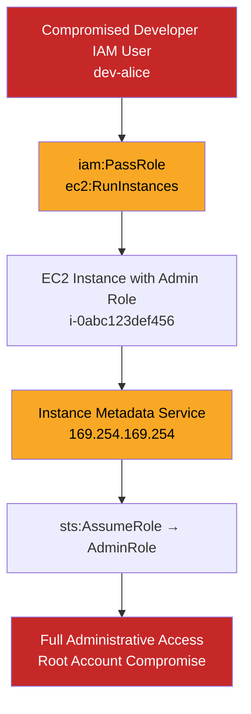
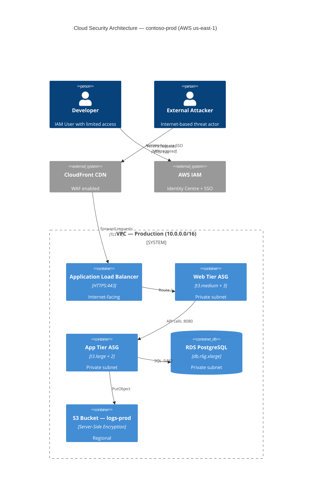
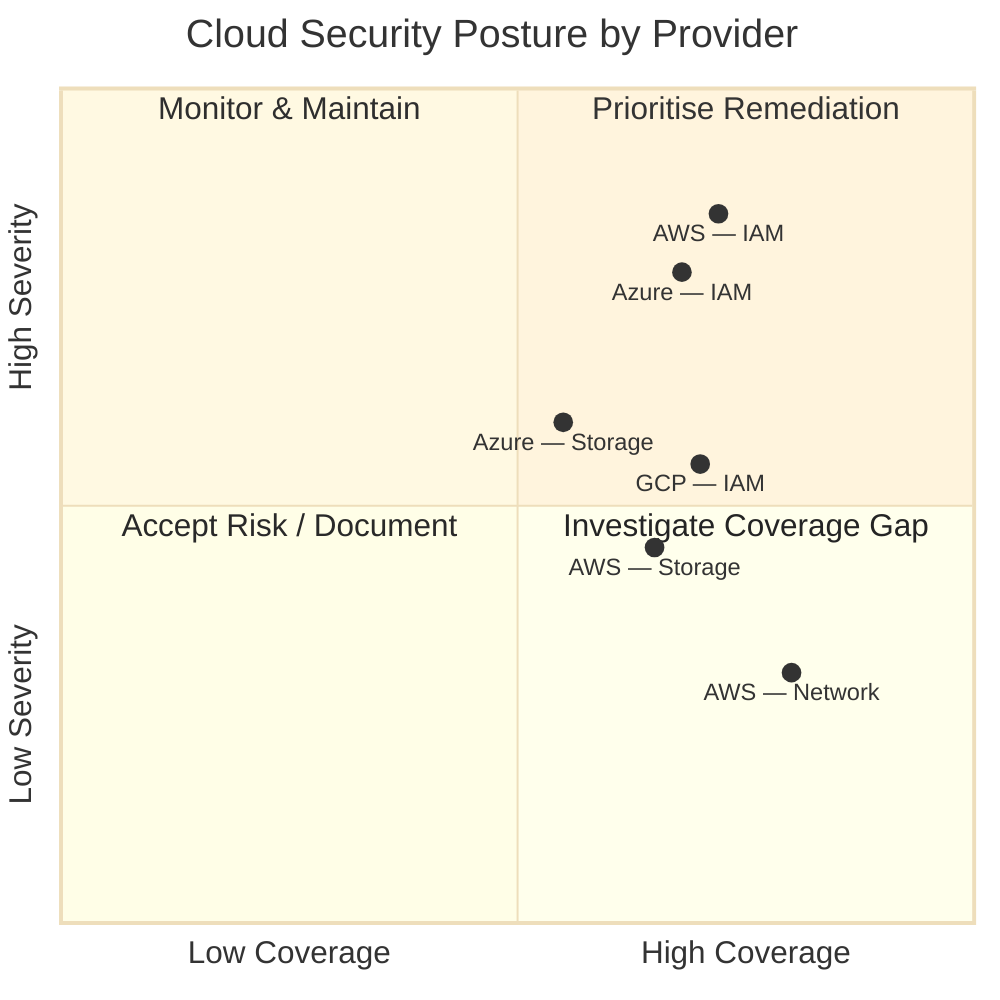

# Cloud Security Assessment Report

## Overview

This skill generates an adversary-perspective cloud security assessment
report — the deliverable a senior cloud security consultant would produce
after a multi-week CSPM (Cloud Security Posture Management) engagement.
Unlike a pure compliance audit, this report emphasises **exploitable
misconfigurations**, **identity-based attack paths**, and **cloud-native
threat modelling** using the MITRE ATT&CK Cloud Matrix.

The report ingests data from cloud-native assessment tools (ScoutSuite,
Prowler, Cloudsplaining, Terrascan, Trivy, AWS Config aggregator, Azure
Defender for Cloud, GCP Security Command Center) and third-party CSPM
platforms (Wiz, Orca, Prisma Cloud).

Every finding is contextualised within the shared responsibility model
and mapped to IASME governance criteria: **Identify, Protect, Detect,
Respond, Recover**.

## Workflow (9 Steps)

### Step 1: Multi-Cloud Data Ingestion
Ingest findings from heterogeneous cloud security tooling:
- **AWS**: ScoutSuite JS, Prowler JSON/CSV, Cloudsplaining JSON, AWS
  Config advanced queries, Security Hub aggregated findings (ASFF)
- **Azure**: AzSkim JSON, Azure Defender for Cloud recommendations CSV,
  AzAdvertizer reports
- **GCP**: Forseti JSON, GCP Security Command Center findings CSV,
  GCPBucketBrute output
- **Kubernetes**: kube-bench JSON, Trivy misconfiguration reports,
  Kubescape JSON, Falco runtime alerts
- **Infrastructure as Code**: Terrascan JSON, Checkov JSON, tfsec JSON,
  KICS JSON

Normalise all sources into the canonical cloud finding schema. Resolve
conflicting severity ratings using the highest-risk source. Deduplicate
findings where CSPM tools report overlapping issues (e.g. S3 bucket
public access detected by both ScoutSuite and Prowler).

### Step 2: Cloud Asset Inventory
Build a unified asset inventory across all assessed cloud environments:
- **Compute**: EC2, Azure VM, GCE instances, Lambda/Functions, container
  clusters (ECS, AKS, GKE), serverless functions
- **Storage**: S3 buckets, Azure Blob Storage, GCS buckets, EBS/Azure Disk/
  Persistent Disk volumes, RDS/CosmosDB/Cloud SQL instances
- **Identity**: IAM users/roles/policies, Azure AD/Entra ID principals,
  GCP IAM members, service accounts, federated identities
- **Network**: VPCs/VNets, subnets, security groups/NSGs, NACLs, VPC Flow
  Logs, WAFs, CloudFront/Azure Front Door/Cloud CDN, load balancers
- **Secrets & Key Management**: KMS keys, Azure Key Vault, Secret Manager,
  Parameter Store, certificates in ACM

### Step 3: Identity & Access Management Analysis
Deep-dive into IAM posture:
- **Privilege Escalation Paths**: Identify roles/users with permission
  combinations enabling vertical or horizontal escalation (e.g.
  `iam:PassRole` + `ec2:RunInstances`, `iam:CreatePolicyVersion`,
  `iam:SetDefaultPolicyVersion`)
- **Cross-Account Trust**: Audit all trust policies permitting external
  AWS account access, Azure cross-tenant invitations, GCP cross-project
  IAM bindings
- **Service Account Hygiene**: Identify overly permissive service
  accounts, unrotated access keys, service accounts with 0-day last-used
  timestamps, GCP service account keys older than 90 days
- **Federation Risks**: Audit SAML/OIDC identity provider configurations,
  conditional access policy gaps, privileged role assignment without PIM
  elevation requirement

### Step 4: Storage Security Assessment
Enumerate data exposure risks:
- **Public Exposure**: S3 buckets/Blob containers/GCS buckets with
  `AllUsers` or `AllAuthenticatedUsers` grants
- **Encryption Gaps**: Resources lacking encryption at rest (default KMS/
  SSE-S3/Azure Storage Service Encryption) or encryption in transit
  (TLS < 1.2)
- **Object-Level Logging**: CloudTrail Data Events, Azure Storage
  Analytics Logs, GCS Audit Logs — identify buckets without logging
  enabled
- **Versioning & Object Lock**: Buckets without versioning or WORM
  object lock (ransomware resilience gap)

### Step 5: Network Security Analysis
Map network exposure:
- **Security Group/NSG Analysis**: Identify rules with 0.0.0.0/0 ingress
  on sensitive ports (22, 3389, 1433, 3306, 5432, 6379, 27017)
- **VPC/Subnet Architecture**: Validate segmentation between tiers,
  identify missing NACLs, assess VPC peering/Transit Gateway hygiene
- **Web Application Firewall**: Audit WAF association coverage, rule
  group configuration, rate-limiting rule presence
- **DDoS Protection**: Verify AWS Shield Advanced, Azure DDoS Protection
  Standard, or Cloudflare Magic Transit deployment

### Step 6: Compute & Workload Security
Assess compute-layer posture:
- **Instance Metadata Service**: Verify IMDSv2 enforcement (AWS),
  metadata server protection (Azure), metadata concealment (GCP)
- **Container Security**: Audit ECS task definitions, AKS pod security
  standards, GKE workload identity — identify privileged containers,
  host network/host PID/host IPC mode pods
- **Serverless Security**: Lambda execution role analysis, Azure Function
  Managed Identity assignments, Cloud Functions IAM bindings
- **Image Hygiene**: Assess whether image scanning (ECR/ACR/GCR) is
  enforced and whether images run as non-root

### Step 7: MITRE ATT&CK Cloud Matrix Mapping
Map findings to adversary techniques from the MITRE ATT&CK Cloud Matrix
(IAAS, SaaS, Identity Provider, Office 365 sub-techniques):
- **TA0001 Initial Access**: Consented phishing OAuth apps, exposed
  storage, compromised CI/CD (CS/CC/CD pipelines)
- **TA0003 Persistence**: IAM backdoor users, cross-account trust abuse,
  unauthorised OAuth applications
- **TA0004 Privilege Escalation**: IAM privilege escalation chains,
  Azure AD PIM bypass, GCP Org Policy circumvention
- **TA0005 Defence Evasion**: CloudTrail/Activity Log/Audit Log
  disruption, GuardDuty IP-set poisoning
- **TA0006 Credential Access**: EC2 instance metadata SSRF, Azure IMDS
  scraping, GCP metadata endpoint abuse
- **TA0010 Exfiltration**: S3/Blob/GCS data transfer via presigned URLs,
  CloudFront/OIDC data staging, cross-account snapshot sharing

### Step 8: Compliance Governance
Map findings to governance frameworks:
- **CIS Benchmarks** (AWS Foundations v1.5.0 / Azure Foundations v1.5.0 /
  GCP Foundations v2.0.0)
- **CSA Cloud Controls Matrix v4.0.1**
- **NIST SP 800-53 Rev 5** (cloud-relevant control families)
- **OWASP Cloud-Native Application Security Top 10**
- **PCI DSS v4.0.1** (cloud-relevant requirements, 6.4.2, 7.2, etc.)

### Step 9: Remediation & Hardening Roadmap
Produce cloud-specific remediation guidance:
- **Immediate (0–7 days)**: Publicly exposed storage, IAM privilege
  escalation chains, admin accounts without MFA
- **Short-Term (7–30 days)**: Unencrypted data stores, unrestricted
  security groups, missing logging, unrotated access keys
- **Medium-Term (30–90 days)**: Network segmentation improvements,
  WAF deployment, image scanning enforcement
- **Long-Term (> 90 days)**: Org-wide SCPs, Azure Policy, GCP Org
  Policies; landing zone refactoring; zero-trust architecture adoption

---

## Input Schema

```yaml
engagement_metadata:
  engagement_id: string
  assessment_date: date
  assessor: string
  client: string
  cloud_providers: [string]    # aws | azure | gcp
  scope_accounts: [string]     # Account/Subscription/Project IDs

cloud_assets:
  compute:
    - provider: string         # aws | azure | gcp
      resource_type: string    # ec2 | vm | gce | lambda | function | cloud_function
      resource_id: string
      name: string
      region: string
      tags: {}
      network_interfaces:
        - public_ip: string
          private_ip: string
          subnet_id: string
          security_groups: [string]
      iam_role: string         # Attached instance profile / managed identity / service account

  storage:
    - provider: string
      resource_type: string    # s3 | blob | gcs
      name: string
      region: string
      public_access_block: {}
      encryption:
        algorithm: string
        key_id: string
      logging_enabled: boolean
      versioning_enabled: boolean

  identity:
    - provider: string
      principal_type: string   # iam_user | iam_role | azure_ad_user | azure_ad_sp | gcp_sa
      principal_name: string
      policies_attached: [string]
      inline_policies: {}
      access_keys:
        - key_id: string
          created: date
          last_used: date
          status: string       # Active | Inactive
      mfa_enabled: boolean

  network:
    - provider: string
      resource_type: string    # vpc | vnet | subnet | security_group | nsg | nacl | waf
      name: string
      rules:
        ingress:
          - protocol: string
            port: integer
            cidr: string
            description: string
        egress:
          - protocol: string
            port: integer
            cidr: string

raw_findings:
  - source_tool: string
    source_format: string      # json | csv | asff
    data: {}                   # Raw finding payload

branding:
  logo_path: string
  primary_color: string
  secondary_color: string
  confidentiality: string
  document_number: string

output:
  format: string              # pdf | docx | html | markdown
  include_raw_findings: boolean
  include_evidence: boolean
  target_path: string
```

## Output Schema

```yaml
report:
  metadata:
    generated_at: datetime
    cloud_providers_assessed: [string]
    total_resources_scanned: integer
    total_findings: integer
    critical_findings: integer
    high_findings: integer
    overall_risk: string

  executive_summary:
    cloud_maturity_rating: string     # A-F letter grade
    provider_breakdown:
      aws: { score: float, findings: integer }
      azure: { score: float, findings: integer }
      gcp: { score: float, findings: integer }
    top_attack_paths: [string]
    blast_radius_analysis: string

  cloud_asset_inventory:
    - provider: string
      compute_count: integer
      storage_count: integer
      identity_principal_count: integer
      unmanaged_resources: integer

  iam_analysis:
    privilege_escalation_paths:
      - principal: string
        technique: string
        steps: [string]
        risk: string
    excessive_privileges:
      - principal: string
        unused_permissions: [string]
        recommendation: string

  storage_security:
    publicly_exposed:
      - resource: string
        provider: string
        exposure_type: string
        data_classification: string
    encryption_gaps:
      - resource: string
        issue: string

  network_security:
    internet_facing_services:
      - resource: string
        port: integer
        cidr: string
        risk: string
    segmentation_findings:
      - description: string
        impacted_zones: [string]

  attack_path_analysis:
    - attack_path_id: string
      mitre_technique: string
      entry_point: string
      target: string
      steps: [string]
      likelihood: string
      impact: string

  compliance_matrix:
    - framework: string
      control_id: string
      status: string
      resource_count: integer
      findings: [string]

  remediation_plan:
    - phase: string
      items:
        - finding_ref: string
          resource: string
          procedure: string
          terraform_snippet: string
          cli_command: string
          effort: string

  charts:
    - asset_topology: string      # Mermaid C4 diagram
    - attack_path_graph: string   # Mermaid flow
    - compliance_radar: string
```

## Canonical Cloud Finding Schema

```yaml
cloud_finding:
  id: string                  # UUIDv4
  provider: string            # aws | azure | gcp
  service: string             # e.g. "S3", "Azure AD", "GKE"
  resource_arn: string        # Full resource ARN / resource ID
  resource_name: string
  resource_type: string
  region: string
  account_id: string          # AWS account / Azure subscription / GCP project
  category: string            # iam | storage | network | compute | logging | encryption | secrets
  severity: string            # Critical | High | Medium | Low
  title: string
  description: string
  impact: string              # Business and security impact narrative
  shared_responsibility: string  # Customer | Provider | Shared
  detection:
    tool: string              # e.g. "ScoutSuite", "Prowler", "AWS Config"
    check_id: string
    evidence: string          # CLI output, screenshot, or config snippet
  exploitation:
    preconditions: [string]
    attack_steps: [string]
    blast_radius: string
    mitre_technique: string   # e.g. "T1525", "T1613"
  remediation:
    console_steps: string     # Console-based remediation
    cli_command: string       # AWS CLI / az CLI / gcloud command
    terraform_fix: string     # IaC remediation snippet
    prevention: string        # Prevent recurrence (SCP, Org Policy, etc.)
  compliance:
    cis_benchmark: string     # e.g. "CIS AWS 1.5.0 § 2.1.1"
    csa_ccm: string           # e.g. "IAM-05"
    nist_800_53: string
    owasp_cloud_native: string
  risk:
    likelihood: string        # Very Likely | Likely | Possible | Unlikely | Rare
    impact_level: string      # Catastrophic | Major | Moderate | Minor | Negligible
    aggregate_risk: string    # Critical | High | Medium | Low
  metadata:
    first_observed: datetime
    last_observed: datetime
    status: string            # Open | Remediated | Risk Accepted | False Positive
    jira_ticket: string
```

## Report Structure

### 1. Executive Summary
- **Cloud Security Maturity Rating** (A–F, breakdown by provider)
- **Crown Jewels at Risk**: Top 3 exploitable attack paths
- **Blast Radius Analysis**: Worst-case impact of compromised IAM principal
- **Shared Responsibility Gaps**: Where the org is failing its side of the model
- **Quick Wins**: 5 remediations achievable in < 8 hours

### 2. Cloud Asset Inventory
- Provider-by-provider asset count summary
- Unmanaged/untagged resources (shadow IT in cloud)
- Architecture topology diagram (Mermaid C4)

### 3. Identity & Access Management Analysis
- Privilege escalation graph with visual attack paths
- Top 10 over-privileged principals with excessive permission report
- Cross-account/cross-tenant trust matrix
- Service account drift analysis

### 4. Storage Security Assessment
- Public exposure register with data classification
- Encryption compliance matrix (at-rest, in-transit, key management)
- Object logging gap analysis
- Ransomware resilience score (versioning, object lock, cross-region replication)

### 5. Network Security Assessment
- Internet-facing attack surface enumeration
- Security group / NSG hygiene score
- Segmentation effectiveness assessment
- DDoS/WAF coverage mapping

### 6. Compliance Matrix
Multi-framework heatmap mapping CIS, CSA CCM, NIST 800-53, OWASP Cloud-Native
controls to findings. Each cell shows: compliant (green), partially compliant
(amber), non-compliant (red), not assessed (grey).

### 7. Remediation Plan
Phased remediation with executable CLI/Terraform snippets and effort
estimates in person-hours.

### 8. Appendices
- Full finding register
- Tooling methodology and versions
- IAM policy analysis deep-dive
- Glossary

---

## Quality Controls

### QC-1: Multi-Source Deduplication
Cross-reference findings from ScoutSuite, Prowler, Security Hub, and CSPM
tools. If the same S3 bucket appears as publicly exposed in three tools,
consolidate into a single finding with all source references.

### QC-2: IAM Policy Complexity Threshold
Flag IAM policies exceeding 6,144 characters (AWS managed policy size limit
warning). Flag inline policies attached to more than 5 principals (indicating
policy reuse anti-pattern).

### QC-3: Network Exposure Validation
For every security group/NSG rule allowing 0.0.0.0/0 ingress, verify whether
the associated resource is internet-facing via a public IP. If no public IP,
downgrade the finding severity by one level.

### QC-4: Encryption Cascade Check
If a KMS CMK is used for S3 encryption, verify the CMK key policy does not
grant `kms:Decrypt` to `*`. If the enclosing S3 bucket is public, escalate
the combined finding to Critical.

### QC-5: Cross-Account Trust Recursion
Follow cross-account trust chains transitively. If Account A trusts Account B
and Account B trusts Account C, flag the transitive trust path and include it
in the attack path analysis.

### QC-6: Provider Parity Gap
If the engagement covers multiple cloud providers, identify controls assessed
on one provider but not on others (e.g. WAF rules checked on AWS but not on
Azure). Flag as a coverage gap.

### QC-7: Severity Inflation Guard
If more than 40% of findings are rated Critical or High, trigger a review
flag. Either the environment is severely compromised or the severity
thresholds need recalibration. Compare against CSPM industry benchmarks.

### QC-8: Remediation Executability
Every Critical finding must have a populated `cli_command` or `terraform_fix`
field. Run a dry-run syntax check on all provided CLI snippets against the
corresponding cloud provider's CLI specification.

---

## Mermaid Cloud Architecture Diagrams

### Attack Path Graph (AWS IAM Privilege Escalation)



### Cloud Asset Topology (C4 Container Diagram)



### Compliance Coverage Radar (Multi-Provider)



---

## Example 1: AWS Multi-Account Assessment

### Input Snippet
```yaml
cloud_assets:
  storage:
    - provider: aws
      resource_type: s3
      name: customer-data-prod
      region: us-east-1
      public_access_block:
        BlockPublicAcls: false
        BlockPublicPolicy: false
        IgnorePublicAcls: false
        RestrictPublicBuckets: false
      encryption:
        algorithm: AES256
        key_id: null
      logging_enabled: false
      versioning_enabled: false
  identity:
    - provider: aws
      principal_type: iam_user
      principal_name: dev-john
      policies_attached:
        - AdministratorAccess
      access_keys:
        - key_id: "AKIA-EXAMPLE-KEY-ID"
          created: 2024-03-15
          last_used: 2026-05-28
          status: Active
      mfa_enabled: false
```

### Generated Finding (S3 Public Exposure)
```yaml
cloud_finding:
  id: "a1b2c3d4-e5f6-7890-abcd-ef1234567890"
  provider: aws
  service: S3
  resource_arn: "arn:aws:s3:::customer-data-prod"
  category: storage
  severity: Critical
  title: "S3 Bucket Publicly Accessible via ACL and Bucket Policy"
  exploitation:
    preconditions:
      - "Attacker discovers bucket via DNS brute-force or certificate transparency"
    attack_steps:
      - "curl https://customer-data-prod.s3.amazonaws.com/ → lists objects"
      - "Download sensitive customer PII via GetObject"
    mitre_technique: "T1530 (Data from Cloud Storage)"
  remediation:
    cli_command: |
      aws s3api put-public-access-block --bucket customer-data-prod \
        --public-access-block-configuration \
        BlockPublicAcls=true,IgnorePublicAcls=true,\
        BlockPublicPolicy=true,RestrictPublicBuckets=true
    terraform_fix: |
      resource "aws_s3_bucket_public_access_block" "customer_data_prod" {
        bucket                  = aws_s3_bucket.customer_data_prod.id
        block_public_acls       = true
        block_public_policy     = true
        ignore_public_acls      = true
        restrict_public_buckets = true
      }
  compliance:
    cis_benchmark: "CIS AWS Foundations v1.5.0 § 2.1.5"
    csa_ccm: "IAM-05"
    nist_800_53: "AC-3, SC-8"
    owasp_cloud_native: "CNAS-2 (Excessive Data Exposure)"
  risk:
    likelihood: Very Likely
    impact_level: Catastrophic
    aggregate_risk: Critical
```

### Executive Summary Table

| Metric | Value |
|---|---|
| Cloud Maturity Rating | D+ (58.3%) |
| AWS Accounts Assessed | 12 (1 management + 11 member) |
| Total Resources Scanned | 4,821 |
| Critical Findings | 7 |
| High Findings | 34 |
| Publicly Exposed S3 Buckets | 3 (2 containing PII) |
| IAM Users Without MFA | 28 (including 4 with AdministratorAccess) |
| Active Access Keys > 90 Days | 41 |
| Recommended Immediate Action | Enable S3 Block Public Access at org level; rotate all unrotated keys |

---

## Example 2: Azure Enterprise Assessment

### Input Snippet
```yaml
cloud_assets:
  identity:
    - provider: azure
      principal_type: azure_ad_sp
      principal_name: sp-legacy-app-prod
      inline_policies: {}     # Role: Contributor on subscription
      access_keys:
        - key_id: "abc123..."
          created: 2023-08-01
          last_used: 2024-01-15
          status: Active       # Key not rotated, unused for 28 months
  compute:
    - provider: azure
      resource_type: vm
      resource_id: "/subscriptions/.../virtualMachines/web-prod-01"
      name: web-prod-01
      network_interfaces:
        - public_ip: "52.1.2.3"
          security_groups: ["nsg-web-tier"]
  network:
    - provider: azure
      resource_type: nsg
      name: nsg-web-tier
      rules:
        ingress:
          - protocol: TCP
            port: 3389
            cidr: "0.0.0.0/0"
            description: "RDP access"
```

### Generated Finding (Service Principal Key Drift)
```yaml
cloud_finding:
  id: "b2c3d4e5-f6a7-8901-bcde-f12345678901"
  provider: azure
  service: Azure AD / Entra ID
  resource_name: "sp-legacy-app-prod"
  category: identity
  severity: High
  title: "Service Principal with Stale Credentials and Subscription Contributor Role"
  description: >
    Service principal 'sp-legacy-app-prod' holds the Contributor RBAC role
    at the subscription scope and has an active client secret that has not
    been rotated since August 2023. The credential has not been used for
    authentication in over 28 months, indicating the application may be
    decommissioned but its identity and privileges persist.
  exploitation:
    preconditions:
      - "Secret leaked via source code, CI/CD logs, or phishing"
    attack_steps:
      - "Authenticate as sp-legacy-app-prod using leaked secret"
      - "Deploy VMs, modify network rules, exfiltrate data from any resource group"
    blast_radius: "Entire production subscription"
    mitre_technique: "T1525 (Implant Internal Image), T1078.004 (Cloud Accounts)"
  remediation:
    cli_command: |
      # Identify and rotate
      az ad sp credential reset --id <object-id> --years 1
      # Or remove the service principal if decommissioned
      az ad sp delete --id <object-id>
    prevention: >
      Deploy Azure Policy to enforce credential expiry ≤ 365 days. Enable
      Microsoft Entra Workload Identity Federation to eliminate static secrets
      in favour of federated credentials.
  compliance:
    cis_benchmark: "CIS Azure Foundations v1.5.0 § 1.21"
    csa_ccm: "IAM-11"
    nist_800_53: "IA-5(1), AC-2(3)"
    owasp_cloud_native: "CNAS-3 (Inadequate Identity & Access Management)"
  risk:
    likelihood: Likely
    impact_level: Major
    aggregate_risk: High
```

### Compliance Dashboard (Azure-Specific)

| Framework | Control | Status | Impacted Resources |
|---|---|---|---|
| CIS Azure v1.5.0 | 1.21 — Ensure no custom subscription owner roles | Compliant | 0 |
| CIS Azure v1.5.0 | 1.5 — Guest users review | Non-Compliant | 12 guest users, 4 with active access |
| CIS Azure v1.5.0 | 6.1 — RDP from Internet | Non-Compliant | 3 VMs |
| CSA CCM v4 | IAM-11 — Timely revocation | Non-Compliant | 5 service principals |
| NIST 800-53 | IA-5(1) — Password-based auth | Non-Compliant | 28 users without MFA |
| OWASP Cloud-Native | CNAS-3 — IAM | Non-Compliant | Multiple |

---

## Branding Configuration

```yaml
branding:
  logo:
    primary: "/assets/logo/cyber_consultancy_logo.png"
    report_header: "/assets/logo/cyber_consultancy_header.png"
    size_header_px: 220
  colors:
    primary: "#1a56db"
    secondary: "#0f3b8c"
    aws_accent: "#FF9900"
    azure_accent: "#0078D4"
    gcp_accent: "#4285F4"
    severity_critical: "#b71c1c"
    severity_high: "#e65100"
    severity_medium: "#f9a825"
    severity_low: "#2e7d32"
    compliant: "#2e7d32"
    non_compliant: "#c62828"
    partially_compliant: "#f57f17"
    not_assessed: "#9e9e9e"
  typography:
    heading_font: "Inter, Helvetica Neue, Arial, sans-serif"
    body_font: "Source Serif 4, Georgia, serif"
    code_font: "JetBrains Mono, Fira Code, monospace"
    heading_size_base_pt: 26
    body_size_pt: 10.5
    code_size_pt: 9
  confidentiality:
    marking: "CONFIDENTIAL — CLIENT PRIVILEGED"
    banner_text: >
      This cloud security assessment report contains privileged information
      regarding the security posture of CLIENT cloud infrastructure.
      Distribution is restricted to designated recipients under the
      Master Services Agreement.
    watermark: true
    watermark_text: "CLIENT CONFIDENTIAL"
  document:
    template: "cloud_security_report.latex"
    page_size: A4
    margin_mm: 20
    header_footer: true
    code_block_style: "one-dark"
    table_stripe: true
```
