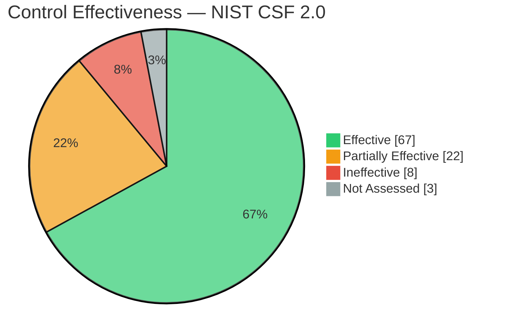
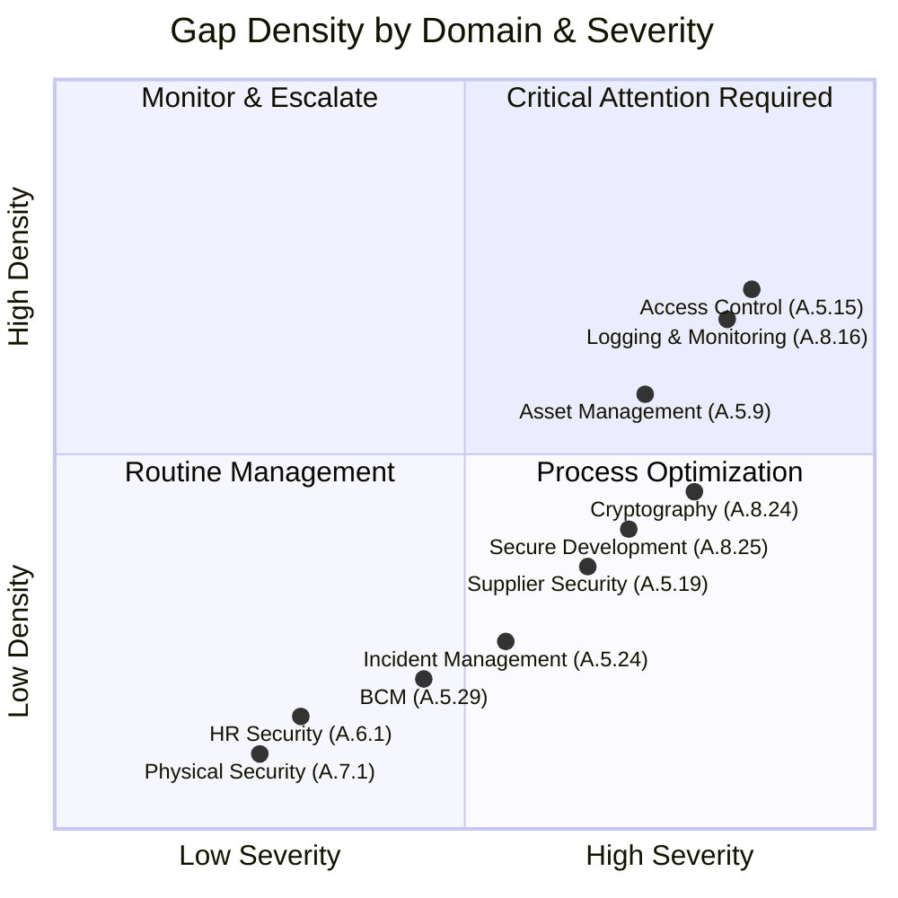

# Compliance Assessment Report

## Overview
Generate comprehensive compliance assessment reports aligned with ISO 27001:2022, NIST Cybersecurity Framework (CSF) 2.0, CIS Controls v8, NIST SP 800-53 Rev 5, PCI DSS 4.0.1, SOC 2 Type II, GDPR, HIPAA Security Rule, and the NIST Risk Management Framework (RMF). This skill produces audit-ready deliverables with control assessment matrices, gap analyses, maturity ratings, and prioritized remediation roadmaps suitable for external auditors, board risk committees, and regulatory submissions.

## Branding & Classification
- **Classification Banner**: `CONFIDENTIAL — AUDIT PRIVILEGE — INTERNAL USE ONLY`
- **Document ID Convention**: `CMP-YYYY-MMDD-NNN` (e.g., `CMP-2026-0601-001`)
- **Watermark**: Diagonal "CONFIDENTIAL" across all pages
- **Distribution**: Limited to GRC team, CISO, external auditors (under NDA)

| Field | Value |
|-------|-------|
| Skill Name | compliance-report |
| Version | 1.0.0 |
| Category | GRC |
| Standards | ISO 27001:2022, NIST CSF 2.0, CIS Controls v8, NIST SP 800-53 Rev 5, PCI DSS 4.0.1, SOC 2 (TSC 2017), GDPR Art. 32, HIPAA Security Rule, NIST RMF (SP 800-37 Rev 2) |

---

## 9-Step Workflow

### Step 1: Scope Definition & Framework Selection
Define the assessment scope: organizational boundaries, business units, geographies, technology stacks, third-party dependencies. Select applicable compliance frameworks based on regulatory requirements, contractual obligations, and business vertical. Document framework-to-control cross-walks for multi-framework assessments.

**Artifacts**: Scope Statement, Framework Selection Matrix, Control Cross-Walk

### Step 2: Control Inventory & Evidence Requirements
Catalog all applicable controls organized by framework domain/clause. Define evidence requirements per control: document type, expected format, sampling methodology, and acceptance criteria. Create evidence request lists (ERL) for control owners.

**Artifacts**: Control Inventory Register, Evidence Requirements Matrix, Evidence Request List

### Step 3: Evidence Collection & Validation
Collect control evidence from system owners, process owners, and automated tooling (CSPM, SIEM, IAM, vulnerability scanners). Validate evidence authenticity, completeness, and currency. Flag missing, insufficient, or expired evidence.

**Artifacts**: Evidence Collection Tracker, Evidence Validation Log, Deficiency Register

### Step 4: Control Assessment & Effectiveness Rating
Assess each control's design effectiveness (is it designed correctly?) and operational effectiveness (is it operating as designed?). Rate each control: Effective, Partially Effective, Ineffective, Not Applicable. Document testing methodology, sample size, and test results per control.

**Artifacts**: Control Assessment Matrix, Design Effectiveness Register, Operational Effectiveness Register

### Step 5: Gap Analysis
Identify control gaps: missing controls, partially implemented controls, ineffective controls, and documentation deficiencies. Map gaps to specific framework requirements. Calculate gap severity (Critical/High/Medium/Low) based on residual risk exposure.

**Artifacts**: Gap Analysis Report, Gap-to-Framework Mapping, Risk Exposure Calculation

### Step 6: Maturity Assessment
Assess organizational maturity across capability domains using CMMI-based maturity levels (Initial, Managed, Defined, Quantitatively Managed, Optimizing). Rate each domain: people, process, technology, governance, metrics. Produce maturity radar charts per framework domain.

**Artifacts**: Maturity Assessment Report, Maturity Radar Charts, Domain Scorecards

### Step 7: Remediation Plan
Develop a prioritized remediation roadmap addressing all identified gaps. Assign owners, target completion dates, estimated effort, and dependencies per remediation item. Align remediation phases with business risk appetite and audit cycles.

**Artifacts**: Remediation Plan, Remediation Tracker, Resource Estimation Matrix

### Step 8: Audit Readiness Scoring
Calculate an audit readiness score (0-100%) based on control coverage, evidence completeness, control effectiveness ratings, and maturity levels. Identify audit blockers: missing critical evidence, ineffective key controls, undocumented processes.

**Artifacts**: Audit Readiness Scorecard, Audit Blocker Register, Readiness Calculator

### Step 9: Report Assembly & Delivery
Assemble all artifacts into the final structured report. Generate compliance posture overview with radar charts and heatmaps. Apply branding and classification. Execute QC gates. Deliver via secure channel.

**Artifacts**: Final Compliance Report (PDF), Executive Summary, Regulatory Submission Package

---

## Compliance-Specific Schemas

### Control Assessment Schema
```json
{
  "control_assessment": {
    "id": "CTRL-001",
    "framework": "iso27001:2022|nist_csf_2.0|cis_v8|nist_800_53|pci_dss_4.0|soc2_tsc|gdpr_art32|hipaa",
    "domain": "string (e.g., A.5 — Organizational Controls)",
    "control_id": "string (e.g., A.5.1, ID.AM-1, CIS Control 1.1)",
    "control_title": "string",
    "control_description": "string",
    "design_effectiveness": "effective|partially_effective|ineffective|not_applicable",
    "operational_effectiveness": "effective|partially_effective|ineffective|not_applicable",
    "overall_rating": "effective|partially_effective|ineffective",
    "testing_methodology": "document_review|interview|automated_scan|configuration_review|log_analysis|walkthrough",
    "sample_size": "integer or string (e.g., '100%', '30 transactions')",
    "test_results_summary": "string (max 500 chars)",
    "evidence_references": ["EVID-001", "EVID-002"],
    "deficiencies": ["DEF-001"],
    "remediation_items": ["REM-001"],
    "assessor": "string (name/role)",
    "assessment_date": "ISO8601"
  }
}
```

### Gap Analysis Schema
```json
{
  "gap_entry": {
    "id": "GAP-001",
    "framework_ref": "string (e.g., ISO 27001 A.5.4, NIST CSF ID.RA-1)",
    "gap_description": "string (max 500 chars)",
    "gap_type": "missing_control|partially_implemented|ineffective_control|documentation_deficiency|evidence_gap",
    "severity": "critical|high|medium|low",
    "risk_scenario": "string (what could go wrong if this gap is not addressed)",
    "residual_risk_score": "float (0.0—10.0)",
    "affected_assets": ["string array"],
    "remediation_id": "REM-001",
    "remediation_priority": "immediate|short_term|medium_term|long_term",
    "detected_date": "ISO8601"
  }
}
```

### Maturity Rating Schema
```json
{
  "maturity_assessment": {
    "id": "MAT-001",
    "domain": "people|process|technology|governance|metrics",
    "framework_mapping": "string (e.g., NIST CSF IDENTIFY)",
    "current_level": "initial|managed|defined|quantitatively_managed|optimizing",
    "target_level": "initial|managed|defined|quantitatively_managed|optimizing",
    "rating": "integer (1-5, mapped to CMMI levels)",
    "strengths": ["string array"],
    "weaknesses": ["string array"],
    "improvement_recommendations": ["string array"],
    "evidence_references": ["EVID-001"]
  }
}
```

---

## Report Structure

### 1. Executive Summary (~2 pages)
- Assessment scope and period
- Overall compliance posture (percentage of controls effective)
- Audit readiness score and key findings (3-5 bullets)
- Critical gaps requiring immediate attention
- Remediation timeline overview
- Resource and budget estimate summary

### 2. Compliance Posture Overview
- Multi-framework compliance heatmap (controls by framework, domain, and rating)
- Radar/maturity charts per framework domain
- Year-over-year trend comparison (if applicable)
- Industry benchmark comparison (if available)

### 3. Control Assessment Matrix
- Tabular control-by-control assessment results
- Filterable by framework, domain, owner, rating
- Evidence status per control (collected, pending, missing, expired)
- Deficiency linkage per control

### 4. Gap Analysis
- Prioritized gap register with risk scores
- Gap-to-framework mapping
- Root cause analysis for systemic gaps
- Gap density heatmap by domain

### 5. Maturity Assessment
- Domain-level maturity scores with CMMI level descriptions
- Radar chart visualization per framework
- Target maturity roadmap with milestone dates

### 6. Remediation Plan
- Prioritized remediation items with owners and deadlines
- Effort estimation (person-days) and resource requirements
- Dependency graph (Mermaid flowchart)
- Phase 1 (0-30 days), Phase 2 (30-90 days), Phase 3 (90-180 days), Phase 4 (180+ days)

### 7. Audit Readiness Score
- Overall readiness score (0-100%)
- Readiness breakdown by framework
- Audit blocker register
- Readiness trajectory (projected scores over next 3 quarters)

### Appendix A: Framework Cross-Walk Matrix
### Appendix B: Evidence Inventory
### Appendix C: Interview Log
### Appendix D: Tooling & Automation Register

---

## Mermaid Compliance Radar Charts

### Control Effectiveness by NIST CSF Function


### Maturity Radar — ISO 27001:2022 Clauses


### Gap Density Heatmap


---

## 10 Quality Controls

| QC# | Gate | Criteria | Pass Condition |
|-----|------|----------|----------------|
| QC-01 | Scope Boundary Validation | Assessment scope clearly defined with explicit inclusions and exclusions | Scope statement reviewed and signed by CISO |
| QC-02 | Framework Accuracy | All control IDs and clause references match the authoritative framework version | Automated cross-reference validation passes |
| QC-03 | Evidence Sufficiency | Each assessed control has documented evidence supporting the rating | Zero controls rated without at least one evidence reference |
| QC-04 | Rating Justification | All "Partially Effective" and "Ineffective" ratings include a deficiency description and risk scenario | Every non-effective rating has a linked deficiency |
| QC-05 | Gap Prioritization | All gaps have a severity rating, residual risk score, and remediation priority | Zero gaps with missing severity or priority fields |
| QC-06 | Inter-Rater Reliability | Where multiple assessors contributed, rating divergence is reconciled | No unresolved rating disagreements between assessors |
| QC-07 | Maturity Calibration | Maturity levels are consistent with evidence and follow CMMI level definitions | Maturity ratings align with evidence granularity |
| QC-08 | Remediation Actionability | Every remediation item has an owner, target date, effort estimate, and success criterion | Zero remediation items with missing required fields |
| QC-09 | Multi-Framework Consistency | Controls mapped across multiple frameworks receive consistent ratings | Cross-walk validation confirms no rating conflicts |
| QC-10 | Executive Sign-Off | Report reviewed and approved by CISO or designated compliance officer | Approval sign-off obtained and documented |

---

## Example 1: ISO 27001:2022 Pre-Certification Readiness Assessment

### Scenario
A 1,200-employee B2B SaaS company preparing for ISO 27001:2022 Stage 1 certification audit in 8 weeks. The organization has a partially implemented ISMS with documented policies but inconsistent operational controls across engineering, IT operations, and HR. The assessment covers all 93 controls across Annex A clauses A.5 through A.8.

### Key Report Excerpts

**Executive Summary**: *ACME SaaS Corp's ISO 27001:2022 pre-certification readiness assessment, conducted over a four-week period (May 2026), evaluated 93 Annex A controls across Organizational (A.5), People (A.6), Physical (A.7), and Technological (A.8) domains. The overall control effectiveness rate is 62% (58 of 93 controls rated Effective), with 28 controls rated Partially Effective and 7 controls rated Ineffective. The current audit readiness score is 71%, indicating a Stage 1 audit is achievable in 8 weeks provided the 7 Ineffective controls are remediated within the next 4 weeks. The maturity assessment places the ISMS at CMMI Level 2 (Managed) with aspiration to reach Level 3 (Defined) post-certification. A prioritized remediation plan comprising 35 remediation items across four phases has been developed. Estimated total remediation effort: 180 person-days over 12 weeks.*

**Critical Gaps Identified**:
| Gap ID | Control | Clause | Severity | Audit Blocker |
|--------|---------|--------|----------|---------------|
| GAP-007 | Supplier Information Security | A.5.19 | Critical | Yes |
| GAP-012 | Cryptographic Controls | A.8.24 | High | Yes |
| GAP-023 | Logging & Monitoring | A.8.16 | High | No |
| GAP-028 | Secure Development Lifecycle | A.8.25 | Critical | Yes |

**Control Assessment Summary**:
| Domain | Effective | Partially Effective | Ineffective | Not Assessed |
|--------|-----------|--------------------|-------------|--------------|
| A.5 Organizational (37 controls) | 24 (65%) | 10 (27%) | 3 (8%) | 0 |
| A.6 People (8 controls) | 6 (75%) | 2 (25%) | 0 | 0 |
| A.7 Physical (14 controls) | 12 (86%) | 1 (7%) | 1 (7%) | 0 |
| A.8 Technological (34 controls) | 16 (47%) | 15 (44%) | 3 (9%) | 0 |

**Remediation Roadmap**:
- **Phase 1 (Weeks 1-4)**: 7 Ineffective controls → Effective (audit blockers cleared)
- **Phase 2 (Weeks 5-8)**: 12 Partially Effective controls → Effective (pre-Stage 1)
- **Phase 3 (Weeks 9-16)**: 10 Partially Effective controls → Effective (pre-Stage 2)
- **Phase 4 (Weeks 17-24)**: 6 Partially Effective → Effective + maturity uplift

---

## Example 2: NIST CSF 2.0 + PCI DSS 4.0.1 Dual-Framework Assessment

### Scenario
A US-based payment processing company (800 employees, on-prem + AWS hybrid) undergoing a combined NIST CSF 2.0 maturity assessment and PCI DSS 4.0.1 compliance validation. The company processes approximately 2.3M cardholder transactions annually (PCI Level 2 merchant). Assessment required by the acquiring bank as part of annual compliance attestation and board-level cybersecurity program review.

### Key Report Excerpts

**Executive Summary**: *PayFlow Inc.'s dual-framework compliance assessment evaluated 108 NIST CSF 2.0 subcategory outcomes and 254 PCI DSS 4.0.1 requirements across 12 requirement areas. The NIST CSF maturity assessment reveals an organization at CMMI Level 3 (Defined) for IDENTIFY and PROTECT functions but Level 2 (Managed) for DETECT, RESPOND, and RECOVER functions. PCI DSS compliance posture is 88% (224 of 254 requirements fully satisfied), with 18 requirements partially satisfied and 12 requirements not satisfied — primarily in Requirements 6 (Secure Software Development), 10 (Logging & Monitoring), and 11 (Security Testing). The combined report identifies 42 remediation items with an estimated 290 person-days of effort. The acquiring bank's compliance attestation deadline of 30 September 2026 is achievable if the 12 non-satisfied PCI requirements are remediated by 15 August 2026.*

**NIST CSF 2.0 Maturity by Function**:
| Function | CMMI Level | Score (1-5) | Target | Gap |
|----------|-----------|-------------|--------|-----|
| GOVERN | Managed (2) | 2.4 | 3.0 | -0.6 |
| IDENTIFY | Defined (3) | 3.1 | 4.0 | -0.9 |
| PROTECT | Defined (3) | 2.8 | 4.0 | -1.2 |
| DETECT | Managed (2) | 2.2 | 3.0 | -0.8 |
| RESPOND | Managed (2) | 1.9 | 3.0 | -1.1 |
| RECOVER | Initial (1) | 1.5 | 3.0 | -1.5 |

**PCI DSS 4.0.1 Compliance by Requirement**:
| Requirement | Total | Satisfied | Partially | Not Satisfied | % Compliant |
|-------------|-------|-----------|-----------|---------------|-------------|
| Req 1: Network Security | 22 | 20 | 2 | 0 | 91% |
| Req 2: Config Standards | 12 | 11 | 1 | 0 | 92% |
| Req 3: Stored Data Protection | 35 | 33 | 2 | 0 | 94% |
| Req 4: Encrypted Transmission | 8 | 7 | 1 | 0 | 88% |
| Req 5: Anti-Malware | 7 | 7 | 0 | 0 | 100% |
| Req 6: Secure Development | 37 | 28 | 5 | 4 | 76% |
| Req 7: Access Control | 14 | 13 | 1 | 0 | 93% |
| Req 8: Identity Management | 29 | 27 | 2 | 0 | 93% |
| Req 9: Physical Security | 14 | 14 | 0 | 0 | 100% |
| Req 10: Logging & Monitoring | 30 | 24 | 3 | 3 | 80% |
| Req 11: Security Testing | 27 | 21 | 1 | 5 | 78% |
| Req 12: Policies & Procedures | 19 | 19 | 0 | 0 | 100% |

**Cross-Framework Gap Clusters** (top 3 systemic issues):
1. **Software Security (PCI Req 6 / CSF ID.RA-1, PR.IP-2)**: Absence of formal SDLC security gates, no SAST/DAST in CI/CD, manual code review only — 9 PCI gaps, 3 CSF gaps
2. **Security Monitoring (PCI Req 10 / CSF DE.CM-1, DE.AE-3)**: Incomplete log coverage, no centralized SIEM correlation, 90-day log retention violates PCI — 6 PCI gaps, 4 CSF gaps
3. **Vulnerability Management (PCI Req 11 / CSF ID.RA-1, DE.CM-8)**: Quarterly external scans only (missing internal scans), no ASV scanning, penetration test scope incomplete — 6 PCI gaps, 2 CSF gaps

---

## Report Assembly Checklist
- [ ] Assessment scope and boundaries explicitly stated
- [ ] All framework versions and control catalogs identified
- [ ] Control cross-walk matrix completed for multi-framework assessments
- [ ] All evidence collected, validated, and referenced
- [ ] Control ratings justified with testing methodology and sample sizes
- [ ] Gap register complete with severity, risk score, and remediation mapping
- [ ] Maturity radar charts generated and validated
- [ ] Remediation plan phased with owners, dates, and effort estimates
- [ ] Audit readiness score calculated and blocker register populated
- [ ] QC gates 01-10 passed
- [ ] Executive sign-off obtained
