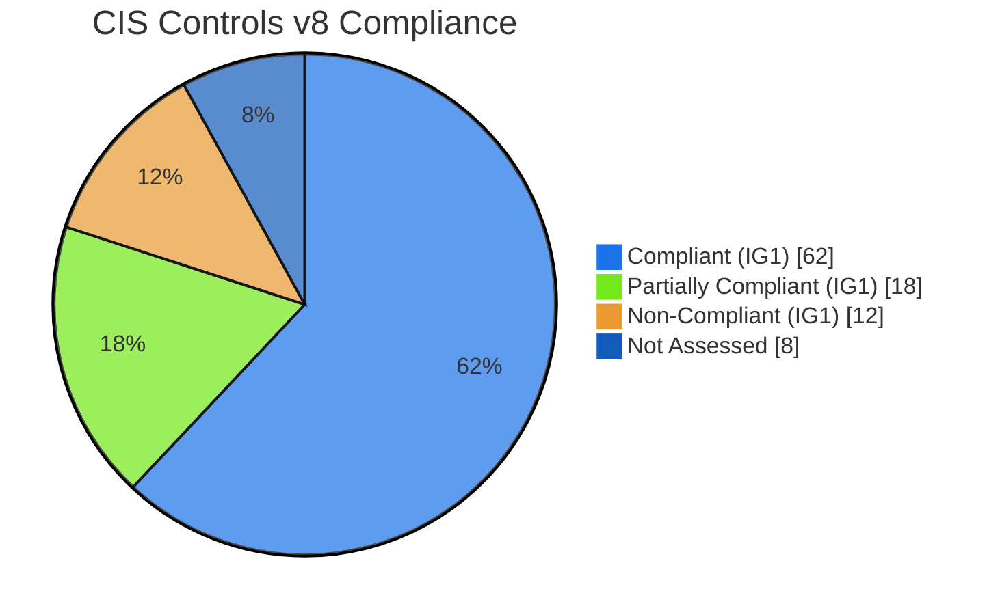
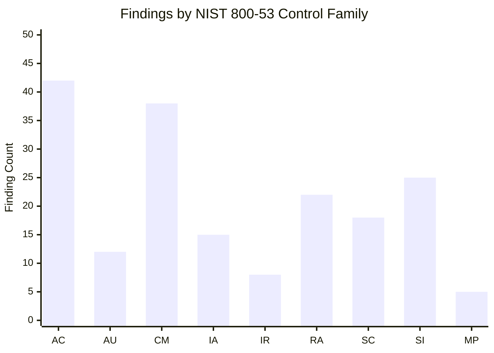
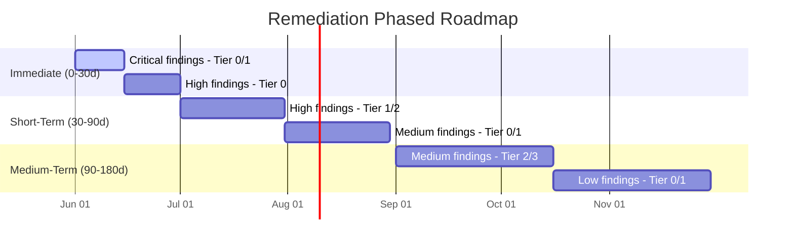

# Hardening Assessment Report

## Overview

This skill automates the generation of a senior-consultant-grade hardening
assessment report. It ingests raw configuration assessment data — typically
from CIS-CAT Pro, OpenSCAP, Lynis, Nessus compliance scans, or custom
benchmarking tooling — and produces a structured deliverable suitable for
CISO briefings, auditor review, and engineering remediation sprints.

The output aligns to a defence-in-depth reporting model, where every finding
is traceable to a specific CIS Control, NIST 800-53 control family, and ISO
27001 Annex A control, enabling multi-framework compliance attestation.

## Workflow (8 Steps)

### Step 1: Data Ingestion & Normalisation
Accept input from heterogeneous scanning sources (CIS-CAT CSV/XML, OpenSCAP
XCCDF, Lynis JSON, Nessus .nessus v2). Normalise all findings into the
canonical finding schema defined below. Deduplicate findings where the same
misconfiguration appears in multiple scan profiles.

### Step 2: Asset Classification
Categorise every scanned asset by:
- **Tier**: 0 (Domain Controllers / IdP), 1 (Critical Servers), 2 (Standard
  Servers), 3 (Workstations)
- **Function**: Authentication, Database, Web, File, End-User Compute, Network
  Appliance
- **Exposure**: Internal, DMZ, Internet-Facing
- **Data Classification**: Public, Internal, Confidential, Restricted

### Step 3: Benchmark-to-Framework Crosswalk
Map every CIS Benchmark rule ID to the corresponding controls in:
- CIS Controls v8 (Implementation Group IG1/IG2/IG3)
- NIST SP 800-53 Rev 5 (Control Family + Control ID)
- NIST CSF 2.0 (Function → Category → Subcategory)
- ISO/IEC 27001:2022 (Annex A control)

### Step 4: Risk Scoring
Apply a weighted risk model to each finding:
- **CVSS v3.1 Environmental Score** (where applicable)
- **Exploitability**: Weaponised exploit available, PoC exists, theoretical
- **Asset Criticality Multiplier** (Tier 0 = 2.0x, Tier 1 = 1.5x, Tier 2 =
  1.0x, Tier 3 = 0.7x)
- **Compensating Control Discount**: Discount risk by 25–75% where verified
  compensating controls exist
- **Aggregate Risk Level**: Critical (≥ 9.0), High (7.0–8.9), Medium
  (4.0–6.9), Low (< 4.0)

### Step 5: Compliance Gap Analysis
For each framework, calculate:
- **Control Coverage %**: (# assessed controls with passing findings / total
  assessed controls) × 100
- **Control Health Score**: Weighted average where Critical failures reduce
  score more heavily than Low failures
- **Gap by Control Family**: Aggregate findings under each NIST 800-53 family
  (AC, AU, CM, IA, etc.)

### Step 6: Remediation Roadmap
Generate phased remediation grouped into:
- **Immediate (0–30 days)**: Critical + High findings on Tier 0/1 assets
- **Short-Term (30–90 days)**: High findings on Tier 2, Medium on Tier 0/1
- **Medium-Term (90–180 days)**: Remaining Medium findings
- **Long-Term (> 180 days)**: Low findings and hardening aspirational targets
- Each item includes: Remediation procedure, verification command, rollback
  plan, change window recommendation

### Step 7: Report Assembly
Compose the final report using the structure defined below. Insert executive
visualisations, compliance heatmaps, and Mermaid-generated charts. Apply
branding configuration (logo, colour palette, confidentiality marking).

### Step 8: Quality Assurance & Delivery
Run all 8 quality controls (defined below). Validate cross-references,
framework mappings, and scoring consistency. Output in the requested format
(PDF via LaTeX, DOCX, HTML, or Markdown).

---

## Input Schema

```yaml
assessment_metadata:
  engagement_id: string       # Unique engagement identifier
  assessment_date: date       # ISO 8601
  assessor: string            # Consultant or team name
  client: string              # Client organisation
  scope: string               # Narrative scope description

assets:
  - hostname: string          # FQDN
    ip_address: string        # IPv4/IPv6
    os: string                # e.g. "Windows Server 2022", "Ubuntu 24.04 LTS"
    tier: integer             # 0-3
    function: string          # From classification enum
    exposure: string          # Internal | DMZ | Internet-Facing
    data_classification: string
    scan_profile: string      # e.g. "CIS_MS_Windows_Server_2022_Level_1"
    scan_tool: string         # e.g. "CIS-CAT Pro v4.38.0"
    scan_timestamp: datetime

findings:
  - asset_hostname: string
    benchmark: string         # e.g. "CIS Benchmark for Ubuntu 24.04 LTS v1.0.0"
    rule_id: string           # e.g. "1.1.1.1", "xccdf_org.ssgproject..."
    rule_title: string
    severity: string          # Critical | High | Medium | Low
    status: string            # Pass | Fail | Manual | Error | Not Applicable
    actual_value: string      # Observed configuration
    expected_value: string    # Required configuration
    remediation_procedure: string
    verification_command: string
    references:               # Framework crosswalks
      cis_control: string     # e.g. "CIS Control 4.1"
      nist_800_53: string     # e.g. "AC-6(1)"
      nist_csf: string        # e.g. "PR.AC-4"
      iso_27001: string       # e.g. "A.9.2.3"

branding:
  logo_path: string           # Path to PNG/SVG logo
  primary_color: string       # Hex colour
  secondary_color: string
  confidentiality: string     # Public | Internal | Confidential | Secret
  document_number: string
  version: string
  classification_banner: boolean

output:
  format: string              # pdf | docx | html | markdown
  include_raw_scan_data: boolean
  include_evidence: boolean   # Attach screenshots/config dumps
  target_path: string
```

## Output Schema

```yaml
report:
  metadata:
    generated_at: datetime    # ISO 8601
    generator_version: string # Skill version
    total_findings: integer
    passed: integer
    failed: integer
    compliance_score: float   # 0-100
    assets_scanned: integer

  executive_summary:
    overall_risk: string      # Critical | High | Medium | Low
    key_findings: [string]    # Top 5 critical issues
    risk_trend: string        # Improving | Stable | Degrading
    recommended_actions: [string]

  compliance_matrix:
    - framework: string
      control_id: string
      control_title: string
      status: string          # Compliant | Partially Compliant | Non-Compliant
      coverage_pct: float
      findings_count: integer

  findings_by_control:
    - cis_control_id: string
      cis_control_title: string
      total_findings: integer
      failed: integer
      pass_rate: float

  remediation_plan:
    - phase: string           # Immediate | Short-Term | Medium-Term | Long-Term
      items:
        - finding_ref: string
          asset: string
          procedure: string
          effort_estimate: string  # e.g. "2 hours", "1 day"
          risk_before: float
          risk_after: float

  charts:
    - compliance_radar: string       # Mermaid/base64
    - risk_heatmap: string
    - finding_distribution: string
    - remediation_burndown: string
```

## Canonical Finding Schema

```yaml
finding:
  id: string                  # UUIDv4
  asset:
    hostname: string
    ip: string
    os: string
    tier: integer
    function: string
  benchmark:
    name: string
    version: string
    rule_id: string
    section: string           # e.g. "1 Initial Setup", "2 Services"
    profile: string           # e.g. "Level 1 - Server"
  assessment:
    status: string            # Pass | Fail | Manual | Error | N/A
    severity: string          # Critical | High | Medium | Low
    actual: string
    expected: string
    rationale: string         # Why this control matters
    audit_procedure: string   # How the check was performed
    scored: boolean
  risk:
    cvss_base: float
    cvss_environmental: float
    exploit_maturity: string  # High | Functional | PoC | Unproven
    asset_criticality_multiplier: float
    compensating_controls: [string]
    aggregate_score: float
    aggregate_level: string
  remediation:
    procedure: string
    verification: string
    rollback: string
    change_window: string
    effort: string
    prerequisites: [string]
  compliance:
    cis_control_v8: string
    cis_safeguard: string
    nist_800_53: string
    nist_csf_2: string
    iso_27001_2022: string
    pci_dss_v4: string        # Optional
  metadata:
    first_seen: date
    last_seen: date
    recurrence_count: integer
    false_positive: boolean
    exception_id: string      # If risk-accepted
```

## Report Structure

### 1. Executive Summary
- **Overall Posture Rating** (A–F letter grade with numeric score)
- **Risk Thermometer** visual (Critical/High/Medium/Low bar chart)
- **Key Findings** (top 5 critical misconfigurations with business impact)
- **Compliance at a Glance** (miniature compliance matrix)
- **Recommended Priority Actions** (executive-level, non-technical)

### 2. Compliance Matrix
Cross-framework compliance attestation table:

| Control ID | Title | CIS v8 | NIST 800-53 | NIST CSF 2.0 | ISO 27001 | Status | Evidence |
|---|---|---|---|---|---|---|---|
| 4.1 | Secure Configuration... | 4.1 | CM-6 | PR.IP-1 | A.8.9 | Compliant | — |
| 5.1 | Admin Privileges... | 5.1 | AC-6(5) | PR.AC-4 | A.9.2.3 | Non-Compliant | Finding F-042 |

### 3. Findings by CIS Control
Grouped by CIS Control, each section containing:
- Control narrative and applicability
- Finding summary table (ID, Asset, Rule, Severity, Status)
- Aggregate pass rate per control
- Detailed finding deep-dives with remediation

### 4. Remediation Plan
Phased plan with Gantt-style timeline, effort estimates, and risk-reduction
projections per phase.

### 5. Appendices
- Full finding register (all findings, filterable)
- Scan methodology and tools used
- Scope definition and exclusions
- Glossary of terms
- Exception register (risk-accepted findings)

---

## Quality Controls

### QC-1: Finding Completeness
Verify every ingested finding has all mandatory schema fields populated.
Missing `remediation_procedure` or `expected_value` triggers a completeness
warning.

### QC-2: Framework Crosswalk Accuracy
Validate every CIS rule ID maps to exactly the correct NIST 800-53, NIST CSF,
and ISO 27001 control. Cross-reference against the CIS Benchmark PDF
supplement or the CIS-CAT Pro crosswalk database.

### QC-3: Asset Deduplication
Ensure no asset appears under multiple hostnames without explicit
justification (e.g. multi-homed server). Flag assets with identical IP but
different hostnames.

### QC-4: Risk Score Consistency
Verify that findings with identical severity, asset tier, and exploit
maturity produce identical aggregate scores within a ±0.1 tolerance.

### QC-5: False Positive Sanity Check
If more than 30% of findings in any benchmark section are flagged as false
positives, raise a review alert suggesting the scan profile may be incorrectly
targeted or the assessment tool misconfigured.

### QC-6: Completeness of Coverage
Confirm that every asset in scope has at least one finding (pass or fail)
in each benchmark section. A section with zero findings indicates the scan
profile was incomplete or the tool skipped that category.

### QC-7: Remediation Feasibility
Verify that every Critical/High finding has a remediation procedure with
a non-empty `verification` field. Flag any remediation that references a
command or path not applicable to the asset's OS.

### QC-8: Compliance Traceability
Ensure every non-compliant framework control has at least one linked finding.
Perform reverse trace: every High/Critical finding must link to at least one
framework control ID.

---

## Mermaid Compliance Coverage Charts

### Compliance Radar Chart



### Findings Distribution by NIST 800-53 Family



### Remediation Burndown Projection



---

## Example 1: Windows Server 2022 Domain Controller

### Input Snippet
```yaml
assets:
  - hostname: dc01.corp.contoso.com
    os: Windows Server 2022 Datacenter
    tier: 0
    function: Authentication
    exposure: Internal
    scan_profile: CIS_Microsoft_Windows_Server_2022_Benchmark_v2.0.0_Level_1_DC
    scan_tool: CIS-CAT Pro v4.38.0

findings:
  - rule_id: "2.3.10.7"
    rule_title: "Ensure 'Network access: Do not allow anonymous enumeration of SAM accounts and shares' is set to 'Enabled'"
    severity: High
    status: Fail
    actual_value: Disabled
    expected_value: Enabled
    remediation_procedure: >
      Apply Group Policy: Computer Configuration\Windows Settings\Security
      Settings\Local Policies\Security Options\Network access: Do not allow
      anonymous enumeration of SAM accounts and shares → Enabled
    references:
      cis_control: "CIS Control 4.7"
      nist_800_53: "AC-3(7)"
      nist_csf: "PR.AC-5"
      iso_27001: "A.9.4.2"
```

### Output Snippet (Executive Summary Table)

| Metric | Value |
|---|---|
| Overall Compliance | 78.3% (C) |
| Critical Findings | 2 |
| High Findings | 14 |
| Medium Findings | 31 |
| Low Findings | 8 |
| Top Risk | Anonymous SMB enumeration enabled on Tier 0 DC |
| Recommended Immediate Action | Deploy hardened GPO for DC security policy; validate with gpresult |

---

## Example 2: Ubuntu 24.04 LTS Web Server

### Input Snippet
```yaml
assets:
  - hostname: web-prod-01.corp.contoso.com
    os: Ubuntu 24.04 LTS
    tier: 1
    function: Web
    exposure: DMZ
    scan_profile: CIS_Ubuntu_24.04_LTS_Benchmark_v1.0.0_Level_1_Server
    scan_tool: OpenSCAP 1.3.10

findings:
  - rule_id: "xccdf_org.ssgproject.content_rule_sshd_disable_root_login"
    rule_title: "Disable SSH Root Login"
    severity: Critical
    status: Fail
    actual_value: "PermitRootLogin yes"
    expected_value: "PermitRootLogin no"
    remediation_procedure: >
      Edit /etc/ssh/sshd_config: set 'PermitRootLogin no'. Restart sshd:
      systemctl restart sshd
    verification_command: "grep '^PermitRootLogin' /etc/ssh/sshd_config"
    references:
      cis_control: "CIS Control 5.4"
      nist_800_53: "AC-6(2)"
      nist_csf: "PR.AC-4"
      iso_27001: "A.9.2.3"
```

### Generated Compliance Matrix Snippet

| Framework | Control | Status | Evidence |
|---|---|---|---|
| CIS Controls v8 | 5.4 (Restrict Admin Privileges) | Non-Compliant | Root SSH enabled |
| NIST 800-53 Rev 5 | AC-6(2) (Least Privilege) | Non-Compliant | F-017 |
| NIST CSF 2.0 | PR.AC-4 | Non-Compliant | F-017 |
| ISO 27001:2022 | A.9.2.3 | Non-Compliant | F-017 |

---

## Branding Configuration

```yaml
branding:
  logo:
    primary: "/assets/logo/consultancy_logo_primary.png"
    report_header: "/assets/logo/consultancy_logo_header.png"
    size_header_px: 200
  colors:
    primary: "#1a73e8"
    secondary: "#0d47a1"
    accent_pass: "#2e7d32"
    accent_fail: "#c62828"
    accent_warn: "#f9a825"
    text_dark: "#212121"
    text_light: "#757575"
    background: "#ffffff"
  typography:
    heading_font: "Helvetica Neue, Arial, sans-serif"
    body_font: "Georgia, Times New Roman, serif"
    code_font: "Fira Code, Consolas, monospace"
    heading_size_base_pt: 28
    body_size_pt: 11
  confidentiality:
    marking: "CONFIDENTIAL"
    banner_text: >
      This document contains proprietary information intended solely for the
      named recipient. Unauthorised distribution is prohibited.
    watermark: true
    watermark_text: "DRAFT — FOR INTERNAL REVIEW ONLY"
  document:
    template: "hardening_report.latex"
    page_size: A4
    margin_mm: 25
    header_footer: true
    table_of_contents: true
    list_of_figures: true
```
