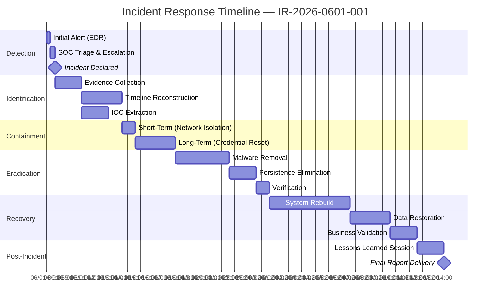
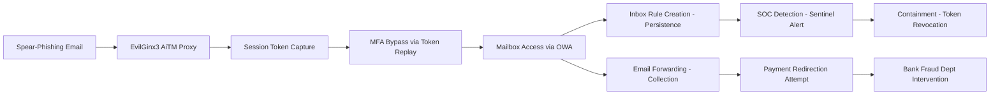

# Incident Response Report

## Overview
Generate comprehensive, courtroom-admissible incident response reports aligned with NIST SP 800-61 Rev 2, SANS PICERL, MITRE ATT&CK, the Cyber Kill Chain, and ISO 27035. This skill produces executive-ready deliverables with forensic rigor suitable for board briefings, regulatory disclosure, cyber insurance claims, and post-breach litigation support.

## Branding & Classification
- **Report Classification Banner**: `CONFIDENTIAL — ATTORNEY-CLIENT PRIVILEGE — FOR INTERNAL USE ONLY`
- **Document ID Convention**: `IR-YYYY-MMDD-NNN` (e.g., `IR-2026-0601-001`)
- **Watermark**: Diagonal "CONFIDENTIAL" across all pages
- **TLP Designation**: TLP:AMBER (default); escalate to TLP:RED for active containment

| Field | Value |
|-------|-------|
| Skill Name | incident-response-report |
| Version | 1.0.0 |
| Category | DFIR |
| TLP Default | AMBER |
| Standards | NIST SP 800-61 Rev 2, SANS PICERL, MITRE ATT&CK v16, Cyber Kill Chain, ISO 27035:2023 |

---

## 10-Step Workflow

### Step 1: Case Intake & Declaration
Collect the incident declaration trigger, date/time of detection, reporting party, initial severity classification (Critical/High/Medium/Low), and business impact statement. Assign a unique IR case number. Record the declarer's name, role, and contact information.

**Artifacts**: Case Intake Form, Incident Declaration Record, Severity Classification Matrix

### Step 2: Evidence Collection & Chain of Custody
Establish chain of custody for all digital evidence. Document evidence source, acquisition method (live response, disk image, memory dump, log pull), hashing algorithm (SHA-256 minimum), custodian name, date/time of acquisition, and storage location. Maintain immutable evidence repository with write-once-read-many (WORM) storage.

**Artifacts**: Chain of Custody Log, Evidence Inventory, Forensic Image Hashes

### Step 3: Timeline Reconstruction (PICERL)
Build a chronological super-timeline using the SANS PICERL framework phases: Preparation detection time, Identification window, Containment start/end, Eradication start/end, Recovery start/end, Lessons Learned session. Superimpose MITRE ATT&CK techniques and Cyber Kill Chain phases onto each timeline entry.

**Artifacts**: Mermaid Gantt Timeline, PICERL Phase Mapping, Technique-to-Timestamp Correlation Matrix

### Step 4: IOC Extraction & Enrichment
Extract atomic, computed, and behavioral IOCs from all evidence sources. Categorize by type: IP addresses, domains, URLs, file hashes (MD5/SHA-1/SHA-256), email addresses, registry keys, mutexes, user-agent strings, and certificate serial numbers. Enrich each IOC with VirusTotal, AbuseIPDB, and threat intelligence platform lookups. Assign confidence scores (High/Medium/Low).

**Artifacts**: IOC Master List, Enrichment Report, Confidence Score Matrix

### Step 5: Root Cause Analysis
Identify the initial access vector (phishing, exploit, credential theft, supply chain, insider, misconfiguration). Trace the full attack path from initial access through to objective completion. Map each step to MITRE ATT&CK techniques and Cyber Kill Chain phases. Determine the root cause using the 5-Why methodology.

**Artifacts**: Attack Path Diagram, 5-Why Analysis, Root Cause Statement

### Step 6: Scope of Compromise Assessment
Define the blast radius: affected systems, compromised accounts, data accessed/exfiltrated, lateral movement paths, persistence mechanisms deployed. Quantify data exposure: record count, data categories (PII, PHI, PCI, IP), regulatory notification triggers. Map crown jewel proximity and business impact.

**Artifacts**: Scope of Compromise Matrix, Data Exposure Quantification, Crown Jewel Proximity Map

### Step 7: Containment Actions Documentation
Document short-term containment (network isolation, account disablement, service suspension) and long-term containment (segmentation, credential rotation, patch deployment). Record start/end timestamps, actor, action, target, and outcome for each containment measure.

**Artifacts**: Containment Action Log, Isolation Verification Report

### Step 8: Eradication & Recovery
Document all eradication actions: malware removal, persistence mechanism elimination, backdoor closure, compromised account remediation. Document recovery steps: system rebuild from golden images, data restoration from verified backups, service restoration sequence, and business validation testing.

**Artifacts**: Eradication Verification Log, Recovery Runbook, Service Restoration Checklist

### Step 9: Lessons Learned & Post-Incident Review
Conduct a formal post-incident review (PIR) session with all stakeholders. Document what went well, what went poorly, detection gaps identified, and process improvements needed. Produce a prioritized remediation roadmap with owners and due dates.

**Artifacts**: PIR Meeting Minutes, Lessons Learned Register, Improvement Roadmap

### Step 10: Report Assembly & Delivery
Assemble all artifacts into the final structured report. Apply branding, classification markings, and TLP designation. Generate executive summary (1-2 pages for C-suite) and technical appendix. Deliver via encrypted channel with read receipt. Conduct quality control review against the 10 QC gates below.

**Artifacts**: Final Report (PDF), Executive Summary (PDF), Encrypted Delivery Receipt

---

## IR-Specific Schemas

### Timeline Entry Schema
```json
{
  "timeline_entry": {
    "id": "TL-001",
    "timestamp": "2026-06-01T14:32:00Z",
    "event_type": "detection|containment|eradication|recovery|notification",
    "picerl_phase": "preparation|identification|containment|eradication|recovery|lessons_learned",
    "description": "string (max 500 chars)",
    "source_system": "string",
    "source_evidence_id": "string",
    "attck_technique_id": "T1566.001",
    "attck_tactic": "initial_access",
    "kill_chain_phase": "delivery|exploitation|installation|c2|actions_on_objectives",
    "actor": "threat_actor|ir_team|automated",
    "confidence": "high|medium|low",
    "artifacts": ["file_hash", "log_entry_id"]
  }
}
```

### IOC Entry Schema
```json
{
  "ioc_entry": {
    "id": "IOC-001",
    "ioc_type": "ipv4|ipv6|domain|url|file_hash_md5|file_hash_sha1|file_hash_sha256|email|registry_key|mutex|user_agent|certificate_serial|process_name|service_name",
    "ioc_value": "string",
    "first_seen": "ISO8601",
    "last_seen": "ISO8601",
    "source": "edr|siem|firewall|proxy|dns|forensic_image|threat_intel",
    "confidence": "high|medium|low",
    "severity": "critical|high|medium|low|informational",
    "enrichment_sources": ["VirusTotal", "AbuseIPDB", "MISP", "AlienVault OTX"],
    "enrichment_results": {
      "malicious_ratio": "string",
      "associated_threat_actor": "string",
      "associated_malware_family": "string",
      "first_submitted": "ISO8601"
    },
    "status": "active|contained|false_positive|expired",
    "mitre_techniques": ["T1566.001"],
    "remediation": "string"
  }
}
```

### Containment Action Schema
```json
{
  "containment_action": {
    "id": "CA-001",
    "timestamp": "ISO8601",
    "action_type": "network_isolation|account_disable|credential_rotation|service_stop|firewall_block|dns_sinkhole|email_purge|endpoint_quarantine|cloud_credential_revoke",
    "target_asset": "string",
    "target_identifier": "string (hostname/IP/account UPN)",
    "action_description": "string",
    "executor": "string (name/role)",
    "authorization": "string (approver/change ticket)",
    "start_time": "ISO8601",
    "end_time": "ISO8601",
    "outcome": "successful|partial|failed|rolled_back",
    "verification_method": "string",
    "rollback_plan": "string",
    "impact_assessment": "string"
  }
}
```

---

## Report Structure

### 1. Executive Summary (~2 pages)
- Incident Identifier, Severity, Date Range
- One-paragraph incident narrative (business context, not technical jargon)
- Key findings (3-5 bullets)
- Business impact summary (financial, operational, reputational, regulatory)
- Current status and containment posture
- Recommended next actions for leadership

### 2. Incident Timeline
- Mermaid Gantt chart overlaying PICERL phases, key events, and team actions
- Tabular chronological timeline (timestamp, event, PICERL phase, ATT&CK technique, source)

### 3. Root Cause Analysis
- Initial access vector determination
- 5-Why analysis
- Attack path diagram (Mermaid flowchart)
- Contributing factors and systemic weaknesses

### 4. Scope of Compromise
- Affected systems inventory (hostname, IP, OS, role, compromise status)
- Compromised accounts (UPN, privilege level, domain, remediation status)
- Data exposure register (category, volume, regulatory trigger, notification status)
- Lateral movement paths identified

### 5. Containment Actions
- Short-term containment log
- Long-term containment log
- Effectiveness verification per action
- Residual risk assessment

### 6. Eradication Steps
- Threat removal actions
- Persistence mechanism elimination
- Verification methodology (re-scan, re-image, forensic validation)

### 7. Recovery Actions
- System restoration sequence (prioritized by business criticality)
- Data restoration from verified backups
- Service validation and business acceptance testing
- Monitoring enhancement for post-recovery period

### 8. Indicators of Compromise (IOCs)
- Atomic IOCs (hashes, IPs, domains, URLs)
- Computed IOCs (YARA rules, Sigma rules, Snort/Suricata signatures)
- Behavioral IOCs (TTPs, attack patterns)
- IOC sharing recommendations (ISAC, CERT, law enforcement)

### 9. Lessons Learned
- What went well
- What went poorly
- Detection gaps identified
- Process deficiencies
- Tool/technology gaps

### 10. Recommendations
- Short-term tactical fixes (0-7 days)
- Medium-term operational improvements (7-30 days)
- Long-term strategic investments (30-90+ days)
- Assigned owners, deadlines, and success criteria per recommendation

### Appendix A: MITRE ATT&CK Technique Register
### Appendix B: Evidence Chain of Custody
### Appendix C: Raw Log Excerpts (redacted)
### Appendix D: Playbook Adherence Assessment

---

## Mermaid Gantt Timeline


---

## 10 Quality Controls

| QC# | Gate | Criteria | Pass Condition |
|-----|------|----------|----------------|
| QC-01 | Timestamp Coherence | All timestamps in UTC ISO 8601; no temporal paradoxes | No event precedes its cause |
| QC-02 | IOC Uniqueness | No duplicate IOCs; deduplicated by canonical value | `SELECT COUNT(DISTINCT ioc_value) = COUNT(*)` |
| QC-03 | TTP Mapping | Every timeline entry mapped to at least one MITRE ATT&CK technique | Null ATT&CK technique entries flagged for review |
| QC-04 | Evidence Traceability | Every assertion linked to a source evidence artifact (hash, log entry, screenshot) | Zero orphan claims |
| QC-05 | Chain of Custody | Complete custody log for each forensic artifact; no gaps | Every evidence item has custody from acquisition to report |
| QC-06 | Redaction Audit | PII/PHI/credentials redacted from report body; redaction log maintained | Automated PII scanner returns zero hits |
| QC-07 | Narrative Consistency | Executive summary, timeline, and technical details agree | Cross-reference validation passes |
| QC-08 | Regulatory Trigger Assessment | All applicable breach notification regulations identified and assessed | Regulatory checklist completed per jurisdiction |
| QC-09 | Recommendation Actionability | Each recommendation has an owner, deadline, and measurable success criterion | Zero recommendations with missing fields |
| QC-10 | Peer Review | Report reviewed by a second qualified IR analyst not involved in the incident | Review sign-off obtained |

---

## Example 1: Ransomware Incident (LockBit Variant)

### Scenario
A mid-market financial services firm (500 endpoints, hybrid Azure AD/on-prem AD, M365 E5) detected LockBit ransomware encryption at 03:42 UTC via Microsoft Defender for Endpoint behavioral detection. The attack vector was a spear-phishing email with a malicious ISO attachment that mounted a DLL side-loading chain (T1574.002), ultimately deploying LockBit 3.0 ransomware.

### Key Report Excerpts

**Executive Summary**: *At approximately 03:42 UTC on 01 June 2026, ACME Financial Services experienced a ransomware incident attributed to the LockBit 3.0 ransomware-as-a-service (RaaS) operation. The threat actor gained initial access via a targeted spear-phishing campaign delivering a malicious ISO attachment. Within 47 minutes of initial execution, the ransomware encrypted 2,847 files across 12 servers and 34 workstations in the finance, HR, and legal departments. Immediate short-term containment via network segmentation and domain-wide credential rotation halted further encryption at 04:51 UTC. No evidence of data exfiltration was identified based on network flow analysis and DLP telemetry review. The incident has been contained, eradication is complete, and all affected systems have been rebuilt from known-good golden images. At this time, we assess with high confidence that no sensitive customer PII or PCI data was exfiltrated.*

**Root Cause**: 5-Why analysis traced the incident to (1) a user executing a malicious ISO attachment received via spear-phishing email, (2) the ISO bypassing M365 Safe Attachments due to a recently registered file extension handling policy gap, (3) the DLL side-loading technique exploiting a legitimate but vulnerable signed binary, (4) insufficient application control policies (no AppLocker), and (5) the absence of ASR rules for ISO/LNK execution from email.

**Key IOCs**:
| IOC Value | Type | Confidence |
|-----------|------|------------|
| 185.234.72.18 | IPv4 (C2) | High |
| lockbit3-update[.]com | Domain (C2) | High |
| a3f8b2c...e9d1 | SHA-256 (ransomware binary) | High |
| HKCU\Software\Microsoft\Windows\CurrentVersion\Run\LB3Persist | Registry | High |

**Detections Mapped**:
- T1566.001 (Spearphishing Attachment) → Initial Access
- T1204.002 (Malicious File) → Execution
- T1574.002 (DLL Side-Loading) → Persistence / Defense Evasion
- T1486 (Data Encrypted for Impact) → Impact
- T1490 (Inhibit System Recovery) → Impact

---

## Example 2: Business Email Compromise (BEC) / OAuth Token Theft

### Scenario
A SaaS company (200 employees, Google Workspace, Okta SSO) detected anomalous mailbox activity when an executive's account created inbox rules forwarding all email with "invoice," "payment," or "wire" in the subject to an external Gmail address. Investigation revealed an adversary-in-the-middle (AiTM) phishing attack using EvilGinx3 that captured the executive's session token and bypassed MFA. The attacker then used the token to access O365 webmail, establish persistence via malicious inbox rules, and attempt to redirect a $450,000 vendor payment.

### Key Report Excerpts

**Executive Summary**: *On 28 May 2026 at 11:13 UTC, ACME SaaS Corp detected unauthorized mailbox access to the CFO's account via an adversary-in-the-middle (AiTM) phishing attack. The threat actor deployed EvilGinx3 infrastructure to intercept the CFO's session token during a phishing engagement, bypassing Okta MFA. Within 22 minutes of token theft, the attacker created four malicious inbox rules to forward financially sensitive communications to an external Gmail account (fraudulent-invoices@gmail[.]com). The attacker subsequently attempted to redirect a $450,000 wire transfer by intercepting and modifying a legitimate vendor invoice thread. The SOC team identified the incident via a Microsoft Sentinel alert on anomalous inbox rule creation and executed immediate containment by revoking all session tokens, disabling the compromised account, and purging the forwarding rules. The wire transfer was intercepted prior to execution by the bank's fraud department following timely notification. The incident has been fully contained with no financial loss.*

**Root Cause**: The CFO clicked a link in a well-crafted spear-phishing email mimicking the company's Okta SSO portal. The EvilGinx3 proxy intercepted the session token post-authentication, bypassing MFA because session token theft does not require MFA re-authentication. Contributing factors included (1) lack of phishing-resistant MFA (FIDO2/WebAuthn), (2) absence of impossible travel conditional access policies, and (3) insufficient monitoring of inbox rule creation events.

**Attack Path** (Mermaid):


---

## Report Assembly Checklist
- [ ] Classification banner and TLP designation applied to every page
- [ ] Document control number assigned (IR-YYYY-MMDD-NNN)
- [ ] Table of contents generated
- [ ] All timestamps in UTC ISO 8601
- [ ] All IOCs defanged for external sharing
- [ ] PII/PHI redacted with redaction log
- [ ] Chain of custody appendix complete
- [ ] MITRE ATT&CK Navigator layer JSON exported and attached
- [ ] Executive summary approved by Incident Commander
- [ ] Legal review completed (if applicable)
- [ ] QC gates 01-10 passed
- [ ] Encrypted delivery to authorized recipients
