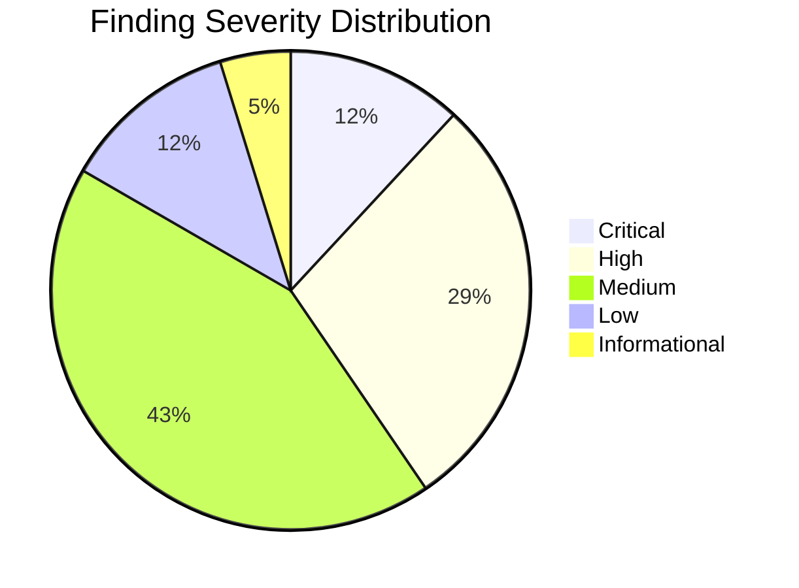
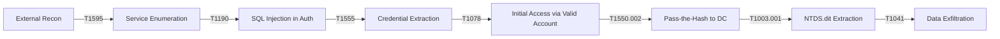
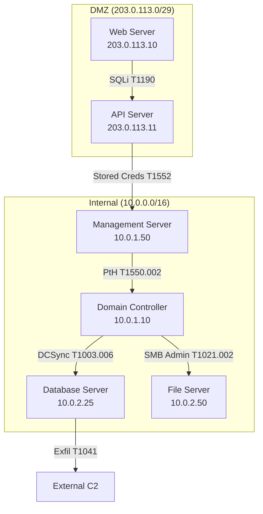
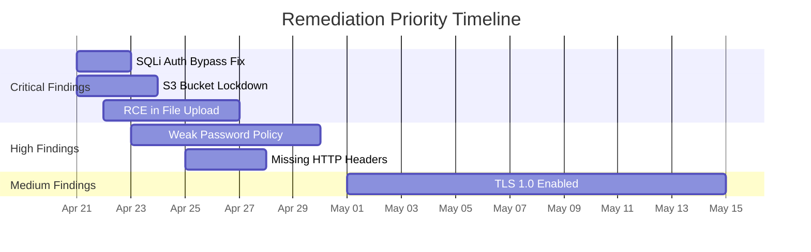

# Pentest Report Generator

## 1. Purpose

This skill generates enterprise-grade penetration test reports conforming to the Penetration Testing Execution Standard (PTES) with integrated OSSTMM v3 metrics. It produces findings that are immediately actionable by remediation teams, risk-rated using CVSS v4.0, and cross-referenced against MITRE ATT&CK techniques, the Cyber Kill Chain, CWE identifiers, and CAPEC attack patterns.

The generated report serves as both a technical deliverable for engineering teams and an executive summary for leadership audiences. Every finding includes evidence reproduction steps, exploitability assessments, and prioritized remediation guidance with compensating controls where direct fixes are infeasible.

## 2. Methodology

The report generation aligns with a multi-framework methodology:

| Phase | PTES Stage | OSSTMM Integration | Deliverable Artifact |
|-------|------------|--------------------|-----------------------|
| 1 | Pre-engagement Interactions | Scope Definition & RAVs | Rules of Engagement, Test Plan |
| 2 | Intelligence Gathering | Visibility Audit (Port, Controls, Limitations) | Reconnaissance Summary |
| 3 | Threat Modeling | Trust Analysis | Threat Matrix, Attack Trees |
| 4 | Vulnerability Analysis | Access & Trust Metrics | Finding Inventory with ravCalc |
| 5 | Exploitation | Penetration Metrics | Compromise Evidence, Attack Narrative |
| 6 | Post-Exploitation | Process Metrics | Impact Assessment, Lateral Movement Map |
| 7 | Reporting | ravs & Limitations Documentation | Final Report |

**Risk Calculation Model:** Composite score derived from CVSS v4.0 Base Score × Business Impact Factor × Exploitability Index. The Business Impact Factor is a 1.0–3.0 multiplier based on asset criticality, data classification, and blast radius. The Exploitability Index is derived from OSSTMM ravs (Realized Attack Vector Score).

**Severity Bands:**
- **Critical** (CVSS ≥ 9.0): Immediate remediation required. Executive notification mandatory.
- **High** (CVSS 7.0–8.9): Remediate within 48 hours. Escalate to system owner.
- **Medium** (CVSS 4.0–6.9): Remediate within 30 days. Include in patch cycle.
- **Low** (CVSS 0.1–3.9): Remediate within 90 days or accept risk formally.
- **Informational**: No direct risk. Observation for hardening consideration.

## 3. Workflow

### Step 1: Engagement Intake
Collect scope document, rules of engagement (RoE), IP ranges, URLs, credentials (if white-box), exclusion lists, and testing windows. Validate scope against written authorization. Generate unique engagement ID (format: `PT-YYYY-QN-NNN`).

### Step 2: Reconnaissance & Asset Inventory
Ingest reconnaissance output: subdomain enumeration, port scans (Nmap XML), service fingerprints, OSINT findings, and WHOIS data. Build asset inventory with criticality ratings. Map external attack surface.

### Step 3: Vulnerability Discovery
Parse scanner output (Nessus, OpenVAS, Burp Suite, custom scripts) and manual testing notes. De-duplicate findings. Correlate scanner results with manual verification. Discard false positives with justification.

### Step 4: Exploitation & Validation
Document successful exploits with timestamped evidence. Record exploitation path: initial vector → privilege escalation → lateral movement → objective achievement. Capture screenshots, console output, and tool version information. Mark findings as "Exploited," "Exploitable (Not Attempted)," or "Theoretical."

### Step 5: Impact Analysis
For each confirmed finding, assess business impact: data exposure (PII/PHI/PCI), system compromise depth, regulatory implications (GDPR, HIPAA, PCI DSS, SOX), and blast radius. Calculate dwell time if incident response data is available.

### Step 6: Remediation Planning
Draft remediation recommendations with specific, verifiable actions. Provide compensating controls for findings where direct remediation is blocked by operational constraints. Include configuration snippets, patch references, and architecture changes.

### Step 7: Finding Risk Scoring
Assign CVSS v4.0 vectors using Attack Vector (AV), Attack Complexity (AC), Attack Requirements (AT), Privileges Required (PR), User Interaction (UI), and subsequent impact metrics. Map to MITRE ATT&CK techniques, CWE IDs, CAPEC IDs, and Cyber Kill Chain phases.

### Step 8: Report Assembly
Generate the full report document with executive summary, methodology section, finding details, appendices. Apply corporate branding. Run all quality control validations. Generate PDF and DOCX via Pandoc or equivalent.

### Step 9: Quality Assurance Review
Validate against all quality control rules (Section 8). Verify finding completeness: every finding has a CVSS vector, a CWE mapping, reproduction steps, and remediation guidance. Confirm executive summary contains no technical jargon. Verify all appendix references resolve.

### Step 10: Delivery & Debrief
Package deliverables: executive summary (1–2 pages), technical report (full), finding spreadsheet (CSV/XLSX), and raw evidence archive. Schedule readout call with technical stakeholders. Conduct executive briefing.

## 4. Input Schema

```yaml
# engagement.yaml - Master engagement definition
engagement:
  id: "PT-2026-Q2-001"
  type: external  # external | internal | webapp | api | wireless | physical | social
  start_date: "2026-04-01"
  end_date: "2026-04-15"
  testers:
    - name: "Jane Doe"
      role: lead
      certifications: [OSCP, OSWE, CISSP]
    - name: "John Smith"
      role: operator
      certifications: [OSCP, GPEN]
  scope:
    targets:
      - type: cidr
        value: "203.0.113.0/29"
        description: "DMZ subnet hosting web applications"
      - type: fqdn
        value: "app.example.com"
        description: "Primary customer-facing application"
      - type: url
        value: "https://api.example.com"
        description: "REST API endpoint"
    exclusions:
      - "192.168.100.0/24"  # Production database subnet
      - "vpn.example.com"
  methodology: ptes
  test_type: grey_box  # black_box | grey_box | white_box
  credentials_provided: false
  testing_windows:
    - start: "02:00"
      end: "06:00"
      timezone: "UTC"
      days: [saturday, sunday]
  contacts:
    technical:
      name: "Alice Engineer"
      email: "alice@example.com"
      phone: "+1-555-0100"
    executive:
      name: "Bob Director"
      email: "bob@example.com"
      phone: "+1-555-0101"
    emergency:
      name: "Charlie CISO"
      email: "charlie@example.com"
      phone: "+1-555-0102"
  risk_acceptance:
    lateral_movement: authorized
    credential_extraction: authorized
    denial_of_service: prohibited
    social_engineering: not_in_scope
    physical_access: not_in_scope

findings:
  - finding_id: "F-001"
    title: "SQL Injection in Login Endpoint Enables Authentication Bypass"
    description: >
      The login endpoint at /api/v1/auth/login is vulnerable to SQL injection
      via the 'username' parameter. An unauthenticated attacker can bypass
      authentication and extract the entire user database, including password
      hashes and PII.
    risk_rating: critical
    cvss4_vector: "CVSS:4.0/AV:N/AC:L/AT:N/PR:N/UI:N/VC:H/VI:H/VA:N/SC:N/SI:N/SA:N"
    cvss4_score: 9.3
    affected_assets:
      - host: "app.example.com"
        ip: "203.0.113.10"
        port: 443
        service: "nginx/1.24.0"
        component: "POST /api/v1/auth/login"
    cwe: "CWE-89"
    capec: "CAPEC-66"
    mitre_attack:
      - "T1190"  # Exploit Public-Facing Application
    kill_chain_phase: "delivery"
    owasp_category: "A03:2021 - Injection"
    vulnerability_class: "SQL Injection"
    discovery_method: "manual"
    tool: "Burp Suite Professional 2026.3"
    reproduction_steps: |
      1. Navigate to https://app.example.com/api/v1/auth/login
      2. Send the following POST request:
         POST /api/v1/auth/login HTTP/1.1
         Host: app.example.com
         Content-Type: application/json
         {"username":"admin' OR '1'='1'--","password":"arbitrary"}
      3. Observe HTTP 200 response containing valid JWT session token
      4. Confirm JWT decodes to 'admin' user with role='administrator'
    evidence:
      - type: screenshot
        path: "evidence/sqli-login-bypass.png"
        caption: "Burp Suite showing successful SQL injection and JWT token"
      - type: request_response
        path: "evidence/sqli-login-request.txt"
        caption: "Raw HTTP request and response"
    remediation:
      primary: >
        Implement parameterized queries using prepared statements.
        Replace string concatenation in the login query builder at
        AuthService.java:142 with PreparedStatement. Ensure all user
        input is bound via setString().
      compensating: >
        Deploy a WAF rule to block requests containing SQL metacharacters
        in the username parameter. Apply rate limiting of 5 requests per
        minute per source IP to the login endpoint.
      references:
        - "https://cheatsheetseries.owasp.org/cheatsheets/SQL_Injection_Prevention_Cheat_Sheet.html"
        - "https://cwe.mitre.org/data/definitions/89.html"
    business_impact:
      confidentiality: "Complete exposure of user credentials and PII for 2.3M accounts"
      integrity: "Ability to modify any database record"
      availability: "Ability to drop tables and corrupt data"
      financial: "Estimated breach cost: $4.2M (based on IBM Cost of Data Breach 2025)"
      regulatory: [GDPR, CCPA, PCI-DSS]
      data_classification: "PII, credentials, financial records"
  - finding_id: "F-002"
    title: "AWS S3 Bucket Configured for Public Read Access"
    description: >
      The S3 bucket 'example-customer-data' has a bucket policy granting
      s3:GetObject to the Principal '*', making all stored objects publicly
      readable. Contains customer PII, internal documentation, and database
      backup files.
    risk_rating: critical
    cvss4_vector: "CVSS:4.0/AV:N/AC:L/AT:N/PR:N/UI:N/VC:H/VI:N/VA:N/SC:N/SI:N/SA:N"
    cvss4_score: 8.7
    affected_assets:
      - host: "example-customer-data.s3.amazonaws.com"
        service: "AWS S3"
    cwe: "CWE-284"
    capec: "CAPEC-127"
    mitre_attack:
      - "T1530"  # Data from Cloud Storage
    kill_chain_phase: "actions_on_objectives"
    owasp_category: "A01:2021 - Broken Access Control"
    vulnerability_class: "Misconfiguration"
    discovery_method: "automated"
    tool: "ScoutSuite 5.14"
    reproduction_steps: |
      1. Run: aws s3 ls s3://example-customer-data --no-sign-request
      2. Observe successful listing of bucket contents
      3. Run: aws s3 cp s3://example-customer-data/customers.csv . --no-sign-request
      4. Confirm download of 240MB file containing customer records
    evidence:
      - type: screenshot
        path: "evidence/s3-public-bucket.png"
        caption: "AWS CLI showing public access to S3 bucket"
    remediation:
      primary: >
        Remove the public-read bucket policy. Enable S3 Block Public Access
        at the account level. Configure CloudTrail logging with alerts on
        bucket policy modifications. Enable default SSE-S3 or SSE-KMS
        encryption.
      compensating: >
        If public access is temporarily required, use CloudFront with
        Origin Access Identity (OAI). Implement bucket-level access logging
        and real-time alerts on GetObject events from non-corporate IPs.
      references:
        - "https://docs.aws.amazon.com/AmazonS3/latest/userguide/security-best-practices.html"
    business_impact:
      confidentiality: "Exposure of 240MB customer records including names, emails, phone numbers"
      integrity: "No direct integrity impact identified"
      availability: "No direct availability impact identified"
      financial: "Estimated regulatory fines: $2.8M (GDPR/CCPA combined)"
      regulatory: [GDPR, CCPA]
      data_classification: "PII, customer records"
```

## 5. Output Schema

```yaml
# report-output.yaml - Generated report structure
report:
  metadata:
    engagement_id: "PT-2026-Q2-001"
    report_version: "1.0"
    classification: "CONFIDENTIAL"
    generated: "2026-04-20T14:30:00Z"
    generator: "CyberSec Reporting Engine"
    generator_version: "2.4.1"
    reviewed_by: "Jane Doe, OSCP, OSWE, CISSP"

  executive_summary:
    overall_risk: "Critical"
    total_findings: 42
    critical: 5
    high: 12
    medium: 18
    low: 5
    informational: 2
    key_observations:
      - "External perimeter contains 5 critical vulnerabilities enabling full compromise"
      - "Internal network segmentation between DMZ and production is ineffective"
      - "AWS cloud infrastructure lacks basic security hardening"
    risk_timeline:
      - label: "Day 1"
        event: "External reconnaissance identified 23 exposed services"
      - label: "Day 2"
        event: "Critical SQL injection discovered in authentication endpoint"
      - label: "Day 3"
        event: "Domain admin compromise achieved through credential harvesting"

  methodology:
    overview: "Assessment conducted per PTES Technical Guidelines v1.0 with OSSTMM v3 metrics"
    phases_executed:
      - name: "Intelligence Gathering"
        duration_hours: 12
        tools: [Shodan, Amass, Subfinder, theHarvester, crt.sh]
      - name: "Vulnerability Analysis"
        duration_hours: 40
        tools: [Nessus, Burp Suite Pro, Nuclei, ScoutSuite, custom scripts]
      - name: "Exploitation"
        duration_hours: 24
        tools: [Metasploit, Cobalt Strike, Impacket, sqlmap, custom exploits]
      - name: "Post-Exploitation"
        duration_hours: 16
        tools: [BloodHound CE, Mimikatz, PowerView, SharpHound]
    constraints:
      - "Testing windows limited to weekends 02:00-06:00 UTC"
      - "Denial of service testing excluded per RoE"
      - "Production database subnet (192.168.100.0/24) excluded from scope"
    limitations:
      - "Social engineering vector not assessed (out of scope)"
      - "Physical security controls not evaluated"
      - "Wireless network security not tested"

  attack_narrative:
    compromise_chain:
      - step: 1
        technique: "T1595 - Active Scanning"
        description: "External port scan identified port 443 serving a web application"
        finding_ref: "F-001"
      - step: 2
        technique: "T1190 - Exploit Public-Facing Application"
        description: "SQL injection in login endpoint achieved authentication bypass"
        finding_ref: "F-001"
      - step: 3
        technique: "T1555 - Credentials from Password Stores"
        description: "Extracted database credentials from application configuration file"
        finding_ref: "F-008"
      - step: 4
        technique: "T1021.002 - Remote Services: SMB/Windows Admin Shares"
        description: "Database credentials reused as Domain Admin credentials"
        finding_ref: "F-012"

  findings:
    - finding_id: "F-001"
      # ... full finding structure per Section 6

  appendices:
    - appendix_id: "A"
      title: "Tools & Versions"
      content: "Complete tool inventory with version numbers"
    - appendix_id: "B"
      title: "Definitions & Acronyms"
      content: "Glossary of terms used in report"
    - appendix_id: "C"
      title: "Remediation Roadmap"
      content: "Prioritized timeline of remediation actions"
    - appendix_id: "D"
      title: "Raw Scanner Output"
      content: "Nessus CSV, Nmap XML, Nuclei JSON exports"
    - appendix_id: "E"
      title: "Evidence Archive Index"
      content: "Full index of evidence files with SHA-256 hashes"
```

## 6. Finding Schema

```yaml
# Complete finding structure - every field is required unless marked optional
finding:
  finding_id:
    type: string
    pattern: "^F-\d{3}$"
    description: "Unique finding identifier, sequential from F-001"
    required: true

  title:
    type: string
    max_length: 120
    description: "Concise, descriptive finding title. Use \'Vulnerability Type in Component Leading to Impact\' format"
    example: "Reflected XSS in Search Parameter Enables Session Hijacking"
    required: true

  description:
    type: string
    min_length: 100
    max_length: 2000
    description: "Plain-language technical description of the vulnerability, its location, and its root cause"
    required: true

  technical_details:
    type: string
    description: "In-depth technical analysis suitable for remediation engineers. Include code-level explanations where applicable. Optional for Low/Info findings."
    required: false

  risk_rating:
    type: enum
    values: [critical, high, medium, low, informational]
    description: "Risk classification per the severity bands defined in Methodology Section 2"
    required: true

  cvss4_vector:
    type: string
    pattern: "^CVSS:4\.0/AV:[NALP]/AC:[LH]/AT:[NP]/PR:[NLH]/UI:[NA]/VC:[HLN]/VI:[HLN]/VA:[HLN]/SC:[HLN]/SI:[HLN]/SA:[HLN](/[A-Z]+:[A-Z]+)*$"
    description: "Full CVSS v4.0 vector string"
    required: true

  cvss4_score:
    type: number
    minimum: 0.0
    maximum: 10.0
    description: "Computed CVSS v4.0 base score"
    required: true

  cvss3_vector:
    type: string
    description: "CVSS v3.1 vector for backward compatibility. Optional if CVSS v4.0 is provided."
    required: false

  affected_assets:
    type: list
    min_items: 1
    description: "List of affected hosts, services, or components"
    items:
      host: string       # FQDN or IP
      ip: string         # IPv4 or IPv6 address
      port: integer      # TCP/UDP port number
      protocol: string   # tcp or udp
      service: string    # Service banner or identified software
      component: string  # Specific component, endpoint, or file path
      os: string         # Operating system, if known (optional)
    required: true

  cwe:
    type: string
    pattern: "^CWE-\d{1,4}$"
    description: "Common Weakness Enumeration identifier mapping the vulnerability type to the root cause weakness"
    required: true

  capec:
    type: string
    pattern: "^CAPEC-\d{1,4}$"
    description: "Common Attack Pattern Enumeration and Classification identifier describing the attack pattern"
    required: true

  mitre_attack:
    type: list
    description: "MITRE ATT&CK technique IDs relevant to the finding"
    items:
      type: string
      pattern: "^T\d{4}(\.\d{3})?$"
    required: true

  kill_chain_phase:
    type: enum
    values: [reconnaissance, weaponization, delivery, exploitation, installation, command_and_control, actions_on_objectives]
    description: "Lockheed Martin Cyber Kill Chain phase where this vulnerability is exploited"
    required: true

  owasp_category:
    type: string
    description: "OWASP Top 10 category. Format: 'ANN:YYYY - Category Name'"
    example: "A03:2021 - Injection"
    required: false  # Required for web application findings only

  vulnerability_class:
    type: string
    description: "Taxonomic classification of the vulnerability"
    example: "SQL Injection | Cross-Site Scripting | Buffer Overflow | Misconfiguration | Cryptographic Failure"
    required: true

  discovery_method:
    type: enum
    values: [automated, manual, hybrid]
    description: "How the finding was discovered"
    required: true

  tool:
    type: string
    description: "Primary tool used to discover or validate the finding, including version"
    example: "Burp Suite Professional 2026.3"
    required: true

  reproduction_steps:
    type: string
    min_length: 50
    description: "Numbered, step-by-step instructions an independent tester can follow to reproduce the finding. Use imperative mood. Include exact commands, URLs, request payloads, and expected results."
    required: true

  evidence:
    type: list
    min_items: 1
    description: "Supporting evidence artifacts"
    items:
      type:
        type: enum
        values: [screenshot, request_response, code_snippet, console_output, file_extract, video, log_excerpt, pcap]
      path: string       # Relative path to evidence file
      caption: string    # Descriptive caption for the evidence
      hash: string       # SHA-256 hash of evidence file (optional but recommended)
    required: true

  remediation:
    primary:
      type: string
      min_length: 50
      description: "Direct fix that eliminates the vulnerability at its root cause. Be specific: include code changes, configuration modifications, architecture adjustments, or version upgrades."
    compensating:
      type: string
      description: "Alternative controls that reduce risk when primary remediation cannot be immediately applied. Include WAF rules, network segmentation, monitoring, or access restrictions."
    references:
      type: list
      items:
        type: string
        format: uri
      description: "Authoritative references for the remediation approach"
    required: true

  business_impact:
    confidentiality:
      type: string
      description: "Impact on data confidentiality if exploited"
    integrity:
      type: string
      description: "Impact on data or system integrity if exploited"
    availability:
      type: string
      description: "Impact on service availability if exploited"
    financial:
      type: string
      description: "Estimated financial impact including breach costs, fines, and remediation expenses"
    regulatory:
      type: list
      items:
        type: string
      description: "Applicable regulatory frameworks (GDPR, HIPAA, PCI-DSS, SOX, CCPA, etc.)"
    data_classification:
      type: string
      description: "Classification of exposed data (PII, PHI, PCI, IP, credentials, etc.)"
    required: true

  exploitability:
    type: enum
    values: [exploited, exploitable_not_attempted, theoretical]
    description: "Whether the vulnerability was actually exploited during testing"
    required: true

  public_exploit:
    type: boolean
    description: "Whether a publicly available exploit exists (Metasploit module, Exploit-DB, PoC)"
    required: false

  epss_score:
    type: number
    description: "EPSS (Exploit Prediction Scoring System) probability score"
    required: false

  tags:
    type: list
    description: "Free-form tags for filtering and categorization"
    items:
      type: string
    required: false
```

## 7. Report Structure

```
PENETRATION TEST REPORT
═══════════════════════════════════════════

1. EXECUTIVE SUMMARY
   1.1 Engagement Overview
        - Engagement type, dates, scope summary
        - Testing team credentials
   1.2 Overall Risk Assessment
        - Composite risk score with interpretation
        - Finding distribution chart
   1.3 Key Findings Summary
        - Top 5 critical findings at a glance
   1.4 Risk Timeline
        - Day-by-day narrative of the attack chain
   1.5 Strategic Recommendations
        - 3-5 high-level strategic improvements

2. METHODOLOGY
   2.1 Assessment Framework
        - PTES phase alignment
        - OSSTMM metrics integration
   2.2 Testing Approach
        - Black/Grey/White box description
        - Credentialed vs. uncredentialed
   2.3 Tools & Techniques
        - Tool inventory with versions
        - Custom tool descriptions
   2.4 Scope & Limitations
        - In-scope assets
        - Exclusions and rationale
        - Constraints (time windows, testing restrictions)
   2.5 Risk Calculation Methodology
        - CVSS v4.0 scoring approach
        - Business impact factor derivation
        - Exploitability index

3. ATTACK NARRATIVE
   3.1 Compromise Chain Visualization
        - Graphical kill chain mapped to MITRE ATT&CK
   3.2 Detailed Attack Walkthrough
        - Step-by-step compromise narrative
        - Tool commands and outputs
        - Screenshots of key milestones
   3.3 Lateral Movement Map
        - Network diagram showing pivot paths
        - Credential reuse chain
   3.4 Objective Achievement
        - Crown jewel access confirmation
        - Data exfiltration demonstration (if authorized)

4. FINDINGS
   4.1 Critical Findings
       - F-001 through F-005
   4.2 High Findings
       - F-006 through F-017
   4.3 Medium Findings
       - F-018 through F-035
   4.4 Low Findings
       - F-036 through F-040
   4.5 Informational Findings
       - F-041 through F-042
   [Each finding rendered with full detail per Finding Schema]

5. REMEDIATION ROADMAP
   5.1 Immediate Actions (0-7 days)
   5.2 Short-Term Actions (7-30 days)
   5.3 Medium-Term Actions (30-90 days)
   5.4 Long-Term Strategic Improvements (90+ days)
   5.5 Remediation Verification Testing

6. APPENDICES
   Appendix A: Tools & Versions
   Appendix B: Finding Cross-Reference Matrix
   Appendix C: Definitions & Acronyms
   Appendix D: Remediation Verification Checklist
   Appendix E: Evidence Archive Index
   Appendix F: Risk Acceptance Form Template
   Appendix G: Scope Validation Checklist
   Appendix H: Raw Scanner Output (optional, large attachments)
```

## 8. Quality Controls

The following validation rules execute against every generated report. A finding that fails any Critical rule blocks report delivery. High-severity rule failures require documented justification from the lead tester.

| Rule ID | Severity | Rule Description |
|---------|----------|------------------|
| QC-001 | **CRITICAL** | Every finding rated Critical or High MUST include at least one evidence artifact. Informational findings exempt. |
| QC-002 | **CRITICAL** | Every finding MUST have a complete, syntactically valid CVSS v4.0 vector string. CVSS v3.1 is not an acceptable substitute for new reports. |
| QC-003 | **CRITICAL** | Reproduction steps MUST contain at least one concrete command, URL, code snippet, or request payload. Generic descriptions like "send a malicious request" are rejected. |
| QC-004 | **CRITICAL** | Every Critical or High finding MUST include primary remediation with specific, verifiable actions. "Apply vendor patches" without CVE or KB references is rejected. |
| QC-005 | **HIGH** | Finding IDs MUST be sequential starting at F-001 with no gaps. Gaps require a "Withdrawn" annotation. |
| QC-006 | **HIGH** | Every finding MUST map to at least one CWE and at least one MITRE ATT&CK technique. Informational findings exempt. |
| QC-007 | **HIGH** | The Executive Summary MUST contain zero technical jargon. Words like "SQL injection," "buffer overflow," and "XSS" must be replaced with business-impact language. |
| QC-008 | **HIGH** | All affected asset IP addresses and FQDNs MUST be within the defined scope. Out-of-scope findings require an "Out of Scope" label and are relegated to an appendix. |
| QC-009 | **MEDIUM** | Finding descriptions must be 100–2000 characters. Descriptions outside this range trigger a manual review prompt. |
| QC-010 | **MEDIUM** | Every finding rated Critical or High MUST include the `exploitability` field set to `exploited` or `exploitable_not_attempted`. `theoretical` on Critical/High is rejected unless accompanied by a documented rationale from the lead tester. |
| QC-011 | **MEDIUM** | The `affected_assets` list MUST include at minimum one entry with either `host` or `ip` populated. |
| QC-012 | **LOW** | Findings SHOULD include `epss_score` where available from FIRST.org EPSS API. |

## 9. Executive Dashboard

### 9.1 Risk Distribution Mermaid Chart



### 9.2 Attack Chain Flow Diagram



### 9.3 Lateral Movement Topology



### 9.4 Remediation Timeline



## 10. Examples

### Example 1: External Infrastructure Penetration Test

**Scenario:** A fintech company requested an external penetration test of their customer-facing web application and supporting cloud infrastructure.

**Input Highlights:**
- 18 IP addresses across cloud (AWS) and colocated infrastructure
- Grey-box test with application user accounts
- 2-week testing window with business-hours only constraint
- PCI-DSS compliance validation required

**Generated Output:** A 127-page report containing:
- Executive summary identifying 3 critical findings enabling full compromise within 4 hours
- Attack narrative tracing path from shodan.io discovery → SQL injection → credential harvesting → AWS console access
- 34 findings total: 3 Critical, 9 High, 15 Medium, 5 Low, 2 Informational
- PCI-DSS compliance gap analysis as standalone section
- CVSS v4.0 vectors for all findings
- Remediation roadmap with 5-day critical fix SLA recommendations
- Executive dashboard with Mermaid risk distribution and attack chain graphs

### Example 2: Internal Network Penetration Test

**Scenario:** A healthcare organization requested an internal network penetration test simulating a compromised workstation on the clinical network segment.

**Input Highlights:**
- Internal /16 network with 4,200 live hosts detected
- Segmented architecture: Clinical, Administrative, Research, and IoT VLANs
- HIPAA compliance validation and PHI exposure assessment required
- Starting point: low-privilege domain user on Clinical VLAN workstation

**Generated Output:** A 215-page report containing:
- Executive summary identifying complete domain compromise in 6.5 hours from initial foothold
- Lateral movement map showing Clinical → Administrative → Domain Controller pivot chain
- 87 findings total: 7 Critical, 22 High, 35 Medium, 18 Low, 5 Informational
- HIPAA compliance mapping table correlating each finding to 45 CFR 164.308-312 controls
- Attack narrative with BloodHound graph exports, Mimikatz output, and DCSync evidence
- Network segmentation assessment with VLAN-hopping validation
- PHI exposure inventory documenting 1.2M patient records accessed during testing
- Remediation roadmap organized by VLAN segment and AD tier

### Example 3: Web Application Security Assessment

**Scenario:** A SaaS provider requested a comprehensive web application penetration test of their multi-tenant platform including REST API, GraphQL endpoint, and WebSocket connections.

**Input Highlights:**
- Single-page application with React frontend and Node.js/Express backend
- OAuth 2.0 + OIDC authentication with Azure AD B2C
- Multi-tenant PostgreSQL database with row-level security
- CI/CD pipeline integration (GitHub Actions, AWS ECS deployment)

**Generated Output:** A 98-page report containing:
- Executive summary identifying session management flaws enabling cross-tenant data access
- 41 findings mapped to OWASP API Security Top 10, OWASP Web Top 10, and CWE Top 25
- GraphQL introspection abuse → mass assignment → cross-tenant data leak chain
- JWT analysis section covering algorithm confusion, kid injection, and missing signature validation
- OAuth 2.0 security review with PKCE validation, redirect URI testing, and scope assessment
- API rate limiting bypass demonstration achieving 10,000 requests/second
- Secure SDLC recommendations integrated with existing CI/CD pipeline architecture

## 11. Branding Configuration

```yaml
branding:
  company_name: "ACME Security Consulting"
  logo_path: "assets/logo.png"
  logo_width: "2.5in"
  primary_color: "#1a237e"
  secondary_color: "#0d47a1"
  accent_color: "#ff6f00"
  font_family: "Helvetica, Arial, sans-serif"
  heading_font: "Helvetica Neue Bold"
  body_font_size: "10pt"
  code_font: "Courier New"
  page_margins:
    top: "1in"
    bottom: "1in"
    left: "1.25in"
    right: "1in"
  header:
    left: "[COMPANY NAME]"
    right: "CONFIDENTIAL"
  footer:
    left: "© 2026 [COMPANY NAME]. All Rights Reserved."
    center: "Page [PAGE] of [TOTAL]"
    right: "[ENGAGEMENT ID]"
  classification_banner:
    enabled: true
    text: "CONFIDENTIAL - FOR AUTHORIZED RECIPIENTS ONLY"
    color: "#b71c1c"
    font_size: "8pt"
  finding_color_coding:
    critical: "#d32f2f"
    high: "#f57c00"
    medium: "#fbc02d"
    low: "#388e3c"
    informational: "#1976d2"
  table_striping: true
  toc_depth: 3
  watermark:
    enabled: true
    text: "DRAFT"
    opacity: 0.05
    rotation: 45
```

## 12. Standards Cross-Reference

Every finding in the generated report maps to the applicable standards automatically. The cross-reference mapping is as follows:

| Finding Field | PTES Section | OSSTMM Channel | NIST SP 800-115 | OWASP | CWE | CAPEC | MITRE ATT&CK | Kill Chain |
|---------------|-------------|----------------|-----------------|-------|-----|-------|--------------|------------|
| `vulnerability_class: SQL Injection` | 5.2.2 - Input Validation | COMSEC - Injection | 3.3 - Injection Testing | A03:2021 | CWE-89 | CAPEC-66 | T1190 | Exploitation |
| `vulnerability_class: Cross-Site Scripting` | 5.2.2 - Input Validation | COMSEC - Injection | 3.3 - Injection Testing | A03:2021 | CWE-79 | CAPEC-63 | T1189 | Delivery |
| `vulnerability_class: Misconfiguration` | 5.1.1 - Config Review | OPSEC - Configuration | 4.2 - Config Review | A05:2021 | CWE-16 | CAPEC-127 | Various | Weaponization |
| `vulnerability_class: Cryptographic Failure` | 5.2.4 - Crypto | COMSEC - Encryption | 4.1 - Crypto Review | A02:2021 | CWE-327 | CAPEC-20 | T1600 | Delivery |
| `vulnerability_class: Broken Access Control` | 5.2.1 - Auth/AC | HUMSEC - Access | 3.1 - Auth Testing | A01:2021 | CWE-284 | CAPEC-233 | T1548 | Exploitation |
| `vulnerability_class: Buffer Overflow` | 5.2.3 - Memory | COMSEC - Overflow | 3.2 - Fuzzing | A03:2021 | CWE-120 | CAPEC-100 | T1203 | Exploitation |
| `vulnerability_class: Path Traversal` | 5.2.2 - Input Validation | COMSEC - Injection | 3.3 - Injection | A01:2021 | CWE-22 | CAPEC-126 | T1005 | Exploitation |
| `vulnerability_class: Insecure Deserialization` | 5.2.5 - Logic | COMSEC - Serialization | 3.5 - Logic Testing | A08:2021 | CWE-502 | CAPEC-586 | T1203 | Exploitation |
| `vulnerability_class: SSRF` | 5.2.7 - SSRF | COMSEC - Redirect | 3.6 - SSRF Testing | A10:2021 | CWE-918 | CAPEC-664 | T1190 | Delivery |
| `vulnerability_class: IDOR` | 5.2.1 - Auth/AC | HUMSEC - Access | 3.1 - Auth Testing | A01:2021 | CWE-639 | CAPEC-233 | T1078 | Delivery |
| `vulnerability_class: Credential Exposure` | 5.1.3 - Credential | HUMSEC - Credentials | 4.3 - Credential | A07:2021 | CWE-522 | CAPEC-70 | T1552 | Exploitation |
| `vulnerability_class: Privilege Escalation` | 6.3 - PrivEsc | HUMSEC - Privilege | 5.2 - PrivEsc | N/A | CWE-269 | CAPEC-233 | T1068 | Installation |
| `mitre_attack: T1190` | 5.2 - Vulnerability Analysis | COMSEC - Perimeter | 3.0 - Target Identification | Various | Various | Various | Exploit Public-Facing Application | Delivery |
| `mitre_attack: T1003` | 6.3 - Credential Access | HUMSEC - Credential | 5.3 - Credential Access | N/A | CWE-522 | CAPEC-70 | OS Credential Dumping | Actions on Objectives |

**Mapping Logic:** The engine automatically populates cross-reference fields based on the `vulnerability_class` and `mitre_attack` primary fields. Manual override is supported via the `standards_override` block in the finding YAML.
