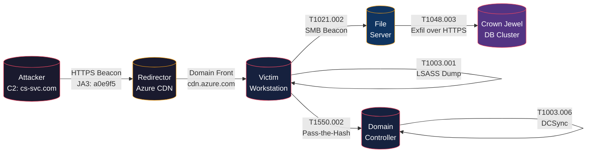

# Red Team Operation Report

Generate comprehensive red team operation reports covering the full adversary emulation lifecycle — from planning and C2 infrastructure deployment through detection gap analysis and remediation roadmaps. Outputs are structured for SOC handoff, executive briefing, and purple-team detonation validation.

## Purpose

Produce enterprise-grade red team reports that bridge the gap between offensive operations and defensive engineering. Every finding is mapped to MITRE ATT&CK technique IDs, kill-chain phases, and observable detection telemetry so blue teams can immediately action results.

## Methodology

**MITRE ATT&CK-based adversary emulation** — operations are scoped against a defined threat actor profile (e.g., APT29, FIN7, or a composite TTP set). The kill chain is instrumented end-to-end, with C2 traffic, payload artifacts, and credential harvesting logged for post-engagement correlation. Detection validation is performed in-band during execution and out-of-band via purple-team sessions.

## Workflow

### Phase 1 — Engagement Scoping

1. **Define Threat Model** — Select or composite an adversary profile with specific TTPs, tooling, and operational tempo. Map techniques to ATT&CK Enterprise matrix.
2. **Establish Rules of Engagement (ROE)** — Document target ranges, excluded assets, authorized techniques, C2 protocols, callback windows, and safety/stop signals.
3. **Infrastructure Design** — Architect redirector chain, domain fronting strategy, C2 listening post topology, payload hosting, and operational security controls (jitter, user-agent rotation, beacon intervals).
4. **Capability Development** — Build or customize implants, payloads, phishing templates, and credential harvesters aligned to the adversary profile. Validate against target EDR/AV stack in a mirror environment.

### Phase 2 — Execution

5. **Initial Access** — Execute the agreed access vector (spearphish, external exploit, physical, assumed breach). Capture timing, payload hash, C2 callback telemetry, and any EDR/DLP alerts triggered.
6. **Internal Reconnaissance & Privilege Escalation** — Enumerate AD/Entra ID objects, hunt for credential material (LSASS, Kerberos tickets, token session data, local secrets), and execute privilege escalation paths. Log every technique, tool, and detection event.
7. **Lateral Movement & Objective Achievement** — Pivot across the environment using stolen credentials, pass-the-hash/ticket, PSExec, WMI, WinRM, or DCOM. Execute crown-jewel objectives (exfiltrate flag data, access Tier-0 assets, etc.). Record all lateral paths and detection gaps.
8. **Persistence & C2 Cleanup** — Optionally implant persistence mechanisms per ROE. At end-of-exercise, execute cleanup procedures and restore tampered systems (services modified, accounts created, scheduled tasks removed).

### Phase 3 — Reporting

9. **Detection Validation & Purple Team** — Run Atomic Red Team or Caldera tests replicating key TTPs to validate SIEM/SOAR detection coverage. Score each technique: Detected (alert fired), Delayed (alert >15min), or Blind (no alert). Produce coverage heatmap.
10. **Report Assembly** — Synthesize operator logs, C2 logs, detection events, and purple-team results into the structured report. Apply quality gates, peer review, and client sanitization pass.

## Input Schema

```json
{
  "engagement": {
    "codename": "string",
    "type": "full-scope | assumed-breach | purple-team | tabletop",
    "threat_actor": "APT29 | FIN7 | APT41 | custom",
    "start_date": "ISO-8601",
    "end_date": "ISO-8601",
    "operators": ["string"]
  },
  "scope": {
    "target_domains": ["string"],
    "target_cidrs": ["string"],
    "excluded_assets": ["string"],
    "crown_jewel_objectives": ["string"],
    "authorized_techniques": ["string"],
    "c2_protocols": ["http", "https", "dns", "smb", "websocket"],
    "phishing_domains": ["string"]
  },
  "infrastructure": {
    "c2_framework": "Cobalt Strike | Sliver | Havoc | Mythic | Covenant | Nighthawk | Brute Ratel",
    "redirector_topology": "single | chain | domain-fronted | cdn",
    "listening_posts": [{"ip": "string", "hostname": "string", "domain": "string"}],
    "payload_types": ["stageless", "staged", "DLL", "PowerShell", "HTA", "VBA"],
    "beacon_interval_seconds": 60,
    "jitter_percent": 30
  },
  "findings": [
    {
      "id": "RT-001",
      "title": "string",
      "severity": "critical | high | medium | low | informational",
      "attack_path": "step-by-step narrative",
      "techniques": ["T1566.001", "T1059.001"],
      "kill_chain_phase": "recon | weaponization | delivery | exploitation | installation | c2 | actions",
      "cve": "CVE-YYYY-NNNNN | null",
      "affected_assets": ["string"],
      "detection_status": "detected | delayed | blind",
      "detection_telemetry": ["EventID:4688", "Sysmon:EventID:1"],
      "remediation": "string",
      "evidence": {
        "screenshots": ["base64"],
        "command_history": ["string"],
        "c2_logs": ["string"],
        "pcap_fragments": ["string"]
      }
    }
  ],
  "detection_gaps": [
    {
      "technique_id": "T1003.001",
      "technique_name": "LSASS Memory Dump",
      "detection_score": "blind | delayed | detected",
      "existing_controls": ["string"],
      "recommended_detection": "string",
      "sigma_rule_suggestion": "yaml-string",
      "edr_telemetry_available": true
    }
  ],
  "tactical_timeline": [
    {
      "timestamp": "ISO-8601",
      "operator": "string",
      "technique_id": "T1566.001",
      "description": "string",
      "host": "string",
      "tool": "string",
      "detected": true
    }
  ],
  "credentials_compromised": [
    {
      "target": "string",
      "type": "ntlm-hash | kerberos-tgt | kerberos-tgs | cleartext | token | ssh-key",
      "privilege_level": "domain-admin | local-admin | standard-user | service-account",
      "extraction_method": "sekurlsa::logonpasswords | dcsync | kerberoast | asreproast | token-theft"
    }
  ]
}
```

## Output Schema — Red Team Report

```json
{
  "report": {
    "title": "string",
    "engagement_codename": "string",
    "classification": "TLP:RED | TLP:AMBER | TLP:GREEN | TLP:CLEAR",
    "version": "1.0",
    "date": "ISO-8601",
    "executive_summary": "string (500 words max)",
    "risk_score": 0.0,
    "attack_narrative": "string (chronological narrative of the full kill chain)",
    "ttps_executed": [
      {
        "technique_id": "T1566.001",
        "technique_name": "Spearphishing Attachment",
        "tactic": "Initial Access",
        "detection_status": "detected | delayed | blind",
        "tools_used": ["Cobalt Strike", "custom-loader.dll"]
      }
    ],
    "detection_gap_analysis": [
      {
        "technique_id": "T1003.001",
        "gap_severity": "critical",
        "description": "string",
        "blue_team_observations": "string",
        "recommendations": ["string"]
      }
    ],
    "blue_team_assessment": {
      "overall_score": "A-F",
      "people": "observation string",
      "process": "observation string",
      "technology": "observation string",
      "mt td_minutes": 0,
      "mttr_minutes": 0
    },
    "recommendations": [
      {
        "priority": 1,
        "category": "detection | prevention | response | people | process",
        "finding_ref": "RT-001",
        "description": "string",
        "effort": "low | medium | high",
        "impact": "low | medium | high",
        "quick_win": true
      }
    ],
    "appendices": {
      "ioc_table": [{"type": "ip | domain | hash | url", "value": "string", "context": "string"}],
      "c2_traffic_summary": "string",
      "command_log": ["string"],
      "coverage_heatmap_base64": "string"
    }
  }
}
```

## Finding Schema

Each finding captures the full attack path, the TTPs used, and critically — what the blue team saw (or didn't see).

```json
{
  "id": "RT-001",
  "title": "Initial Access via Spearphishing Bypassed Email Gateway",
  "severity": "critical",
  "attack_path": "Operator registered typosquatted domain xcorp-secure[.]com, configured SPF/DKIM/DMARC, and sent spearphish to 15 users → 3 users executed weaponized ISO → ISO mounted, LNK executed → Cobalt Strike beacon staged over HTTPS → DNS callback to azure-cdn-edge[.]net redirector → full beacon established within 120 seconds.",
  "attack_path_graph": "mermaid-string (see below)",
  "techniques": [
    {"id": "T1566.001", "name": "Spearphishing Attachment"},
    {"id": "T1204.002", "name": "User Execution: Malicious File"},
    {"id": "T1553.005", "name": "Subvert Trust Controls: Mark-of-the-Web Bypass"},
    {"id": "T1071.001", "name": "Web Protocols"},
    {"id": "T1090.004", "name": "Proxy: Domain Fronting"}
  ],
  "kill_chain_phase": "delivery",
  "detection_status": "blind",
  "detection_telemetry": ["Sysmon:EventID:11 (ISO file creation)", "Sysmon:EventID:1 (beacon execution)"],
  "blue_team_gaps": [
    "No alerting on ISO/IMG file downloads from external domains",
    "No correlation between LNK execution and outbound HTTPS to CDN infrastructure",
    "C2 callback JA3/JA4 fingerprint not in detection feed"
  ],
  "remediation": [
    "Block ISO/IMG/VHD file downloads via email gateway policy",
    "Deploy Sysmon EventID 11 correlation rule for writable-mount-disk-image → outbound-connection chain",
    "Ingest JA3/JA4 hash feeds from ThreatConnect or self-generated C2 fingerprint database"
  ],
  "evidence_screenshots": ["base64-or-url"],
  "iocs": [
    {"type": "domain", "value": "xcorp-secure.com", "context": "Typosquatted phishing domain"},
    {"type": "domain", "value": "azure-cdn-edge.net", "context": "CDN redirector for C2"},
    {"type": "hash", "value": "a3f8b2c...", "context": "Beacon payload SHA256"}
  ]
}
```

## Report Structure

### 1. Executive Summary
- **One-page** summary for C-suite and board.
- Engagement scope and adversary profile.
- Key finding: crown jewel access achieved? In what timeframe?
- Risk score with severity distribution.
- Top 3 detection gaps.
- Top 3 strategic recommendations.

### 2. Attack Narrative
- Chronological, story-driven narrative of the full engagement.
- Broken into kill-chain phases with timestamps.
- Attack path diagrams per major finding (Mermaid flowcharts).
- Credential compromise table.
- C2 infrastructure diagram.

### 3. TTP Matrix
- Table mapping every technique executed → ATT&CK ID → tactic → tool → detection status.
- Color-coded: green (detected), yellow (delayed), red (blind).

### 4. Detection Gap Analysis
- Per-gap breakdown: technique, what was executed, what telemetry was available, why it was missed.
- Sigma/KQL/Splunk SPL rule recommendations for each blind spot.
- Coverage heatmap (ATT&CK Navigator layer export).

### 5. Blue Team Assessment
- Graded assessment across People, Process, and Technology.
- MTTD/MTTR metrics where available.
- Analyst triage observations.
- SOC escalation effectiveness.

### 6. Recommendations
- Prioritized matrix (severity × effort × impact).
- Quick wins (< 1 week implementation).
- Strategic improvements (6-12 month roadmap).
- Purple-team validation schedule.

## Mermaid Attack Path Graphs

### Syntax



## Quality Controls (10 Gates)

1. **Peer Review** — Second operator reviews every finding for technical accuracy before draft release.
2. **TTP Cross-Reference** — Every attack action must map to at least one MITRE ATT&CK technique ID. No unmapped actions.
3. **Detection Telemetry Audit** — For each finding, verify that the listed detection telemetry was actually observable in the environment (not theoretical).
4. **IOC Validation** — All IOCs must be validated at time-of-report (resolve domains, verify hashes, check for false positives against internal assets).
5. **Screenshot Sanitization** — Screenshots must not contain operator PII, internal IPs not in scope, or client-sensitive data from other engagements.
6. **Severity Consistency** — Apply a uniform severity rubric across all findings (CVSS-based: Critical = domain compromise, High = credential theft/scoped RCE, Medium = information disclosure, Low = hardening gap).
7. **Remediation Actionability** — Every recommendation must be specific, measurable, and implementable. No "improve monitoring" without specifying the log source and event ID.
8. **Client Data Sanitization** — Client name, internal hostnames, and proprietary data must be redacted or pseudonymized per the data handling agreement.
9. **Executive Readability** — Executive summary must be comprehensible to non-technical stakeholders. Define all acronyms on first use. Use business-impact language.
10. **Consistency Pass** — Ensure command timestamps, operator notes, C2 logs, and detection events are temporally consistent. Cross-reference the tactical timeline against SIEM timestamps.

## Complete Example 1 — Full-Scope Engagement

### Engagement Profile
- **Codename:** NIGHTFALL
- **Type:** Full-Scope Red Team
- **Threat Actor:** Composite (APT29 TTPs + FIN7 tooling)
- **Target:** 2,500-user enterprise with on-prem AD, Azure AD hybrid, M365 E5, CrowdStrike Falcon
- **Objectives:** (1) Access Tier-0 assets, (2) Exfiltrate simulated PII from HR database, (3) Establish covert persistence

### Attack Narrative (Abridged)

**Day 1–3 — Reconnaissance & Infrastructure**
- Registered typosquatted domains: `conteso[.]com`, `contoso-sso[.]com`
- Deployed redirector chain: VPS → Azure CDN → Cobalt Strike teamserver
- Built ISO payload with LNK → DLL side-load chain, tested against Falcon in mirror environment (not detected)

**Day 4 — Initial Access (T1566.001)**
- Spearphish targeting 20 employees in Finance and HR
- Subject: "Q2 Bonus Allocation — Action Required"
- Weaponized ISO attachment with invoice-2025.lnk
- 4 users executed; 3 beacons established
- **Detection status: BLIND** — Email gateway allowed ISO; Falcon did not alert on LNK→DLL execution chain

**Day 5–7 — Internal Reconnaissance & Credential Harvesting**
- BloodHound/SharpHound collection from initial beachhead
- Identified path: Standard User → Local Admin on SQL-02 (session) → Domain Admin
- LSASS dump via Cobalt Strike `mimikatz` on first beacon host → cleartext credentials for svc_sql
- Kerberoasting (T1558.003) returned crackable TGS for svc_sharepoint
- **Detection status: BLIND** — No alert on LSASS access; no alert on anomalous Kerberos TGS requests

**Day 8–10 — Lateral Movement & Domain Dominance**
- Pass-the-Hash with svc_sql → SQL-02 (T1550.002)
- SQL-02 had active Domain Admin session → token theft → DA (T1134.001)
- DCSync from DA context → full NTDS.dit extraction (T1003.006)
- **Detection status: DELAYED** — SOC caught DCSync via MS Defender for Identity 22 minutes after execution (analyzed post-hoc, no automated response)

**Day 11–12 — Objective Achievement**
- Accessed HR database via svc_sharepoint credentials → exfiltrated 12,000 simulated PII records to C2 redirector (T1048.003)
- Implanted WMI persistence (T1546.003) and scheduled task persistence (T1053.005) on 3 systems
- **Detection status: BLIND** — No alert on bulk data export; no alert on WMI subscription creation

**Day 13 — Cleanup & Debrief**
- Removed persistence mechanisms, beacons, and artifacts per ROE
- Restored modified GPOs and service configurations
- Delivered hotwash with SOC manager

### Key Metrics

| Metric | Value |
|--------|-------|
| Time to Initial Access | 4 days |
| Time to Domain Admin | 7 days (from beachhead: 3 days) |
| Time to Objective | 10 days |
| Techniques Executed | 34 |
| Techniques Detected (real-time) | 6 (17.6%) |
| Techniques Delayed (>15 min) | 5 (14.7%) |
| Techniques Blind | 23 (67.6%) |
| Credentials Compromised | 14 (2 DA, 3 service, 9 user) |
| C2 Callbacks | 847 over 10 days |

### Detection Gap Highlights

1. **T1566.001 + T1553.005** — ISO/LNK/DLL initial access chain entirely invisible to both email gateway and EDR. Recommend: block container file types at email boundary, deploy ASR rule "Block executable files from running unless they meet a prevalence, age, or trusted list criterion."
2. **T1003.001** — LSASS credential dumping undetected by Falcon. Recommend: enable ASR rule "Block credential stealing from the Windows local security authority subsystem," tune Falcon sensor to alert on `OpenProcess` to LSASS from non-whitelisted binaries.
3. **T1048.003** — 12,000-record exfiltration generated no DLP or network alert. Recommend: deploy Data Classification labels on HR shares, configure Purview DLP policy for bulk downloads >500 records, implement network egress monitoring for anomalous data volume per endpoint.

### Recommendations (Top 5)

| # | Recommendation | Effort | Impact |
|---|---------------|--------|--------|
| 1 | Block ISO/IMG/VHD/XLL/CHM at email gateway | Low | High |
| 2 | Deploy LSASS ASR rule + Falcon credential guard telemetry | Low | Critical |
| 3 | Implement Kerberos TGS request anomaly alerting (volume baseline per user) | Medium | High |
| 4 | Deploy Purview DLP for sensitive data repositories | Medium | High |
| 5 | Establish quarterly purple-team cadence validating top 10 blind techniques | Medium | Medium |

## Complete Example 2 — Assumed Breach Engagement

### Engagement Profile
- **Codename:** SILENTFORGE
- **Type:** Assumed Breach
- **Threat Actor:** Ransomware affiliate (LockBit TTPs)
- **Entry Point:** Standard user workstation in Marketing VLAN (beacon pre-staged)
- **Objectives:** (1) Escalate to Domain Admin, (2) Map and exfiltrate file server shares, (3) Simulate ransomware deployment preparation (shadow copy deletion, backup enumeration)

### Attack Narrative (Abridged)

**Hour 0–2 — Privilege Escalation**
- Enumerated local privileges: SeImpersonatePrivilege → JuicyPotato → SYSTEM (T1134.003)
- Dumped LSASS → recovered Domain Admin NTLM hash from cached session (T1003.001)
- **Detection: BLIND**

**Hour 2–4 — AD Enumeration**
- SharpHound collection from SYSTEM context
- Identified shortest path to DA (already had hash), mapped file servers, Exchange, SQL cluster
- Enumerated AD CS for ESC1–ESC8 vulnerabilities (found ESC1 on SubCA-01, not exploited per ROE)
- **Detection: BLIND** (SharpHound collection not flagged)

**Hour 4–6 — Lateral Movement & File Mapping**
- Pass-the-Hash → FILE-01, FILE-02 (T1550.002)
- Enumerated 45 TB of file shares; identified HR, Finance, Legal, and R&D repositories
- Staged 2 GB of simulated PII in `C:\Windows\Temp\staging\` (T1074.001)
- **Detection: DELAYED** — SOC analyst noticed anomalous SMB connections after 45 minutes but did not escalate

**Hour 6–8 — Ransomware Simulation**
- Executed `vssadmin delete shadows /all /quiet` on FILE-01 (T1490)
- Enumerated Veeam backup server via SMB; identified backup repositories
- Simulated deletion of 3 backup jobs via Veeam PowerShell module
- **Detection: DELAYED** — VSS deletion triggered Windows Event 22/23, alert fired after 8 minutes

**Hour 8 — Exfiltration**
- Compressed staging data → `finance_audit.7z`
- Exfiltrated to attacker-controlled S3 bucket via WinSCP scripting (T1048.002, T1567.002)
- **Detection: BLIND** — No egress filtering or DLP on file server VLAN

### Key Metrics

| Metric | Value |
|--------|-------|
| Time to Domain Admin | 1.5 hours |
| Time to File Server Access | 4 hours |
| Time to Simulated Ransomware | 7 hours |
| Techniques Executed | 22 |
| Techniques Detected (real-time) | 3 (13.6%) |
| Techniques Blind | 17 (77.3%) |

### Detection Gap Highlights

1. **T1003.001** — Cached DA credentials accessible from marketing workstation (violation of tiered admin model). Recommend: implement ESAE/red forest, prohibit Domain Admin logons to non-Tier-0 assets.
2. **T1074.001** — Data staging in `C:\Windows\Temp` not monitored. Recommend: deploy FIM on sensitive directories, alert on archive creation (7z, rar, tar) in staging paths.
3. **T1490** — Shadow copy deletion generated delayed alert only. Recommend: create real-time alert and automated response (isolate host) on VSS deletion events.
4. **T1048.002** — WinSCP/SFTP exfiltration undetected. Recommend: block outbound SCP/SFTP from server VLAN, implement network DLP rules for anomalous file transfer protocols.

## Branding Configuration

```yaml
branding:
  firm_name: "string"
  report_classification_levels:
    - TLP:CLEAR
    - TLP:GREEN
    - TLP:AMBER
    - TLP:RED
  page:
    header_logo: "base64-or-path"
    footer_text: "CONFIDENTIAL — {firm_name} — {engagement_codename}"
    font_family: "Helvetica, Arial, sans-serif"
  colors:
    primary: "#1a1a2e"
    accent: "#e94560"
    detected: "#27ae60"
    delayed: "#f39c12"
    blind: "#e74c3c"
    table_header: "#16213e"
  cover_page:
    title_prefix: "RED TEAM OPERATIONS REPORT"
    classification_banner: true
    toc: true
```

## Standards Cross-Reference

| Standard | Section | Report Mapping |
|----------|---------|----------------|
| **MITRE ATT&CK v15** | Enterprise Matrix | TTP Matrix, Detection Gap Analysis |
| **Cyber Kill Chain** | 7 Phases | Attack Narrative (phase-structured) |
| **PTES** | Reporting | Report Structure, Finding Schema |
| **NIST SP 800-115** | Section 5 (Post-Test) | Recommendations, Blue Team Assessment |
| **CISA Red Team Assessment Guide** | Full | Detection Gap Analysis, MTTD/MTTR metrics |
| **NIST SP 800-53 Rev 5** | RA-5, CA-8 | Remediation mapping to security controls |
| **TLP 2.0** | Information Sharing | Report classification, IOC sharing |

## Usage

Load this skill before generating a red team report from raw engagement data. The AI will:

1. Parse the operator-provided input (tactical timeline, findings, credential log)
2. Structure findings per the finding schema with full attack paths and detection telemetry
3. Generate Mermaid attack path diagrams for each major finding
4. Map every technique to MITRE ATT&CK and kill-chain phase
5. Produce detection gap analysis with Sigma/KQL rule suggestions
6. Generate the executive summary in business-impact language
7. Create the prioritized recommendation matrix
8. Apply all 10 quality control gates
9. Format the report per the output schema
10. Apply branding configuration and TLP classification
