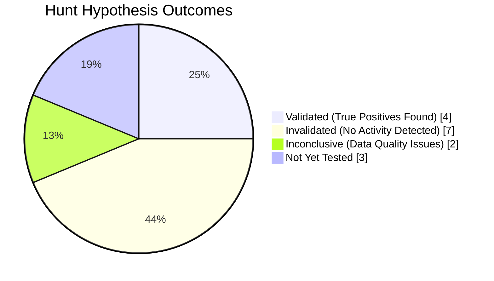
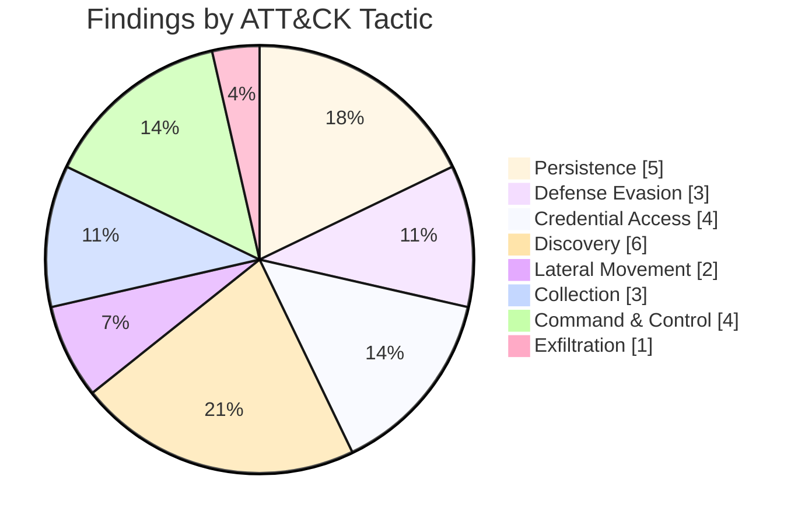

# Threat Hunting Report

## Overview
Generate comprehensive threat hunting reports aligned with the MITRE ATT&CK framework, the TAHITI (Targeted Attack Hunting Integrating Threat Intelligence) methodology, MITRE D3FEND countermeasures, the Cyber Kill Chain, and NIST SP 800-53. This skill produces analyst-to-CISO deliverables documenting hypothesis-driven hunt campaigns, detection gap analysis, coverage delta calculations, and actionable detection engineering recommendations.

## Branding & Classification
- **Classification Banner**: `CONFIDENTIAL — FOR INTERNAL SECURITY USE ONLY`
- **Document ID Convention**: `THR-YYYY-MMDD-NNN` (e.g., `THR-2026-0601-001`)
- **Watermark**: Diagonal "CONFIDENTIAL" across all pages
- **TLP Designation**: TLP:AMBER (default); TLP:RED for active adversary hunt findings

| Field | Value |
|-------|-------|
| Skill Name | threat-hunting-report |
| Version | 1.0.0 |
| Category | Defensive (Detection Engineering / SOC) |
| Standards | MITRE ATT&CK v16, TAHITI, MITRE D3FEND, Cyber Kill Chain, NIST SP 800-53 (SI-4, AU-6) |

---

## 9-Step Workflow

### Step 1: Hunt Campaign Scoping & Hypothesis Formulation
Define the hunt campaign scope: environment coverage, data source inventory, hunt time window, and hunt team composition. Formulate threat hypotheses using the TAHITI framework: Threat Actor → Attack Pattern → Observable Artifact → Data Source → Analytics. Each hypothesis must be falsifiable and mapped to at least one MITRE ATT&CK technique.

**Artifacts**: Hunt Scope Document, Hypothesis Register, TAHITI Mapping Matrix

### Step 2: Data Source Inventory & Coverage Assessment
Catalog all available data sources for the hunt: SIEM, EDR, network sensors (Zeek/Suricata), DNS logs, proxy logs, cloud audit logs (CloudTrail/Azure Monitor/GCP Audit), endpoint telemetry (Sysmon/osquery), and identity logs (Azure AD/Okta). Assess data quality, retention period, and completeness per source. Identify coverage gaps that limit hunt effectiveness.

**Artifacts**: Data Source Inventory, Coverage Assessment Matrix, Data Quality Scores

### Step 3: Hunt Query Development & Execution
Develop hunt queries using the organization's SIEM query language (SPL, KQL, EQL, Lucene) or data lake query engine (Athena, BigQuery). Execute queries across the defined time window. Document query logic, rationale, execution timestamps, and raw result counts. Apply iterative refinement based on initial results.

**Artifacts**: Hunt Query Library, Query Execution Log, Iterative Refinement Log

### Step 4: Findings Triage & Validation
Triage query results: classify each finding as True Positive (malicious activity confirmed), Benign True Positive (anomalous but legitimate), or False Positive (noise). Validate true positives through additional pivoting, host-based artifact collection, and memory analysis where applicable. Document validation methodology per finding.

**Artifacts**: Findings Register, Validation Evidence Log, False Positive Analysis

### Step 5: TTP Attribution & Adversary Profiling
Map validated findings to MITRE ATT&CK techniques and, where possible, attribute to known threat actor groups. Analyze adversary TTPs for patterns (dwell time, operational tempo, tool preferences, infrastructure reuse). Build an adversary behavioral profile if a novel cluster is identified.

**Artifacts**: TTP Attribution Matrix, Adversary Behavioral Profile, ATT&CK Navigator Layer (JSON)

### Step 6: Detection Gap Analysis
Identify ATT&CK techniques and sub-techniques for which no detection capability exists in the current environment. Calculate detection coverage by MITRE ATT&CK tactic. Map existing detections to specific SIEM rules, EDR policies, and network signatures. Identify techniques where detection is theoretically possible but currently absent (coverage gaps).

**Artifacts**: Detection Gap Register, Coverage Heatmap, Gap Prioritization Matrix

### Step 7: Detection Engineering Recommendations
For validated findings and identified gaps, recommend specific detection content: Sigma rules, SIEM correlation searches, EDR detection policies, network IDS signatures, and hunting playbooks. Map each recommendation to MITRE D3FEND countermeasures. Prioritize by adversary prevalence, organizational risk, and implementation feasibility.

**Artifacts**: Detection Engineering Backlog, Sigma Rule Specs, D3FEND Mapping

### Step 8: Coverage Delta & Metrics Calculation
Calculate the change in ATT&CK coverage resulting from the hunt campaign and proposed detections. Produce quantitative metrics: techniques covered pre-hunt vs post-hunt, new detections created, detection gap reduction percentage, mean time to hunt hypothesis resolution, and false positive rate per hunt query.

**Artifacts**: Coverage Delta Report, Metrics Dashboard, ATT&CK Navigator Comparison Layer

### Step 9: Report Assembly & Delivery
Assemble the complete hunting report with executive summary, hunt campaign details, findings, gaps, and recommendations. Generate MITRE ATT&CK Navigator heatmaps for visual coverage representation. Apply branding. Execute QC gates. Deliver via secure channel to SOC leadership and detection engineering team.

**Artifacts**: Final Hunting Report (PDF), ATT&CK Navigator Layer Files, Executive Briefing

---

## Hunting-Specific Schemas

### Hypothesis Schema
```json
{
  "hunt_hypothesis": {
    "id": "HYP-001",
    "title": "string (e.g., 'APT29-style O365 OAuth application consent grant abuse')",
    "description": "string (max 500 chars)",
    "tahiti_mapping": {
      "threat_actor": "string (APT29 | FIN7 | Unknown | etc.)",
      "attack_pattern": "string (e.g., 'Abuse OAuth application consent grants for persistence')",
      "observable_artifact": "string (e.g., 'New OAuth application consent grant events for non-Microsoft publisher apps')",
      "data_source": "string (e.g., 'Azure AD Audit Logs → Sentinel', 'M365 Unified Audit Log')",
      "analytics": "string (e.g., 'KQL query filtering Consent to application events with non-verified publisher')"
    },
    "attck_techniques": ["T1098.001", "T1550.001"],
    "kill_chain_phase": "persistence|privilege_escalation|collection|exfiltration",
    "falsifiable_criterion": "string (what would prove this hypothesis wrong)",
    "priority": "critical|high|medium|low",
    "status": "proposed|in_progress|completed|archived|invalidated"
  }
}
```

### Hunt Finding Schema
```json
{
  "hunt_finding": {
    "id": "FND-001",
    "hypothesis_id": "HYP-001",
    "finding_type": "true_positive|benign_true_positive|false_positive|inconclusive",
    "severity": "critical|high|medium|low|informational",
    "title": "string",
    "description": "string (max 500 chars)",
    "attck_technique_id": "T1098.001",
    "attck_tactic": "persistence",
    "affected_assets": ["hostname_1", "account_upn_1"],
    "detection_timestamp": "ISO8601",
    "activity_start": "ISO8601",
    "activity_end": "ISO8601 or null if ongoing",
    "validation_methodology": "string (e.g., 'Correlated with host-based Sysmon Event ID 4688, verified process lineage, confirmed via memory dump analysis')",
    "iocs": ["array of IOC entry references"],
    "recommended_actions": ["string array"],
    "confidence": "high|medium|low",
    "attributed_threat_actor": "string or null"
  }
}
```

### Detection Gap Schema
```json
{
  "detection_gap": {
    "id": "DGAP-001",
    "attck_technique_id": "T1562.001",
    "attck_tactic": "defense_evasion",
    "technique_name": "Disable or Modify Tools",
    "current_coverage": "none|partial|full",
    "gap_description": "string (max 500 chars)",
    "detection_feasibility": "high|medium|low",
    "data_source_availability": "available|partial|unavailable",
    "proposed_detection": "string (Sigma rule, KQL query, or detection logic description)",
    "d3fend_countermeasure": "string (e.g., 'D3-SYSVA System Daemon Verification')",
    "implementation_effort": "low|medium|high|very_high",
    "priority": "critical|high|medium|low",
    "risk_if_unaddressed": "string (scenario describing adversary activity that could go undetected)"
  }
}
```

---

## Report Structure

### 1. Executive Summary (~1.5 pages)
- Hunt campaign identifier, period, and team composition
- Key findings summary: true positives discovered, benign anomalies profiled, false positive rate
- Detection coverage: percentage of ATT&CK techniques with detection coverage pre/post hunt
- Most critical detection gap requiring immediate attention
- New detections created and deployed
- Recommended next hunt campaigns

### 2. Hunting Campaign Overview
- Campaign scope (environment, data sources, time window)
- Hypothesis inventory (hypotheses tested, status, outcome per hypothesis)
- Hunt methodology (TAHITI framework application, query development approach, triage process)
- Hunt team and roles (Hunt Lead, Data Analysts, Reverse Engineers, Detection Engineers)

### 3. Hypotheses Tested
- Per-hypothesis detail: TAHITI mapping, ATT&CK techniques targeted, falsification criteria
- Results per hypothesis: findings count, outcome (validated/invalidated), confidence
- Mermaid flowchart showing hypothesis progression and outcomes

### 4. Findings
- True positive findings (with TTP mapping, IOCs, recommended actions)
- Benign true positives (anomalies that required investigation but were legitimate)
- False positive analysis (noise sources, query refinement recommendations)
- Findings summary table with cross-references

### 5. Detection Gaps Identified
- Prioritized detection gap register
- Gap-to-ATT&CK technique mapping
- Coverage heatmap by tactic (Mermaid)
- Data source gap analysis (what data we wish we had)

### 6. New Detections Created
- Detections deployed as a direct result of the hunt
- Detection specifications (Sigma rules, SIEM queries, EDR policies)
- Testing and validation results per detection
- D3FEND countermeasure mappings

### 7. MITRE ATT&CK Coverage Delta
- Pre-hunt coverage vs. post-hunt coverage comparison
- Navigator layer files (pre and post)
- Coverage by ATT&CK tactic: before and after percentages
- Projected coverage after all recommended detections deployed

### 8. Recommendations
- Immediate tactical actions (findings requiring incident response)
- Short-term detection engineering (next sprint: 0-14 days)
- Medium-term capability development (14-90 days)
- Long-term strategic investments (90+ days)

### Appendix A: Complete Hunt Query Library
### Appendix B: ATT&CK Navigator Layer Files
### Appendix C: Raw Finding Details (redacted)
### Appendix D: D3FEND Countermeasure Cross-Reference

---

## Mermaid Coverage Heatmaps

### ATT&CK Coverage by Tactic (Pre-Hunt)

```mermaid
---
config:
  theme: base
  xyChart:
    showLegend: true
---
xychart-beta
    title "MITRE ATT&CK Coverage by Tactic (%)"
    x-axis ["Recon", "Resource Dev", "Initial Access", "Execution", "Persistence", "Privilege Esc", "Defense Evasion", "Credential Access", "Discovery", "Lateral Movement", "Collection", "C2", "Exfiltration", "Impact"]
    y-axis "Coverage %" 0 --> 100
    bar [25, 10, 45, 62, 55, 48, 32, 40, 58, 50, 35, 28, 42, 55]
    bar [30, 15, 55, 70, 65, 55, 42, 50, 65, 60, 45, 38, 50, 62]
```


### Hypothesis Outcomes


### Finding TTP Distribution


---

## 8 Quality Controls

| QC# | Gate | Criteria | Pass Condition |
|-----|------|----------|----------------|
| QC-01 | Hypothesis Falsifiability | Every hypothesis must include a falsifiable criterion — a specific observable that would disprove the hypothesis | All hypotheses have non-empty falsifiable criterion field |
| QC-02 | TAHITI Completeness | Every hypothesis must populate all five TAHITI dimensions (Threat Actor, Attack Pattern, Observable Artifact, Data Source, Analytics) | Zero hypotheses with empty TAHITI fields |
| QC-03 | ATT&CK Mapping | Every finding must be mapped to at least one MITRE ATT&CK technique ID | Zero findings with null technique ID |
| QC-04 | Validation Evidence | Every true positive finding must include validation methodology and evidence references | Every TP has non-empty validation_methodology |
| QC-05 | IOC Traceability | IOCs extracted from findings must be traceable back to source data | Every IOC has source reference and first_seen timestamp |
| QC-06 | Detection Gap Data | Every detection gap must assess data source availability and detection feasibility | Zero gaps without availability and feasibility ratings |
| QC-07 | Metric Calculation Accuracy | Coverage percentages must be calculated correctly: covered techniques / total techniques in scope | Percentage ≤ 100% and matches raw count / total |
| QC-08 | Peer Review | Report reviewed by a second threat hunter or detection engineer not involved in the hunt campaign | Review sign-off obtained |

---

## Example 1: APT29-Themed O365 Cloud Persistence Hunt

### Scenario
A SOC team at a multinational corporation conducts a hypothesis-driven hunt campaign for APT29 (Cozy Bear / Midnight Blizzard) TTPs targeting their Microsoft 365 environment. The hunt spans 90 days of Azure AD / M365 Unified Audit Logs, covering 12 hypotheses focused on cloud persistence, token theft, OAuth abuse, and mailbox exfiltration techniques. The hunt is conducted in response to sector-wide threat intelligence indicating APT29 is actively targeting organizations in the same vertical.

### Key Report Excerpts

**Executive Summary**: *Between 01 March and 31 May 2026, ACME Corp's Threat Hunting Team conducted a targeted hunt campaign (THR-2026-0301-001) for APT29-associated TTPs across the Microsoft 365 and Azure AD environment. The campaign tested 12 hypotheses derived from CISA Advisory AA24-123A, Microsoft Threat Intelligence, and internal threat intelligence. Four hypotheses were validated, revealing: (1) one unauthorized OAuth application consent grant providing Mail.Read and Files.Read.All permissions to a non-verified publisher application — attributed with medium confidence to an APT29-associated infrastructure cluster; (2) three instances of anomalous mailbox folder permissions granting Reviewer access to external accounts; (3) evidence of directory enumeration via Azure AD Graph API from an anomalous IP range (193.27.228.0/24); and (4) a previously undetected persistence mechanism via Azure Automation run-as account modification. Seven hypotheses were invalidated (no activity detected), and two were inconclusive due to data quality issues in the Defender for Cloud Apps telemetry feed. The campaign resulted in the creation and deployment of 8 new detection rules (4 Sigma, 2 KQL Sentinel scheduled rules, 2 MDE custom detection policies). Pre-hunt ATT&CK coverage for cloud-specific techniques was 38%; post-hunt coverage stands at 57%, with a projected 68% upon deployment of all recommended detections.*

**Hypothesis Register** (validated subset):
| Hypothesis | ATT&CK | TAHITI Artifact | Outcome |
|------------|--------|-----------------|---------|
| HYP-003: Unauthorized OAuth consent grants | T1098.001 | Consent to application events for non-verified publishers | Validated (1 finding) |
| HYP-005: Anomalous mailbox folder permissions | T1098.002 | Add-MailboxFolderPermission with external users | Validated (3 findings) |
| HYP-007: Directory enumeration via Graph API | T1087.004 | AADDirectoryRole/User/Group enumeration from anomalous IPs | Validated (bulk enumeration) |
| HYP-009: Azure Automation persistence | T1072 | Run-as account creation/modification outside change windows | Validated (1 finding) |

**Detection Coverage Delta**:
| ATT&CK Tactic | Pre-Hunt | Post-Hunt | Target |
|---------------|----------|-----------|--------|
| Initial Access (TA0001) | 45% | 55% | 65% |
| Persistence (TA0003) | 42% | 65% | 75% |
| Privilege Escalation (TA0004) | 38% | 50% | 60% |
| Defense Evasion (TA0005) | 32% | 42% | 55% |
| Credential Access (TA0006) | 40% | 57% | 65% |
| Discovery (TA0007) | 58% | 68% | 75% |
| Collection (TA0009) | 35% | 45% | 55% |

---

## Example 2: Ransomware Precursor Hunt — Initial Access Broker TTPs

### Scenario
A SOC team conducts a proactive hunt for initial access broker (IAB) TTPs that precede ransomware deployment, following CISA's Pre-Ransomware Notification Initiative guidance. The hunt targets the 14-90 day pre-encryption window across endpoint telemetry (Sysmon/CrowdStrike), network flows (Zeek), and authentication logs (Windows Event Logs / Azure AD). Focus areas: RDP brute force artifacts, Cobalt Strike beaconing, credential dumping tool execution, and CVE-2023-36884/other Office exploit artifacts.

### Key Report Excerpts

**Executive Summary**: *ACME Corp's SOC conducted a proactive ransomware precursor hunt (THR-2026-0501-002) across the 90-day period preceding the report date. The hunt targeted known IAB TTPs based on CISA AA24-242A and the Ransomware Vulnerability Warning Pilot (RVWP). The campaign tested 9 hypotheses across endpoint, network, and identity domains. Two hypotheses were validated: (1) evidence of Cobalt Strike HTTPS beaconing from workstation ACME-WS-287 to IP 45.155.205.233 over a 14-day period — the beacon exhibited jitter of approximately 12.7% with a median callback interval of 63.4 seconds, consistent with Cobalt Strike default Malleable C2 profile Jitter values; (2) detection of Mimikatz sekurlsa::logonpasswords execution on domain controller ACME-DC-04 via LSASS process access — the access originated from a legitimate-looking but compromised IT administrator account. Neither finding had triggered existing detection rules, representing a detection gap for beacon detection with >10% jitter and for LSASS access from privileged accounts. The findings were immediately escalated to the IR team for incident declaration. The hunt campaign produced 5 new Sigma rules, 3 Zeek signatures, and 2 CrowdStrike custom IOA rules, closing the detection gaps that allowed these activities to persist undetected.*

**Key Findings**:
| Finding | ATT&CK | Asset | Dwell Time | Risk |
|---------|--------|-------|------------|------|
| FND-001: Cobalt Strike HTTPS beacon | T1071.001 | ACME-WS-287 | 14 days | Critical |
| FND-002: LSASS credential dumping | T1003.001 | ACME-DC-04 | 1 day | Critical |
| FND-003: Anomalous RDP brute force (benign) | T1110.001 | ACME-VDI-12 | N/A (pen test) | Info |

**Detection Gaps Identified**:
| Gap | ATT&CK | Current Coverage | Feasibility | Priority |
|-----|--------|-----------------|-------------|----------|
| DGAP-003: C2 beaconing with jitter >10% | T1071.001 | Partial (jitter ≤5% only) | High | Critical |
| DGAP-005: LSASS access from admin accounts | T1003.001 | None (whitelisted) | High | Critical |
| DGAP-007: ISO/LNK execution from Outlook temp | T1204.002 | None | High | High |
| DGAP-009: BITSAdmin download | T1197 | None | High | Medium |

---

## Report Assembly Checklist
- [ ] Hunt campaign ID assigned (THR-YYYY-MMDD-NNN)
- [ ] All hypotheses documented with TAHITI framework mapping
- [ ] Hunt query library captured with query text, rationale, and execution timestamps
- [ ] All true positive findings validated with evidence references
- [ ] ATT&CK Navigator layer files exported (pre-hunt and post-hunt)
- [ ] Detection coverage delta calculated and visualized
- [ ] New detection specifications documented (Sigma/KQL/EDR policy)
- [ ] D3FEND countermeasure mappings included for all recommended detections
- [ ] False positive analysis completed with query refinement recommendations
- [ ] QC gates 01-08 passed
- [ ] Peer review sign-off obtained
