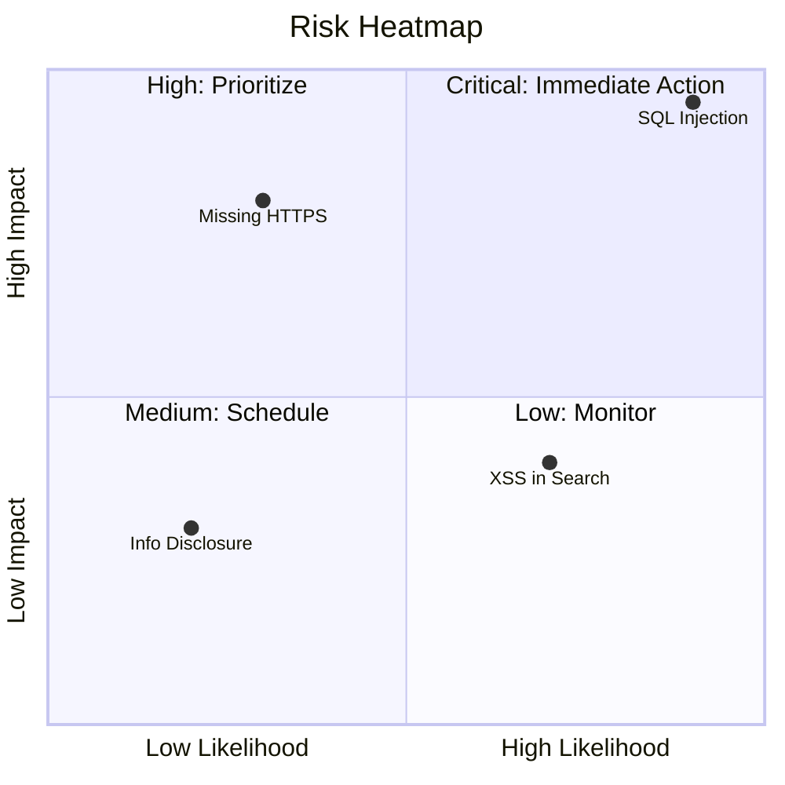
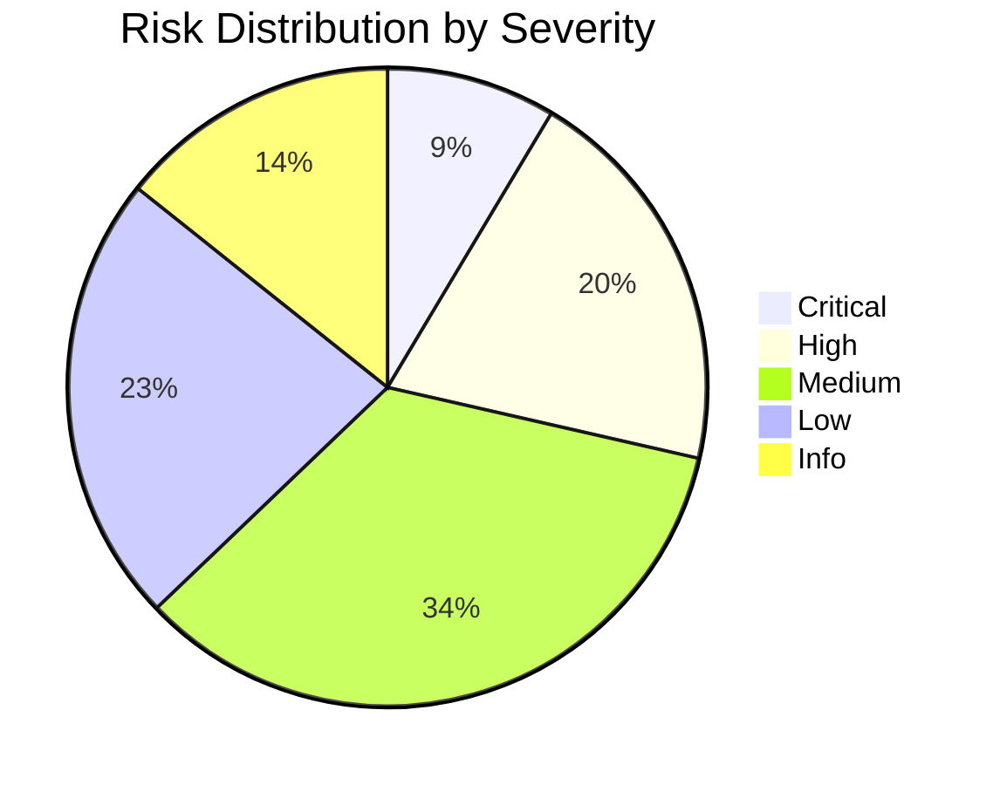
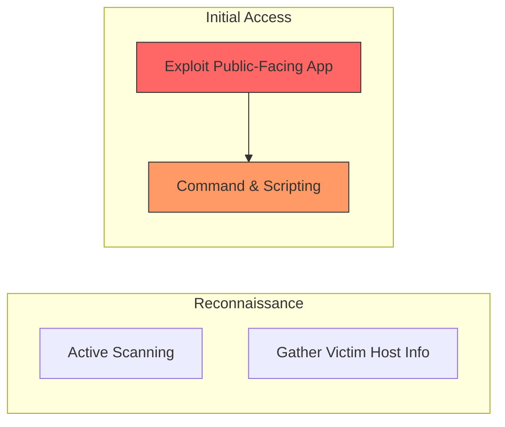
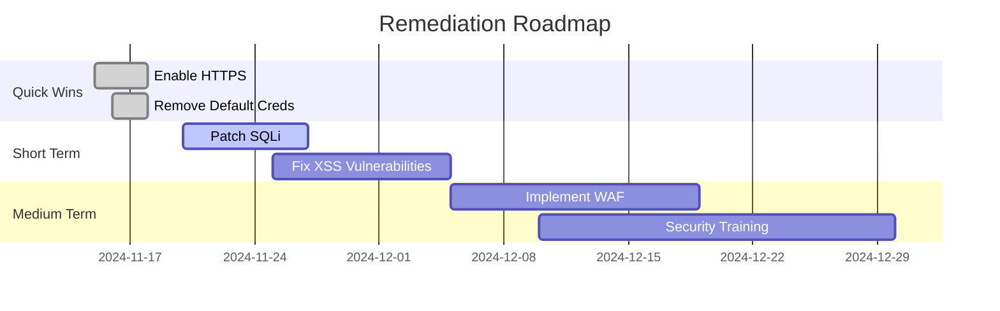

# Universal Reporting Engine

## Purpose

The Universal Reporting Engine is the master orchestration skill for the CyberSec Reporting Engine platform. It automatically:

1. **Detects** the assessment type from raw findings or structured data
2. **Analyzes** findings against applicable standards and frameworks
3. **Selects** the appropriate reporting methodology and template
4. **Generates** a complete, enterprise-grade deliverable package
5. **Validates** output quality against defined quality controls

No manual intervention is required — the engine intelligently routes findings through the correct pipeline.

---

## Architecture

```
┌─────────────────────────────────────────────────────────┐
│                  UNIVERSAL REPORTING ENGINE               │
├─────────────────────────────────────────────────────────┤
│                                                           │
│  ┌──────────┐  ┌──────────┐  ┌──────────┐  ┌──────────┐ │
│  │ASSESSMENT│  │ FINDING  │  │METHODOLOGY│  │ TEMPLATE │ │
│  │ DETECTOR │→│ ANALYZER │→│ SELECTOR  │→│ SELECTOR  │ │
│  └──────────┘  └──────────┘  └──────────┘  └──────────┘ │
│                                                     │     │
│                                                     ▼     │
│  ┌──────────┐  ┌──────────┐  ┌──────────┐  ┌──────────┐ │
│  │EXECUTIVE │  │TECHNICAL │  │ DASHBOARD│  │REMEDIATION│ │
│  │ REPORT   │← │ REPORT   │← │GENERATOR │→ │ ROADMAP  │ │
│  └──────────┘  └──────────┘  └──────────┘  └──────────┘ │
│                                                           │
│  ┌──────────────────────────────────────────────────┐   │
│  │              OUTPUT GENERATOR                      │   │
│  │   Markdown │ HTML │ DOCX │ PDF (with branding)     │   │
│  └──────────────────────────────────────────────────┘   │
│                                                           │
└─────────────────────────────────────────────────────────┘
```

---

## Workflow

### Phase 1: Assessment Detection

Analyze input data to determine assessment type:

| Indicator | Assessment Type |
|-----------|----------------|
| `pentest`, `external`, `network`, `infrastructure` | Pentesting |
| `webapp`, `web application`, `api`, `rest`, `graphql` | Web/API Assessment |
| `mobile`, `ios`, `android`, `apk`, `ipa` | Mobile Assessment |
| `active directory`, `ad`, `domain`, `kerberos`, `ldap` | AD Assessment |
| `cloud`, `aws`, `azure`, `gcp`, `s3`, `ec2` | Cloud Assessment |
| `red team`, `adversary`, `emulation`, `simulation` | Red Team Operations |
| `purple team`, `detection`, `coverage`, `atomic` | Purple Team |
| `hardening`, `baseline`, `cis`, `benchmark` | Hardening Assessment |
| `forensic`, `forensics`, `disk`, `memory`, `image` | Digital Forensics |
| `incident`, `ir`, `breach`, `ransomware`, `response` | Incident Response |
| `malware`, `reverse`, `analysis`, `sample` | Malware Analysis |
| `threat hunt`, `hunting`, `hypothesis`, `apt` | Threat Hunting |
| `compliance`, `audit`, `iso`, `soc2`, `pci`, `gdpr` | Compliance |
| `vulnerability`, `vuln`, `scan`, `nessus`, `qualys` | Vulnerability Assessment |
| `architecture`, `review`, `design`, `sdlc` | Architecture Review |

### Phase 2: Finding Analysis

For each finding, extract and normalize:

```yaml
finding_normalization:
  required_fields:
    - title
    - description
    - severity (Critical|High|Medium|Low|Info)
    - affected_asset
  optional_fields:
    - cvss_score
    - cvss_vector
    - cwe_id
    - evidence
    - remediation
  enrichment:
    - auto_calculate_cvss_v4
    - map_to_mitre_attack
    - map_to_kill_chain
    - map_to_capec
    - cross_reference_cwe
    - calculate_risk_score
```

### Phase 3: Methodology Selection

Select applicable methodology based on assessment type:

| Assessment Type | Primary Methodology | Secondary Standards |
|----------------|-------------------|-------------------|
| Pentesting | PTES | OSSTMM, NIST 800-115 |
| Web App | OWASP Testing Guide | OWASP ASVS |
| API | OWASP API Top 10 | OWASP ASVS |
| Mobile | OWASP MASTG | OWASP MASVS |
| AD | MITRE ATT&CK | BloodHound Methodology |
| Cloud | CIS Benchmarks | CSA CCM |
| Red Team | MITRE ATT&CK | Cyber Kill Chain |
| Forensics | NIST 800-86 | SANS DFIR |
| IR | NIST 800-61 | SANS PICERL |
| Compliance | ISO 27001 | NIST CSF 2.0 |
| Threat Hunting | MITRE ATT&CK | TAHITI |

### Phase 4: Template Selection

Select templates based on audience and assessment type:

| Audience | Template | Sections |
|----------|----------|----------|
| C-Suite / Board | `executive-summary` | State of Security, Business Risk, Strategic Roadmap |
| Technical Team | `technical-report` | Methodology, Findings, Evidence, Remediation |
| SOC / Blue Team | `operations-report` | Detection Coverage, Alert Analysis, MITRE Mapping |
| PMO / Remediation | `remediation-roadmap` | Prioritized Fixes, Effort, Timeline, Dependencies |
| Combined | `full-report` | All sections in executive-first order |

### Phase 5: Report Generation

Generate the complete deliverable package:

```
deliverable_package/
├── 01-Executive-Summary.md|html|docx|pdf
├── 02-Technical-Report.md|html|docx|pdf
├── 03-Findings-Register.md|html|docx|pdf
├── 04-Remediation-Roadmap.md|html|docx|pdf
├── 05-Executive-Dashboard.md|html|docx|pdf
├── 06-Appendices.md|html|docx|pdf
├── evidence/
│   └── screenshots/
└── raw/
    └── findings.json
```

### Phase 6: Quality Validation

Validate against quality controls (see Quality Controls section).

---

## Input Schema

```yaml
input:
  assessment_metadata:
    client_name: string
    project_name: string
    assessment_type: string (auto-detected if not provided)
    assessment_dates:
      start: date
      end: date
    assessors:
      - name: string
        role: string
        certification: string
    scope:
      targets: list
      exclusions: list
      limitations: list

  findings:
    - id: string
      title: string
      description: string
      severity: string (Critical|High|Medium|Low|Info)
      cvss_score: number (0.0-10.0)
      cvss_vector: string
      cwe_id: string
      affected_asset: string
      evidence: string (path or inline)
      reproduction_steps: list
      remediation: string
      references: list

  branding:
    theme: string (enterprise-dark|enterprise-light|executive-blue|security-ops)
    client_logo: string (path)
    company_name: string

  output:
    formats: list (markdown|html|docx|pdf)
    include_executive_summary: boolean
    include_technical_report: boolean
    include_dashboard: boolean
    include_remediation_roadmap: boolean
```

---

## Output Schema

```yaml
output:
  executive_summary:
    state_of_security: string
    risk_summary:
      business_risk: string
      operational_risk: string
      reputational_risk: string
      financial_risk: string
      regulatory_risk: string
    key_findings: list
    strategic_recommendations: list
    risk_distribution_chart: mermaid

  technical_report:
    scope: string
    methodology: string
    findings: list (detailed)
    evidence: list
    attack_narrative: string
    risk_analysis: string
    business_impact: string
    remediation_summary: string

  findings_register:
    - finding_id: string
      title: string
      severity: string
      cvss_v4: object
      cwe: string
      mitre_attack: object
      kill_chain_phase: string
      affected_assets: list
      status: string

  remediation_roadmap:
    quick_wins: list
    short_term: list
    medium_term: list
    long_term: list
    strategic_initiatives: list

  executive_dashboard:
    risk_heatmap: mermaid
    risk_distribution: mermaid
    compliance_coverage: mermaid
    remediation_progress: mermaid
    security_kpis: object
```

---

## Quality Controls

### Content Quality

| Rule | Description | Enforcement |
|------|-------------|-------------|
| QC-01 | Executive summary must be under 1000 words | Auto-trim |
| QC-02 | All Critical/High findings must have CVSS v4 vectors | Validation error |
| QC-03 | Every finding must map to at least one CWE | Warning |
| QC-04 | Every finding must map to at least one MITRE ATT&CK technique | Warning |
| QC-05 | No generic language ("fixed", "secure it", "be careful") | Auto-flag |
| QC-06 | Remediation must include specific commands/configs | Validation |
| QC-07 | Evidence must be referenced for Critical findings | Validation error |
| QC-08 | Report must include methodology section | Validation error |
| QC-09 | Risk ratings must be consistent (no High impact + Low likelihood = Critical) | Auto-check |
| QC-10 | All external references must be valid | Warning |

### Formatting Quality

| Rule | Description |
|------|-------------|
| FQ-01 | Consistent heading hierarchy (H1 > H2 > H3) |
| FQ-02 | Tables must have headers |
| FQ-03 | Code blocks must specify language |
| FQ-04 | Images must have alt text |
| FQ-05 | No orphan headings (heading with no content) |

### Standards Compliance

| Rule | Standard | Check |
|------|----------|-------|
| SC-01 | PTES | Report follows PTES reporting structure |
| SC-02 | OWASP | Findings use OWASP risk rating methodology |
| SC-03 | NIST 800-61 | IR report follows NIST incident response phases |
| SC-04 | ISO 27001 | Compliance report maps to Annex A controls |
| SC-05 | CVSS v4 | All scores calculated with CVSS v4.0 |

---

## Branding & Visual Identity

### Theme Selection

```
enterprise-dark    → Dark backgrounds, slate accents, emerald highlights
enterprise-light   → White backgrounds, blue accents, gray secondary
executive-blue     → Deep navy, gold accents, white text
security-ops       → Dark gray, red alerts, amber warnings, green ok
```

### Component Usage

```yaml
severity_badges:
  critical: "🔴 CRITICAL" (red badge)
  high:     "🟠 HIGH" (orange badge)
  medium:   "🟡 MEDIUM" (yellow badge)
  low:      "🟢 LOW" (green badge)
  info:     "🔵 INFO" (blue badge)

risk_cards:
  format: |
    ┌─────────────────────────────────┐
    │ FINDING-001: SQL Injection      │
    │ Severity: 🔴 CRITICAL           │
    │ CVSS v4: 9.8                    │
    │ CWE: CWE-89                     │
    │ MITRE ATT&CK: T1190             │
    │ Kill Chain: Exploitation        │
    └─────────────────────────────────┘

executive_tables:
  style: clean, minimal, with alternating row colors
  headers: bold, uppercase tracking
  alignment: numbers right, text left

kpi_widgets:
  format: compact cards with icon, value, label, trend arrow
```

---

## Example Usage

### Example 1: Pentest Report (Structured Input)

```yaml
input:
  assessment_metadata:
    client_name: "Acme Financial Services"
    project_name: "Q4 2024 External Penetration Test"
    assessment_type: "pentest"
    assessment_dates:
      start: "2024-11-01"
      end: "2024-11-15"
    assessors:
      - name: "Jane Smith"
        role: "Lead Penetration Tester"
        certification: "OSCP, OSCE"
    scope:
      targets: ["acmefinance.com", "api.acmefinance.com", "203.0.113.0/28"]
      exclusions: ["*.test.acmefinance.com"]
      limitations: ["No DoS testing", "Business hours only"]

  findings:
    - id: "ACME-001"
      title: "Unrestricted File Upload Leading to RCE"
      severity: "Critical"
      cvss_score: 9.8
      cwe_id: "CWE-434"
      affected_asset: "acmefinance.com/upload"
      description: >
        The file upload functionality at /upload accepts arbitrary
        file types without validation. An attacker can upload a
        webshell and achieve remote code execution.
      remediation: >
        Implement server-side file type validation using MIME type
        checking and file extension whitelisting (jpg, png, pdf only).
        Store uploaded files outside the web root.

  branding:
    theme: "enterprise-dark"
    company_name: "CyberSec Consulting Group"

  output:
    formats: ["markdown", "html", "pdf"]
    include_executive_summary: true
    include_technical_report: true
    include_dashboard: true
    include_remediation_roadmap: true
```

### Example 2: Auto-Detection (Free-Text Input)

The engine can also process unstructured text:

```
"I performed a web application pentest on example.com last week.
I found SQL injection in the login form, XSS in the search bar,
and the admin panel was accessible without authentication.
The SQLi is critical, XSS is high, and the admin panel is medium.
I used Burp Suite and sqlmap for testing.
Client: Acme Corp, dates: 2024-10-01 to 2024-10-05."

→ Engine auto-detects: Web Application Assessment
→ Engine extracts: 3 findings with severities
→ Engine assigns: CWE-89 (SQLi), CWE-79 (XSS), CWE-306 (Missing Auth)
→ Engine maps: MITRE ATT&CK T1190, T1059, T1078
→ Engine generates: Full report package
```

---

## Integration with Specialized Skills

The Universal Engine delegates to specialized skills when the assessment type is identified:

```
Universal Report Engine
  ├── pentest-report (PTES, OSSTMM, NIST 800-115)
  ├── redteam-report (MITRE ATT&CK, Cyber Kill Chain)
  ├── hardening-report (CIS Benchmarks, NIST 800-53)
  ├── cloud-security-report (CIS Cloud, CSA CCM)
  ├── ad-assessment-report (MITRE ATT&CK, BloodHound)
  ├── forensics-report (NIST 800-86, SANS DFIR)
  ├── incident-response-report (NIST 800-61, SANS PICERL)
  ├── compliance-report (ISO 27001, NIST CSF 2.0)
  ├── threat-hunting-report (MITRE ATT&CK, TAHITI)
  └── vulnerability-assessment-report (CVSS v4, CIS Controls v8)
```

---

## Mermaid Dashboard Templates

### Risk Heatmap



### Risk Distribution



### MITRE ATT&CK Coverage



### Remediation Timeline



---

## Validation Rules

Before delivering any report, the engine validates:

1. **Completeness**: All required sections present
2. **Consistency**: Severity ratings match CVSS scores
3. **Standards Compliance**: Mapped to applicable frameworks
4. **Quality**: No generic language, professional tone
5. **Branding**: Consistent visual identity applied
6. **Evidence**: Screenshots and logs referenced
7. **Remediation**: Actionable, specific, prioritized
8. **References**: Standards and external sources cited

---

## Error Handling

| Error Code | Description | Resolution |
|-----------|-------------|------------|
| `E001` | Assessment type not detected | Provide explicit type or more context |
| `E002` | Missing required finding fields | Add title, description, severity |
| `E003` | Invalid CVSS vector | Recalculate or provide valid vector |
| `E004` | Template not found for assessment type | Use generic template |
| `E005` | Output format not supported | Fall back to Markdown |
| `E006` | Branding theme not found | Use enterprise-dark default |
| `E007` | Finding severity inconsistency | Auto-correct based on CVSS |
| `E008` | Evidence file not found | Flag in report, continue generation |

---

## Configuration

```yaml
# engine.config.yaml
engine:
  auto_detect: true
  strict_mode: false  # If true, halt on validation errors
  fallback_template: "universal"
  default_theme: "enterprise-dark"

quality:
  max_executive_words: 1000
  require_cvss_for_critical: true
  require_evidence_for_critical: true
  min_remediation_specificity: 50  # chars

output:
  default_formats: ["markdown", "pdf"]
  include_raw_findings: true
  evidence_directory: "./evidence"

branding:
  default_company: "CyberSec Consulting Group"
  default_theme: "enterprise-dark"
  client_logo_max_height: 80  # px

standards:
  prefer_cvss_v4: true
  require_mitre_mapping: true
  require_cwe_mapping: true
```

---

**Universal Reporting Engine v1.0.0** — *Enterprise reporting, fully automated.*
