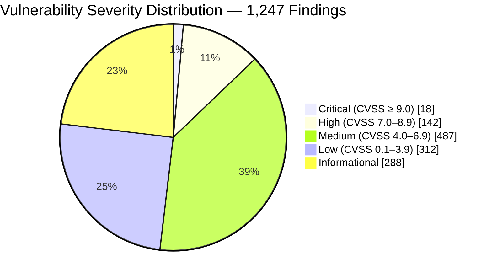
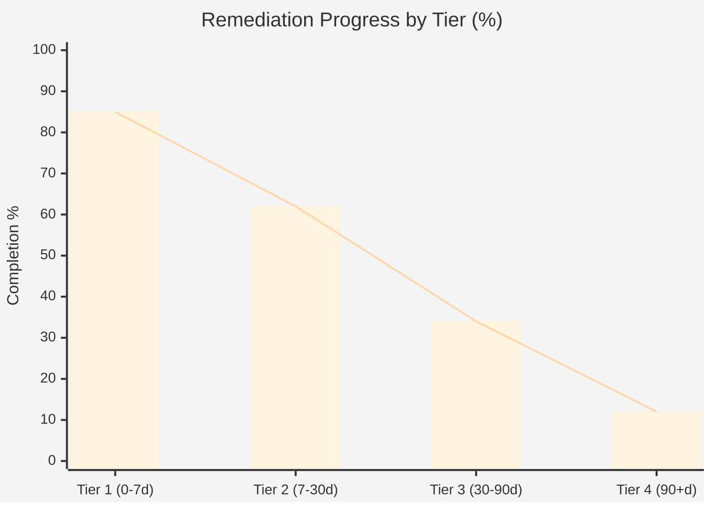
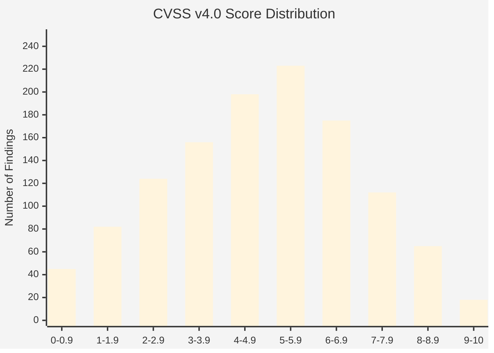
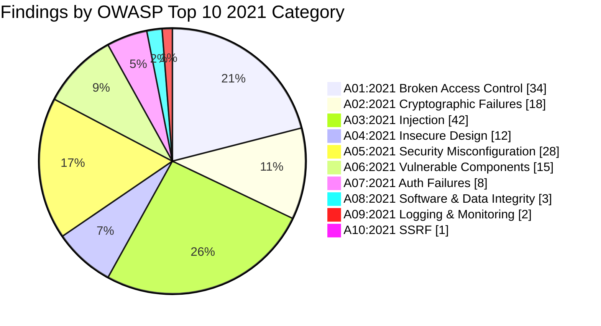

# Vulnerability Assessment Report

## Overview
Generate comprehensive vulnerability assessment reports aligned with CVSS v4.0, CIS Controls v8, NIST SP 800-40 (Guide to Enterprise Patch Management), OWASP Testing Guide, MITRE ATT&CK, CWE (Common Weakness Enumeration), and EPSS (Exploit Prediction Scoring System). This skill produces risk-prioritized deliverables with asset-grouped findings, exploitation probability analysis, patching cadence recommendations, and executive-ready risk summaries for vulnerability management program stakeholders.

## Branding & Classification
- **Classification Banner**: `CONFIDENTIAL — FOR INTERNAL SECURITY USE ONLY`
- **Document ID Convention**: `VAS-YYYY-MMDD-NNN` (e.g., `VAS-2026-0601-001`)
- **Watermark**: Diagonal "CONFIDENTIAL" across all pages
- **TLP Designation**: TLP:AMBER (default); TLP:GREEN for sanitized remediation guidance to system owners

| Field | Value |
|-------|-------|
| Skill Name | vulnerability-assessment-report |
| Version | 1.0.0 |
| Category | Offensive (Vulnerability Management) |
| Standards | CVSS v4.0, CIS Controls v8, NIST SP 800-40, OWASP Top 10 (2021), MITRE ATT&CK v16, CWE Top 25 (2024), EPSS v2024 |

---

## 9-Step Workflow

### Step 1: Assessment Scope & Methodology Definition
Define the assessment scope: target IP ranges, domains, cloud environments, applications, and API endpoints. Specify assessment methodology: authenticated vs. unauthenticated scanning, agent-based vs. agentless, internal vs. external perspective, compliance scanning (CIS benchmarks, DISA STIGs), and web application scanning (OWASP ZAP, Burp Suite). Document scanner tooling and versions.

**Artifacts**: Scope of Work, Methodology Statement, Scanner Configuration Summary

### Step 2: Asset Discovery & Inventory
Discover and inventory all in-scope assets: IP addresses, hostnames, operating systems, installed software, open ports, running services, web applications, cloud resources, and database instances. Classify assets by business criticality (Tier 1 — Critical, Tier 2 — High, Tier 3 — Medium, Tier 4 — Low) for risk-weighted prioritization.

**Artifacts**: Asset Inventory, Asset Criticality Classification, Network Topology Map

### Step 3: Vulnerability Scanning Execution
Execute vulnerability scans using enterprise scanners (Nessus, Qualys, Rapid7 InsightVM, OpenVAS/Greenbone). Run multiple scan profiles: full authenticated scan, unauthenticated external scan, web application scan, and compliance scan. Document scan windows, bandwidth throttling, and any scan exceptions or exclusions.

**Artifacts**: Scan Execution Log, Raw Scan Results (Nessus .nessus / Qualys XML), Scan Coverage Report

### Step 4: Finding Deduplication & Normalization
Deduplicate findings across multiple scanners and scan profiles. Normalize vulnerability identifiers to CVE IDs. Map each finding to CWE (Common Weakness Enumeration), MITRE ATT&CK techniques (where applicable), and OWASP categories (for web application findings). Remove false positives through manual validation and scanner rule tuning.

**Artifacts**: Deduplicated Finding Register, CWE Cross-Reference, False Positive Removal Log

### Step 5: CVSS v4.0 Scoring & Severity Classification
Score each validated finding using CVSS v4.0 (Attack Vector, Attack Complexity, Attack Requirements, Privileges Required, User Interaction, Vuln/Sub Confidentiality Impact, Vuln/Sub Integrity Impact, Vuln/Sub Availability Impact). Classify by severity: Critical (CVSS ≥ 9.0), High (7.0–8.9), Medium (4.0–6.9), Low (0.1–3.9), Informational (0.0).

**Artifacts**: CVSS Scoring Matrix, Severity Classification Register, CVSS Vector Strings

### Step 6: EPSS Exploitation Probability Analysis
Enrich each CVE with EPSS (Exploit Prediction Scoring System) data: probability of exploitation within 30 days (0.0–1.0), EPSS percentile ranking. Correlate with CISA Known Exploited Vulnerabilities (KEV) catalog. Generate risk scores combining CVSS severity + EPSS exploitation probability + asset criticality.

**Artifacts**: EPSS Enrichment Report, KEV Cross-Reference, Combined Risk Score Matrix

### Step 7: Remediation Prioritization
Prioritize remediation using a combined risk score: `Risk = CVSS_Score × EPSS_Probability × Asset_Criticality_Weight`. Group into remediation tiers: Tier 1 — Immediate (0–7 days, actively exploited or EPSS ≥ 0.10), Tier 2 — Short-term (7–30 days, CVSS ≥ 7.0), Tier 3 — Medium-term (30–90 days, CVSS ≥ 4.0), Tier 4 — Long-term (90+ days, CVSS < 4.0).

**Artifacts**: Remediation Priority Register, Tiered Remediation Schedule, Risk Score Distribution Chart

### Step 8: Patch Management Recommendations
Develop patching cadence recommendations per asset tier. Identify compensating controls where patching is not immediately feasible (WAF rules, network segmentation, IPS signatures, application whitelisting). Document patch testing requirements, maintenance windows, and rollback procedures for critical systems.

**Artifacts**: Patch Management Schedule, Compensating Control Register, Patch Testing Playbook

### Step 9: Report Assembly & Delivery
Assemble the complete vulnerability assessment report. Generate severity distribution charts, asset group summaries, EPSS correlation graphs, and remediation trackers. Apply branding and classification. Execute QC gates. Deliver findings to vulnerability management platform (DefectDojo, ServiceNow VR, Jira) via structured export.

**Artifacts**: Final Vulnerability Assessment Report (PDF), CSV Export for VM Platform, Executive Briefing

---

## Vulnerability-Specific Schemas

### Vulnerability Finding Schema
```json
{
  "vulnerability_finding": {
    "id": "VULN-001",
    "cve_id": "CVE-2026-12345",
    "cwe_id": "CWE-89",
    "title": "string (e.g., 'SQL Injection in /api/users endpoint')",
    "description": "string (max 500 chars)",
    "cvss_v40": {
      "base_score": 9.3,
      "severity": "critical|high|medium|low|informational",
      "vector_string": "CVSS:4.0/AV:N/AC:L/AT:N/PR:N/UI:N/VC:H/VI:H/VA:H/SC:N/SI:N/SA:N",
      "attack_vector": "network|adjacent|local|physical",
      "attack_complexity": "low|high",
      "attack_requirements": "none|present",
      "privileges_required": "none|low|high",
      "user_interaction": "none|passive|active"
    },
    "epss": {
      "probability": 0.234,
      "percentile": 0.92,
      "exploitation_likelihood": "high|medium|low"
    },
    "cisa_kev": true,
    "asset": {
      "hostname": "string",
      "ip_address": "string",
      "operating_system": "string",
      "asset_tier": "tier_1|tier_2|tier_3|tier_4",
      "asset_group": "string (e.g., 'DMZ Web Servers', 'Internal Database Cluster')",
      "business_owner": "string (name/team)",
      "technical_owner": "string (name/team)"
    },
    "discovery": {
      "scanner": "nessus|qualys|rapid7|openvas|crowdstrike_spotlight|wiz|oracles|snyk|manual",
      "scan_date": "ISO8601",
      "scan_type": "authenticated|unauthenticated|agent|api|manual",
      "plugin_id": "string (scanner-specific ID)",
      "plugin_name": "string",
      "port": "integer or null",
      "protocol": "tcp|udp|icmp|http|https"
    },
    "remediation": {
      "remediation_type": "patch|configuration_change|upgrade|removal|compensating_control|accept_risk",
      "patch_available": true,
      "patch_identifier": "string (KB, update ID, or 'none')",
      "remediation_steps": "string (max 500 chars)",
      "remediation_tier": "immediate|short_term|medium_term|long_term",
      "remediation_deadline": "ISO8601",
      "compensating_controls": ["string array or null"],
      "estimated_effort_hours": "float"
    },
    "risk_score": {
      "combined_risk": "float (0.0–100.0)",
      "risk_formula": "CVSS × EPSS × AssetWeight"
    },
    "owasp_category": "string (A01-A10 per OWASP Top 10 2021, or null for non-web)",
    "attck_techniques": ["string array of ATT&CK technique IDs"],
    "affected_instances": "integer (number of assets affected by this vulnerability)",
    "first_discovered": "ISO8601",
    "status": "open|in_progress|remediated|accepted_risk|false_positive|wont_fix"
  }
}
```

### Asset Group Schema
```json
{
  "asset_group": {
    "id": "AG-001",
    "name": "string (e.g., 'DMZ Web Servers')",
    "description": "string",
    "tier": "tier_1|tier_2|tier_3|tier_4",
    "criticality_weight": 1.0,
    "asset_count": "integer",
    "assets": ["array of hostname/IP references"],
    "os_distribution": {"windows": 12, "linux": 8, "other": 0},
    "vulnerability_summary": {
      "critical": 3,
      "high": 12,
      "medium": 28,
      "low": 15,
      "informational": 42,
      "total": 100
    },
    "mean_cvss": "float",
    "mean_epss": "float",
    "highest_risk_finding_id": "VULN-001",
    "remediation_owner": "string (team/individual)",
    "patch_window": "string (e.g., 'Monthly — 2nd Sunday 02:00-06:00 UTC')"
  }
}
```

### Remediation Tracker Schema
```json
{
  "remediation_item": {
    "id": "REM-001",
    "vulnerability_ids": ["VULN-001", "VULN-045"],
    "title": "string (e.g., 'Apply KB5021234 to all Windows Server 2022 DMZ hosts')",
    "description": "string",
    "remediation_type": "patch|configuration_change|upgrade|removal|compensating_control",
    "tier": "immediate|short_term|medium_term|long_term",
    "deadline": "ISO8601",
    "assets_affected": "integer",
    "cves_addressed": ["CVE-2026-12345"],
    "risk_reduction": "float (expected reduction in combined risk score after remediation)",
    "owner": "string (team/individual)",
    "status": "not_started|in_progress|completed|deferred|accepted_risk",
    "estimated_effort_hours": "float",
    "change_ticket_id": "string or null",
    "maintenance_window": "string or null",
    "rollback_plan": "string or null",
    "verification_method": "string (e.g., 'Rescan asset group post-patching, validate KB patch level')",
    "completed_date": "ISO8601 or null"
  }
}
```

---

## Report Structure

### 1. Executive Summary (~1.5 pages)
- Assessment period, scope summary, and methodology overview
- Total assets assessed and findings discovered
- Severity distribution summary (Critical / High / Medium / Low / Info)
- Top 5 most critical vulnerabilities (with CVE IDs, CVSS, EPSS, affected assets)
- Overall risk posture assessment (Critical / Elevated / Moderate / Low)
- Remediation priority overview and estimated timeline
- Trend comparison with previous assessment (if available)

### 2. Vulnerability Overview
- Severity distribution pie/bar chart (Mermaid)
- Findings by asset group (heatmap)
- Findings by CWE category (top 10)
- EPSS exploitation probability distribution
- KEV catalog matches and their urgency
- Vulnerability age analysis (aging findings by first discovery date)

### 3. Findings by Severity
- Critical findings (detailed per-finding analysis with exploitation scenarios)
- High findings (grouped by asset or vulnerability class)
- Medium findings (summarized with remediation recommendations)
- Low findings (aggregated with bulk remediation guidance)
- Informational findings (for awareness, not requiring immediate action)

### 4. Findings by Asset Group
- Per-asset-group risk posture summary
- Top findings per asset group
- Asset group vulnerability density (findings per asset)
- Patch compliance by asset group
- Mermaid quadrant chart: risk vs. remediation effort per asset group

### 5. CVSS Analysis
- CVSS v4.0 score distribution histogram
- CVSS metric breakdown (exploitability metrics, impact metrics)
- Comparison: CVSS v3.1 vs CVSS v4.0 scores (if dual-scored)
- CVSS vector string analysis for top findings

### 6. EPSS Exploitation Probability
- EPSS probability distribution across all CVE findings
- EPSS vs. CVSS correlation scatter plot description
- High EPSS (>0.10) but Low CVSS findings (hidden risks)
- Low EPSS (<0.01) but High CVSS findings (theoretical risks)
- KEV catalog matches and remediation mandates

### 7. Remediation Prioritization
- Combined Risk Score methodology explanation
- Tier 1–4 remediation schedule with deadlines
- Risk reduction projections (pre- and post-remediation risk scores)
- Dependency-aware remediation sequencing
- Mermaid Gantt chart for remediation timeline

### 8. Patch Management Recommendations
- Patching cadence per asset tier (daily, weekly, monthly, quarterly)
- Compensating controls for unpatchable systems (legacy, medical, OT/ICS)
- Patch testing workflow recommendations
- Emergency out-of-band patching procedure
- Vulnerability management program maturity recommendations

### Appendix A: Complete Finding Register (CSV export)
### Appendix B: CVSS v4.0 Scoring Methodology Reference
### Appendix C: Scanner Configuration Details
### Appendix D: Asset Inventory
### Appendix E: KEV Catalog Cross-Reference

---

## Mermaid Vulnerability Charts

### Severity Distribution


### Asset Group Risk Matrix
```mermaid
quadrantChart
    title Asset Group Risk vs. Remediation Effort
    x-axis Low Remediation Effort --> High Remediation Effort
    y-axis Low Risk --> High Risk
    quadrant-1 Priority 1: High Risk, Low Effort
    quadrant-2 Priority 2: High Risk, High Effort
    quadrant-3 Priority 3: Low Risk, Low Effort
    quadrant-4 Priority 4: Low Risk, High Effort
    "DMZ Web Servers": [0.70, 0.85]
    "Internal DB Cluster": [0.35, 0.75]
    "Developer Workstations": [0.80, 0.40]
    "Active Directory DCs": [0.15, 0.90]
    "File & Print Servers": [0.60, 0.25]
    "Network Infrastructure": [0.25, 0.55]
    "Cloud IaaS (AWS)": [0.50, 0.45]
    "SaaS Integrations": [0.75, 0.15]
```

### Remediation Progress Tracker


### CVSS Score Distribution


---

## 8 Quality Controls

| QC# | Gate | Criteria | Pass Condition |
|-----|------|----------|----------------|
| QC-01 | CVE Validity | Every CVE ID must be verifiable against the NVD (National Vulnerability Database) or MITRE CVE List | All CVEs resolve to a valid NVD/MITRE record |
| QC-02 | CVSS Scoring Consistency | CVSS v4.0 vector strings must be internally consistent and produce a base score matching the reported score | CVSS calculator verification returns same score |
| QC-03 | EPSS Enrichment | All CVE findings with CVSS ≥ 7.0 must have EPSS probability and percentile data | Zero High/Critical CVEs without EPSS data |
| QC-04 | Asset Classification | Every vulnerable asset must have a business criticality tier (Tier 1–4) assigned | Zero findings with null asset_tier |
| QC-05 | Remediation Tier Assignment | Every finding must be assigned to a remediation tier (Immediate / Short-term / Medium-term / Long-term) based on the combined risk score | Zero findings with null remediation_tier |
| QC-06 | False Positive Validation | All flagged false positives must include a validation rationale and validator name | Every FP has rationale and validator attribution |
| QC-07 | KEV Cross-Reference | All CVEs listed in the CISA KEV catalog must be flagged as such and escalated to Tier 1 remediation | Zero KEV-listed CVEs in Tier 2 or below |
| QC-08 | Scanner Coverage | Scan must achieve ≥ 95% asset coverage for all in-scope IP ranges and domains | Coverage report confirms ≥ 95% |

---

## Example 1: Enterprise Network Vulnerability Assessment

### Scenario
A quarterly vulnerability assessment of a 2,500-asset enterprise environment (Windows/Linux servers, workstations, network devices, cloud IaaS) using Nessus Professional with authenticated scanning (domain admin + root credentials). Assessment scope: 8 /24 subnets across 3 data centers and AWS VPC. Scan duration: 72 hours (staggered across maintenance windows). 1,247 validated findings discovered across 892 unique hosts.

### Key Report Excerpts

**Executive Summary**: *ACME Corp's Q2 2026 enterprise vulnerability assessment, conducted 01–04 June 2026, evaluated 2,500 assets across three on-premises data centers and AWS us-east-1 VPC. Authenticated Nessus Professional scanning with domain-level credentials discovered 1,247 validated vulnerabilities across 892 hosts (89.2% of in-scope assets were reachable and scannable). Of these findings, 18 are Critical (CVSS ≥ 9.0), 142 are High (CVSS 7.0–8.9), 487 are Medium, 312 are Low, and 288 are Informational. The overall risk posture is assessed as Elevated, driven primarily by 3 Critical findings in the DMZ Web Server asset group that have EPSS exploitation probabilities exceeding 0.20 (top 8th percentile) and are listed in the CISA KEV catalog. Twelve of the 18 Critical findings are exploitable remotely without authentication (AV:N/PR:N/UI:N). The top remediation priority is CVE-2026-12345 (CVSS 9.8, EPSS 0.234, KEV-listed, affecting 23 DMZ web servers), which enables unauthenticated remote code execution on Apache HTTP Server 2.4.x. A four-tier remediation plan with 248 remediation items has been developed, targeting a 72% risk reduction within 30 days.*

**Top 5 Critical Findings**:
| CVE ID | CVSS v4.0 | EPSS | KEV | Affected | Asset Group | Tier |
|--------|-----------|------|-----|----------|-------------|------|
| CVE-2026-12345 | 9.8 | 0.234 | Yes | 23 servers | DMZ Web Servers | Immediate |
| CVE-2026-23456 | 9.6 | 0.187 | Yes | 8 servers | Internal DB Cluster | Immediate |
| CVE-2026-34567 | 9.4 | 0.156 | No | 12 servers | Active Directory DCs | Immediate |
| CVE-2026-45678 | 9.3 | 0.211 | Yes | 45 workstations | Developer Workstations | Immediate |
| CVE-2026-56789 | 9.1 | 0.089 | No | 3 servers | Network Infrastructure | Short-term |

**Findings by CWE Category (Top 5)**:
| CWE ID | Category | Count | % of Total |
|--------|----------|-------|------------|
| CWE-79 | Cross-Site Scripting (XSS) | 187 | 15.0% |
| CWE-89 | SQL Injection | 98 | 7.9% |
| CWE-20 | Improper Input Validation | 76 | 6.1% |
| CWE-200 | Exposure of Sensitive Information | 64 | 5.1% |
| CWE-287 | Improper Authentication | 52 | 4.2% |

---

## Example 2: Web Application + API Vulnerability Assessment

### Scenario
A dedicated web application and API security assessment of a customer-facing SaaS platform (12 microservices, 4 SPAs, 48 REST API endpoints, 3 GraphQL endpoints) conducted using Burp Suite Professional, OWASP ZAP, and manual penetration testing. Assessment follows OWASP Application Security Verification Standard (ASVS) Level 2 requirements. Scope includes authenticated testing with three user roles (Customer, Administrator, API Partner). Discovered 163 findings: 3 Critical, 21 High, 58 Medium, 49 Low, 32 Informational.

### Key Report Excerpts

**Executive Summary**: *ACME SaaS Platform's Q2 2026 web application and API security assessment evaluated the customer-facing platform across 12 microservices, 4 single-page applications (React), 48 REST endpoints, and 3 GraphQL endpoints. Testing was conducted per OWASP ASVS v4.0.3 Level 2 requirements using Burp Suite Professional, OWASP ZAP, and manual penetration testing by two senior application security engineers. Authenticated testing covered three privilege levels: Customer, Administrator, and API Partner. The assessment identified 163 validated findings, including 3 Critical findings: (1) CVE-mapped SQL injection in the /api/v2/billing/invoice endpoint enabling arbitrary database read via boolean-based blind SQLi (CVSS 9.3, CWE-89, OWASP A03:2021 Injection); (2) Broken Object Level Authorization (BOLA/IDOR) in the /api/v2/users/{id}/documents endpoint allowing any authenticated customer to access documents belonging to other customers by incrementing a sequential user ID (CVSS 8.7, OWASP API1:2023); and (3) JWT algorithm confusion in the authentication microservice allowing token forgery via alg:none bypass when the server accepted the JWT header algorithm without enforcement (CVSS 9.1, CWE-347). Immediate remediation of these three findings is required before the next production release.*

**OWASP Top 10 Distribution**:


**API Security Findings (OWASP API Top 10 2023)**:
| API Risk | Count | Critical | High |
|----------|-------|----------|------|
| API1:2023 BOLA | 14 | 1 | 4 |
| API2:2023 Broken Authentication | 8 | 0 | 3 |
| API3:2023 Broken Object Property Level Authorization | 6 | 0 | 2 |
| API4:2023 Unrestricted Resource Consumption | 3 | 0 | 1 |
| API5:2023 Broken Function Level Authorization | 5 | 0 | 2 |
| API7:2023 SSRF | 1 | 0 | 0 |
| API8:2023 Security Misconfiguration | 11 | 0 | 3 |

---

## Report Assembly Checklist
- [ ] Document ID assigned (VAS-YYYY-MMDD-NNN)
- [ ] All CVEs validated against NVD/MITRE CVE List
- [ ] CVSS v4.0 vector strings verified and consistent
- [ ] EPSS enrichment completed for all High and Critical CVEs
- [ ] KEV catalog cross-reference completed; KEV-listed CVEs escalated to Tier 1
- [ ] All assets classified by business criticality tier
- [ ] Remediation tier assigned to every finding via combined risk score
- [ ] False positive log documented with validator attribution
- [ ] Scanner coverage report confirms ≥ 95% asset coverage
- [ ] Severity distribution charts generated (Mermaid)
- [ ] Asset group risk matrix generated (Mermaid quadrant chart)
- [ ] Remediation Gantt chart generated
- [ ] CSV export generated for vulnerability management platform ingestion
- [ ] QC gates 01-08 passed
