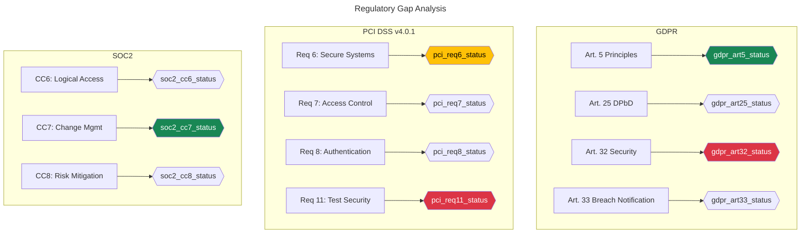

<!-- ─────────────────────────────────────────────────────────── -->
<!--              CYBERSEC REPORTING ENGINE                      -->
<!--             DASHBOARD TEMPLATES v2.1                        -->
<!--          Renders with Mermaid.js 10.x+                     -->
<!-- ─────────────────────────────────────────────────────────── -->

# Dashboard Templates

All dashboards use **Mermaid.js v10+** syntax and are designed for embedding in HTML-rendered reports, markdown viewers, and the CyberSec Reporting Engine web interface. Replace `{{placeholder}}` variables with actual data values.

---

## 1. Executive Risk Summary Dashboard


```mermaid
---
title: Risk Trend — Last {{assessment_count}} Assessments
config:
  theme: base
  themeVariables:
    xychart1: "#0D6EFD"
    xychart2: "#DC3545"
---
xychart-beta
    title "Risk Score Trend — {{assessment_period}}"
    x-axis [{{assessment_labels}}]
    y-axis "Risk Score" 0 --> 100
    line "Residual Risk" [{{residual_risk_data}}]
    line "Acceptable Threshold" [{{threshold_data}}]
```

```mermaid
---
title: Enterprise Risk Radar
---
quadrantChart
    title Enterprise Risk Quadrant
    x-axis "Low Likelihood" --> "High Likelihood"
    y-axis "Low Impact" --> "High Impact"
    quadrant-1 "Critical — Act Now"
    quadrant-2 "Monitor Closely"
    quadrant-3 "Accept / Monitor"
    quadrant-4 "Mitigate & Transfer"
    {{finding_01_short}}: [{{finding_01_likelihood_num}}, {{finding_01_impact_num}}]
    {{finding_02_short}}: [{{finding_02_likelihood_num}}, {{finding_02_impact_num}}]
    {{finding_03_short}}: [{{finding_03_likelihood_num}}, {{finding_03_impact_num}}]
    {{finding_04_short}}: [{{finding_04_likelihood_num}}, {{finding_04_impact_num}}]
    {{finding_05_short}}: [{{finding_05_likelihood_num}}, {{finding_05_impact_num}}]
```

```mermaid
---
title: Remediation Progress Overview
---
gantt
    title Remediation Roadmap — {{client_short_name}}
    dateFormat  YYYY-MM-DD
    axisFormat  %b %d

    section Critical ({{critical_count}} items)
    {{critical_item_01}}  :crit1, {{critical_start_01}}, {{critical_duration_01}}
    {{critical_item_02}}  :crit2, {{critical_start_02}}, {{critical_duration_02}}

    section High ({{high_count}} items)
    {{high_item_01}}      :high1, {{high_start_01}}, {{high_duration_01}}
    {{high_item_02}}      :high2, {{high_start_02}}, {{high_duration_02}}

    section Medium ({{medium_count}} items)
    {{medium_item_batch_01}} :med1, {{medium_start_01}}, {{medium_duration_01}}

    section Low ({{low_count}} items)
    Low Priority Batch     :low1, {{low_start_01}}, {{low_duration_01}}
```

### Executive Dashboard Summary Stats

| KPI | Value | Trend | Target |
|---|---|---|---|
| Total Findings | {{total_findings_count}} | {{findings_trend}} | — |
| Critical Open | {{critical_open_count}} | {{critical_trend}} | 0 |
| Mean CVSS v4 | {{mean_cvss}} | {{cvss_trend}} | < 4.0 |
| Overall Risk Score | {{overall_risk_score}}/100 | {{risk_trend}} | < 25 |
| Maturity Score | {{maturity_score}}/5 | {{maturity_trend}} | ≥ 4.0 |
| MTTR (Mean Time to Remediate) | {{mttr_days}} days | {{mttr_trend}} | < {{mttr_target}} |
| Remediation Progress | {{remediation_pct}}% | — | 100% |

---

## 2. Technical Findings Dashboard


```mermaid
---
title: CVSS v4 Score Distribution
---
xychart-beta
    title "CVSS v4 Score Distribution"
    x-axis ["0-1", "1-2", "2-3", "3-4", "4-5", "5-6", "6-7", "7-8", "8-9", "9-10"]
    y-axis "Finding Count" 0 --> {{max_count}}
    bar [{{cvss_0_1}}, {{cvss_1_2}}, {{cvss_2_3}}, {{cvss_3_4}}, {{cvss_4_5}}, {{cvss_5_6}}, {{cvss_6_7}}, {{cvss_7_8}}, {{cvss_8_9}}, {{cvss_9_10}}]
```

```mermaid
---
title: Kill Chain Phase Coverage
---
flowchart LR
    subgraph Recon
        A[Reconnaissance\n{{kill_chain_recon_count}} findings]
    end
    subgraph Weaponize
        B[Weaponization\n{{kill_chain_weaponize_count}} findings]
    end
    subgraph Deliver
        C[Delivery\n{{kill_chain_deliver_count}} findings]
    end
    subgraph Exploit
        D[Exploitation\n{{kill_chain_exploit_count}} findings]
    end
    subgraph Install
        E[Installation\n{{kill_chain_install_count}} findings]
    end
    subgraph C2
        F[Command & Control\n{{kill_chain_c2_count}} findings]
    end
    subgraph Actions
        G[Actions on Objectives\n{{kill_chain_actions_count}} findings]
    end
    A --> B --> C --> D --> E --> F --> G

    style D fill:#DC3545,color:#fff
    style E fill:#FD7E14,color:#fff
    style A fill:#198754,color:#fff
```

### Technical Findings Summary Table

| Severity | Count | % of Total | Avg CVSS v4 | Most Common CWE | Top ATT&CK Tactic |
|---|---|---|---|---|---|
| Critical | {{critical_count}} | {{critical_pct}}% | {{critical_avg_cvss}} | {{critical_top_cwe}} | {{critical_top_attck}} |
| High | {{high_count}} | {{high_pct}}% | {{high_avg_cvss}} | {{high_top_cwe}} | {{high_top_attck}} |
| Medium | {{medium_count}} | {{medium_pct}}% | {{medium_avg_cvss}} | {{medium_top_cwe}} | {{medium_top_attck}} |
| Low | {{low_count}} | {{low_pct}}% | {{low_avg_cvss}} | {{low_top_cwe}} | {{low_top_attck}} |
| Info | {{info_count}} | {{info_pct}}% | N/A | {{info_top_cwe}} | N/A |

---

## 3. Compliance Coverage Dashboard


```mermaid
---
title: CIS Benchmark Compliance by Domain
---
xychart-beta
    title "CIS Controls Compliance — {{cis_version}}"
    x-axis ["IAM", "Logging", "Network", "Compute", "Storage", "AppSec", "Endpoint", "Data"]
    y-axis "Compliance %" 0 --> 100
    bar [{{cis_iam}}, {{cis_logging}}, {{cis_network}}, {{cis_compute}}, {{cis_storage}}, {{cis_appsec}}, {{cis_endpoint}}, {{cis_data}}]
    line [80, 80, 80, 80, 80, 80, 80, 80]
```




### Compliance Summary

| Framework | Version | Controls Assessed | Compliant | Non-Compliant | Compliance % | Gap Count |
|---|---|---|---|---|---|---|
| PCI DSS | {{pci_version}} | {{pci_total_controls}} | {{pci_compliant}} | {{pci_non_compliant}} | {{pci_pct}}% | {{pci_gaps}} |
| CIS Benchmarks | {{cis_version}} | {{cis_total_controls}} | {{cis_compliant}} | {{cis_non_compliant}} | {{cis_pct}}% | {{cis_gaps}} |
| NIST CSF 2.0 | 2.0 | {{nist_total_subcats}} | {{nist_compliant}} | {{nist_non_compliant}} | {{nist_pct}}% | {{nist_gaps}} |
| ISO 27001 | {{iso_version}} | {{iso_total_controls}} | {{iso_compliant}} | {{iso_non_compliant}} | {{iso_pct}}% | {{iso_gaps}} |
| SOC 2 | {{soc2_version}} | {{soc2_total_controls}} | {{soc2_compliant}} | {{soc2_non_compliant}} | {{soc2_pct}}% | {{soc2_gaps}} |
| GDPR | — | {{gdpr_total_articles}} | {{gdpr_compliant}} | {{gdpr_non_compliant}} | {{gdpr_pct}}% | {{gdpr_gaps}} |

---

## 4. Remediation Tracking Dashboard

```mermaid
---
title: Remediation Progress by Severity
---
%%{init: {'theme':'base', 'themeVariables': {'fontSize':'12px'}}}%%
gantt
    title Remediation Progress Timeline — {{client_short_name}}
    dateFormat  YYYY-MM-DD
    axisFormat  %b %d

    section Critical
    {{critical_finding_01}}   :done, crit-01, {{crit01_start}}, {{crit01_duration}}
    {{critical_finding_02}}   :active, crit-02, {{crit02_start}}, {{crit02_duration}}
    {{critical_finding_03}}   :crit-03, {{crit03_start}}, {{crit03_duration}}

    section High
    {{high_finding_batch_01}} :active, high-01, {{high_start}}, {{high_duration}}

    section Medium
    {{medium_finding_batch_01}}: med-01, {{med_start}}, {{med_duration}}

    section Low
    Low Priority Batch        : low-01, {{low_start}}, {{low_duration}}
```

```mermaid
---
title: Remediation Burndown Chart
---
xychart-beta
    title "Finding Burndown — {{burndown_period}}"
    x-axis [W1, W2, W3, W4, W5, W6, W7, W8, W9, W10, W11, W12]
    y-axis "Open Findings" 0 --> {{total_findings_count}}
    line "Actual" [{{burndown_actual}}]
    line "Projected" [{{burndown_projected}}]
    line "Target" [{{burndown_target}}]
```


```mermaid
---
title: Remediation Status Flow
---
flowchart LR
    A[Open\n{{status_open_count}}] -->|"Assigned"| B[In Progress\n{{status_in_progress_count}}]
    B -->|"Fix Deployed"| C[Pending Validation\n{{status_pending_count}}]
    C -->|"Validated"| D[Closed\n{{status_closed_count}}]
    A -->|"Reviewed"| E[Risk Accepted\n{{status_accepted_count}}]
    B -->|"Cannot Fix"| F[Deferred\n{{status_deferred_count}}]
    A -->|"Invalid"| G[False Positive\n{{status_fp_count}}]

    style D fill:#198754,color:#fff
    style E fill:#FFC107,color:#000
    style F fill:#6C757D,color:#fff
    style G fill:#6C757D,color:#fff
    style A fill:#DC3545,color:#fff
    style C fill:#0D6EFD,color:#fff
```

### Remediation KPIs

| Metric | Current | Target | Variance |
|---|---|---|---|
| Open Critical Findings | {{open_critical}} | 0 | ❌ Off Track✅ On Track |
| Open High Findings | {{open_high}} | ≤ {{high_target}} | ❌ Off Track✅ On Track |
| Mean Time to Remediate (Critical) | {{mttr_critical}} days | ≤ {{mttr_critical_target}} days | {{mttr_critical_delta}} |
| Mean Time to Remediate (High) | {{mttr_high}} days | ≤ {{mttr_high_target}} days | {{mttr_high_delta}} |
| SLA Compliance Rate | {{sla_compliance_pct}}% | ≥ 95% | {{sla_delta_pct}}% |
| Risk Accepted Findings | {{risk_accepted_count}} | ≤ {{risk_acceptance_max}} | {{risk_accepted_delta}} |
| Findings Past SLA | {{past_sla_count}} | 0 | ❌❌ Off Track✅ On Track |

---

## 5. SOC Operations Dashboard

```mermaid
---
title: SOC Alert Volume & Classification
---
xychart-beta
    title "Alert Volume — Last 30 Days"
    x-axis [D1, D3, D5, D7, D9, D11, D13, D15, D17, D19, D21, D23, D25, D27, D29]
    y-axis "Alerts" 0 --> {{soc_max_alerts}}
    line "Total" [{{soc_alert_volume}}]
    line "True Positive" [{{soc_true_positive}}]
    line "False Positive" [{{soc_false_positive}}]
```


```mermaid
---
title: Incident Response Lifecycle Metrics
---
flowchart LR
    subgraph Detection
        A[MTTD\n{{mttd_minutes}} min]
    end
    subgraph Triage
        B[MTTT\n{{mttt_minutes}} min]
    end
    subgraph Containment
        C[MTTC\n{{mttc_minutes}} min]
    end
    subgraph Eradication
        D[MTTE\n{{mtte_hours}} hrs]
    end
    subgraph Recovery
        E[MTTR\n{{mttr_hours}} hrs]
    end
    A -->|"{{detection_to_triage_delta}}m"| B
    B -->|"{{triage_to_contain_delta}}m"| C
    C -->|"{{contain_to_eradicate_delta}}h"| D
    D -->|"{{eradicate_to_recover_delta}}h"| E

    style A fill:#0D6EFD,color:#fff
    style C fill:#DC3545,color:#fff
    style E fill:#198754,color:#fff
```


### SOC Operations KPIs

| Metric | Current | Benchmark | Status |
|---|---|---|---|
| Mean Time to Detect (MTTD) | {{mttd_minutes}} min | < {{mttd_benchmark}} min | {{mttd_status}} |
| Mean Time to Triage (MTTT) | {{mttt_minutes}} min | < {{mttt_benchmark}} min | {{mttt_status}} |
| Mean Time to Contain (MTTC) | {{mttc_minutes}} min | < {{mttc_benchmark}} min | {{mttc_status}} |
| Mean Time to Eradicate (MTTE) | {{mtte_hours}} hrs | < {{mtte_benchmark}} hrs | {{mtte_status}} |
| Mean Time to Recover (MTTR) | {{mttr_hours}} hrs | < {{mttr_benchmark}} hrs | {{mttr_status}} |
| False Positive Rate | {{false_positive_pct}}% | < 10% | {{fpr_status}} |
| Alert-to-Incident Ratio | {{alert_to_incident_ratio}}:1 | < {{alert_ratio_benchmark}}:1 | {{alert_ratio_status}} |
| Detection Coverage (ATT&CK) | {{detection_coverage_pct}}% | > 85% | {{detection_coverage_status}} |
| Analyst Utilization | {{analyst_utilization_pct}}% | 70–85% | {{analyst_util_status}} |
| Incidents Closed Within SLA | {{sla_closure_pct}}% | > 95% | {{sla_closure_status}} |

---

## Appendix: Color Scheme Reference

| Variable | Hex | Use |
|---|---|---|
| Critical | `#DC3545` | Critical severity, non-compliant, breached SLA |
| High | `#FD7E14` | High severity, at-risk indicators |
| Medium | `#FFC107` | Medium severity, warning thresholds |
| Low / Compliant | `#198754` | Low severity, compliant, on-track |
| Informational / Neutral | `#6C757D` | Informational, neutral, N/A |
| Primary Blue | `#0D6EFD` | Trends, progress lines, active states |
| Background | `#F8F9FA` | Chart backgrounds |

---

<div class="classification-banner">
⚠️  DASHBOARD DATA IS CONFIDENTIAL — {{client_name}}  ⚠️
</div>
